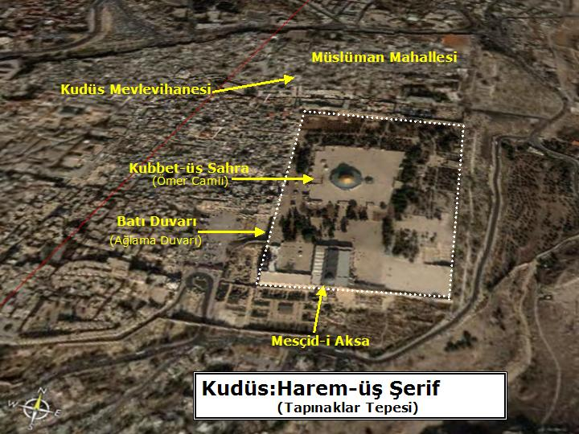

Aşağıda geçenlerde   üç ayrı gazete tarafından verilmiş üç ayrı haber var. Bunları görüşlerinize arzederim:  

**Hürriyet 20 ağustos)**   Gül, Haremüşşerif'teki Kubbet-üs Sahra'da namazını kıldıktan sonra El Aksa camisine girmesinin ardından bir Filistinli bağırarak, “bu toprakların kurtulması için mücadele edilmesini” istedi. Filistinli, Bakana eşlik eden İsrailli korumalar tarafından dışarı çıkarıldı.

**Sabah 21 ağustos)**   Miraç Kandili nedeniyle Gül temaslarına başlamadan önce Kudüs'e geçerek, Mescid- i Aksa'yı ziyaret etti. Gül önce Hz. Muhammed'in göğe yükseldiği kabul edilen yerde namaz kıldı. Sonra Haremüşşerif'e geçen Gül'ü burada Filistinli bir genç protesto etti. "Sizin İsrail ile ilişkiniz var. Sizi istemiyoruz" diye bağıran gence İsrail polisi müdahale etti. Filistinli gencin arkadaşları da polise direnince kısa süreli arbede yaşandı.

**Radikal 21 ağustos)**     Dışişleri Bakanı, Kudüs'te Harem üş-Şerif ziyaretindeyse heyecanlı dakikalar yaşadı. Kubbet üs-Sahra'da namaz kılıp El Aksa'ya giren Gül, burada Filistinli bir genç tarafından 'sıkıştırıldı'. Gencin üzerine yürüdüğü Gül'e "Gelin ve burayı kurtarın" diye bağırdığı belirtildi. Kudüs polis sözcüsü Ben-Rubi ise, gencin bakana hakaret ettiğini söyledi. İsrailli korumalar ve camide bulunanlarca uzaklaştırılan genç, sorguya alındı. Harem üş-Şerif Vakfı yöneticileri, genci ilk kez gördüklerini söyledi.

**Bu haberlerde Kudüs'te Harem üş Şerif'te el- Aksa Camiinde bakan Abdullah Gül'e hakaret eden Filistinli gencin “gelin burayı kurtarın” veya “sizi istemiyoruz İsrail'le ilişkileriniz var...” dediği belirtiliyor... Bu iki ayrı ifadenin hangisi doğrudur ? Destur...**

Bu haberler doğru değilse, bunların arkasındaki maksat nedir ?

Hürriyet'in birşeyler sakladığı anlaşılıyor... Destur ! Acaba kimlerden ve nerelerden emir almıştır. Şu günlerde yaşadığımız korkunç “dezenformasyon”dan en fazla yakınan bu gazete, acaba, artık iyiden iyiye kara deliğe dönüşen dezenformasyon girdabına kendisi de kapılmış mıdır ? Anlaşılmıyor...

Haberleri çarpıtma anlamına gelen “dezenformasyon” eğer gizli maksatlara hizmet etmiyorsa en azından Ortadoğu ve İslam toprakları konusunda, her gün inanılmaz cehalet örnekleri veren Türk basının bir yüz karasıdır. Hürriyet “sayın Bakan'a “Kubbet üs Sahra” da namaz kıldırıyor... Diğerleri “Mescid-i Aksa”da... Sabah haberinde “Gül, önce Mescid-i Aksa'da namaz kıldı sonra “Harem üş Şerif'e geçti” diyor... Mescid-i Aksa zaten Harem-üş Şerif'in sınırları içinde, bu haberi yazan hiç o tarafa gitmemiş ki... Paris, Londra, Vegas dolaylarında dolaşmış...

**Ülke yönetiminde etkin bir kısım Türk aydınının yüz elli yılda ve iki siyasal sistem içinde laikleşerek İslam dini ve İslam topraklarından soğuması üzerine başlayan bu cehalet halkası işte bizi, şimdi bu hallere getirmiştir.**

Kızgın pratiğin tam orta yerinde dahi hükmünü icra eden bu cehalet yüzünden zaten bu ülkede çok az kişi “Kubbet-üs Sahra” ile “Mescid-i Aksa” arasındaki farkı biliyor... Doğan güneşe göre biri solda diğeri sağda   olan bu iki mekân, İslam geleneğinde Kâbe-i Muazzama' dan sonra gelen en değerli kutsal yapıların bulunduğu yerdir. Kudüs'te İslam'a yabancıların “Tapınaklar tepesi” Müslümanların “Harem- üş Şerif” adını verdikleri birkaç kapı ile çevreye açılan kale duvarları ile çevrili bir alan, bir tepedir.

Bu tepede vaktiyle Süleyman mabedi vardı. Romalılar yıktılar. O tapınaktan kalan bir duvarın önünde “burası neden yıkıldı...”diye Musevî dindarlar   binlerce yıldır hâlâ ağlıyorlar... Ağlamayı din edinmişler...

**Bizzat Hz. Peygamber'in kararıyla İslam'ın “kıble”si, Kabe'den önce “Kudüs” tü. Bu yüzden İstanbul'da mihrabı hem “Kudüs'e hem de “Mekke”ye bakan ve “Kıbleteyn” adını taşıyan bir cami vardır.**

Ne olur, gazeteci kardeşler, şimdi sırası geldi... Acilen lâzım oldu. Biraz İslam tarih ve coğrafyası okuyun... İyi gelir. Haber yazarken “gülünç durumlara” düşmezsiniz.

**Kim bilir ! belki de tarihe hizmet edersiniz...**
