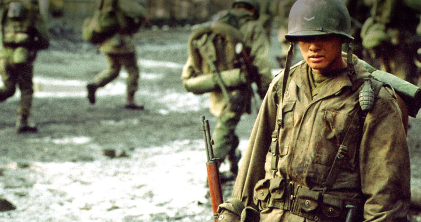

  

Türk hükümetinin yetkilisi “Lübnan'a gidecek Türk askeri **çatışmaya girmeyecek**” dedi.

**Ya öbürleri girerse..**

Çatışma ikili olur. Tek kişi, **tek başına çatışamaz...** İki kişi veya iki ordu karşı karşıya gelir çatışırlar. İki ordu veya iki askerî gücün çatışmaya veya çatışmamaya karar vermesi için her ikisinin de ortak görüş sahibi olması gerekir. Taraflardan biri **“çatışacağım”** derse o **“çatışacağım”** diyen tarafın kararı geçerlidir.Ve çatışma olur.Bütün bunları bilmek için geçen yüzyılın Alman savaş filozofu Clausevitzh'in **“der Kriege”** Savaş kitabını okumaya gerek yoktur. Sokaktaki veletler bile bunu bilir. Kaldı ki bu kitap yıllardan beri **Türk askeri okulların**da ders kitabı olarak okunmaktadır.

Adam diyor ki:Çatışma zamanı geldiğinde çatışmamak, çatışmaktan daha tehlikelidir.

**Ne demektir çatışmaya girmeyeceğiz... ? Ya onlar girerse ? değil mi efendim. Hiç askerlik yapmadınız mı ?**

İngilizler büyük sıcak **sömürgecilik** yıllarına hiçbir zaman ilk ateş eden olmamışlardı. Yelken döneminin büyük savaş kadırgaları dahi karşıdan ateş yemedikçe toplarını konuşturmadılar... Ancak daha sonraki yıllarda, **tavşanlıkları** arttığında karşı tarafa casus koyup **gizlice ateş ettirdiler**. Savaşlar hep öyle başladı **“1861 Navarin Körfezi”** savaşında olduğu gibi

18o6' da dört İngiliz savaş fırkateyni bir sabah Marmara'ya girip Sultan **III. Selim**'in henüz uykusundan uyanmadığı bir saatte, sulara kadar inen büyük bayrakları ile **Topkapı Sarayı'nın** karşısına dizildiklerinde İstanbulda Fransız **Devrim Hükümetini** temsil eden İhtilal'in sevimli çocuğu **General Sebastiyani** iki atlı arabası ile acele saray'a koşup **“aman sakın sahilden ateş etmeyin...**   görürsünüz sonra size ne yapacaklarını...”dedi.

**İngiliz donanması** daha o tarihlerde **namusunu** kaybetmemişti. Karşıdan   Ateş yemeyince ateş etmediler ve **çekip gittiler...**Hırslarını yenemeyip **Yassıada**'ya asker çıkardıklarını tarihler yazıyor.

Efendi sen **dürüst** bir savaşın içinde değilsin. Bu şerefsiz **bir gerilla** savaşıdır. Vur kaç düzenidir. Ne demektir çatışmaya girmeyeceğiz... **Karşı tarafa** sordun mu ?

Devlet adamı eksikliği ülkemizde her sabah **güneş gib**i yeniden doğuyor.

Hak şerleri hayreyler... Zannetme ki gayreyler... Görelim   Mevlam n'eyler. Neylerse güzel eyler...                       **Erzurumlu İbrahim Hakkı**
