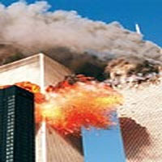

  

  

Amerika Birleşik Devletleri Başkanı George Bush Dünyayı iki cepheye ayırdı: **Demokrasi cephesi, Terör cephesi...**

Başkan böylece siperleri kazarak belki de dünyanın sonu olacak bir savaşı başlattı. Hayırlı olsun ! **İki kulesi yıkıldı diye dünyayı ateş çemberine sardı.** Hem kendisini, hem halkını, hem de **Dünya halklarını** sonu  belirsiz bir maceraya sürükledi.

Beş yıl önce **"Onbir eylül"** olayı çıktığı saatlarde **Arap teröristlerin** adı geçti. Ben böylesine devâsâ bir işi, bir **Arabın** düşünüp becereceğine hiç inanmamıştım. **Hâlâ da inanmıyorum**. Arabın ne **kafası**, ne **inancı**, ne modern askerî **dehâsı** ve ne de çağdaş siyasî **azmi** bu kadarına uzanamazdı. **ABD Devlet sisteminin** amansız düşmanları olan, ne **Stalin,** ne de **Hitler** böyle bir şey düşünmemişlerdi. Bu olayı sonradan inceleyenler, bunun ancak çok büyük **ihanet projelerine** imzasını atan, **Amerikan sisteminin** yüz karası, eski generallerden 1988'de ölen **General Lyman** **Lemnitzer**'den geriye kalan **hainler şebekesi'**ne yakıştığını söylediler...

Ben işte buna inandım. Gerçekten yakışıyor. Zira o şebeke yaşadığı yıllarda başında, general **Lyman Lemnitzer** olmak üzere, muhtemelen başarısız Küba **Domuzlar körfezi** saldırısını ve **Başkan Kennedy** süikastını düzenlemişti. " **Dünya Ticaret Merkezi"nin** iki gökdelenini, intihar uçaklarıyla 450 bin tonluk bir enkaza dönüştürmek ancak **bu çapta** bir çetenin işi olabilirdi. **Devlet başkanını öldüren** ve böylece ar damarı patlayan **şebeke**, elbette ona yakışan projelerle yoluna devam etmeliydi.

Bu **teoriye** inanan sadece ben değilim. Beş yıl önce 11 eylül sabahı o meş'um olayı yaşamaya başlayan **Amerika'nın zirve kadrosu** da o korkunç **varsayıma** inanmıştı. Olayın başlamasından yarım saat sonra {ığınaklara giren **Beyaz Saray** ve **Pentagon**'lular **"işte o hain generalin adamları yine geldi..."** dediler. Akşam sekiz buçuğa kadar sığınaklardan çıkmadılar. O saatlerde herkes "Amerika iç savaşı"nin başladığına inanıyordu. Ama bunu ilan etselerdi **"iç savaş" gerçekten başlamış olacaktı...** İki yüz yıl sonra bir kere daha **"Amerikan barışı: pakta Amerikana"** yeni bir iç savaşın sonunu beklemek zorunda kalacaktı... İşi Arabın üzerine yıkmaya karar verdiler.

Gerçekten kuleleri patlatanlar, bu iş için en uygun kişiler olarak Amerikan üniversitelerinde okuyan **fanatik fedai Arap öğrencilerini** seçmişlerdi. Akıllı Bush yönetimi, 11 eylül günü, akşamüstü **"World Trade Center"** in, henüz dumanı tüten enkazı üzerine, güneş son ışıklarını yayarken, bu olayın asıl faili olabilecek **Lemnitzer grubunu** sollayarak, **Arabı öne sürdüler.**

Böylece Amerika Birleşik Devletleri yönetimi dünyaya bir **Usame bin Ladin** ve terörist **" el-Kaide" örgütü** hediye etti . Bu iki isim, Birleşik Amerika'nın **Naziler** ve **Komünistler**den sonra seçtiği son hedef oldu. **Amerika yeni düşmanını buldu.** Savaşla doğan devlet savaşla yaşamak zorundaydı. Dünyayı da yanına çekerek... Şimdi bu sürecin içindeyiz.

**Bush her gün "el-Kade"nin reklamını yapıyor.** Tüm yandaşları da yarış halinde ona uyuyorlar. Dünyada öylesine inanılmaz bir kriz yaşanmaya başlandı ki, yakında **Alabama**'lı bir köylüden **Şangay**'lı bir iş adamına kadar herkes başına gelenleri **"el-Kaide**"den bilecek. Bush'un yarattığı ejderha belki de giderek dünyayı yutacak.

Ancak İslam tarihi ve kültürü konusunda hiçbir bilgisi ve gayreti bulunmayan Bush "el-Kaide"nin ismini devamlı anmakla **"reklamın kötüsü olmaz"**diyen TV çağının kurallarına göre hareketi yasallaştırmakta, farkında olmadan Araba mukemmel bir hizmet sunmaktadır.

Bush'un kulelerini yıkanlar Araplar ise, bu Araplar 260 yıl önce **"Allah yolunda aşırılıklara ve din perdesi altında toplanan haksız servetlere" düşman olarak doğan Vahhabîlerdir...** Bir zamanlar Osmanlı toprağı olan Arabistan'ın Necid bölgesinde yaşayan bu cahil çöl Arapları, **1745**'ten beri şekil değiştirerek bu günlere geldiler. Çelişkili siyasal süreçleri, farklı ekonomik-politik ve askerî çekim alanlarını aşarak bu çağa ulaştılar. Ama sanırım ruhen "**ilk hareket noktalarının"** pek de uzağına düşmediler. Böylece İslâmda **"Hanbelî ekolünde"** var olan **"silahlı savunma hareketi"** doğrultusunda, **İbni Teymiyye** uzantısını temel alan mücahit **Abdülvehhab'ın,** 1745'te Necit'te **"Deyriyye"** kasabasında **Emir Suud'**la birleşmesinden doğan **Vahhabî-Suudî"** hareketi, **el-Kaide ve Bin Ladin'le** devam etmektedir.

Böylece **11 Eylül hareketi bir "Vahhabî" hareketidir.** Genç Vahhabîler İsa Peygamber Ruhullah Aleyhisselam'in doğuşundan 2000'yıl sonra dünyayı saran şeytanın kalbini bir kurşunla yere serdiler. İyi oldu. Şimdi melek-şeytan kavgasında son raundu göreceğiz. Bush bunun yeni adını **"Demokrasi"** ve **"Terör"** olarak koydu. **"Demokrasi"** adı altında **"Geri Kalmışlara Saldırı"** ve **"Terör"** adı altında **"Yasal Savunma"** da diyebilirsiniz. İsteyen istediği tarafı seçsin. Ben **Haçlı**ların son kumandanı şarib ü leyl ü nehar **Bush**'tan yana değilim. Bush "**Amerika silahını düşmandan önce çekmeli"** diyor...Pekiyi... ya düşman silahını çekmeyecekse o zaman **kaatil oldun efendi** kaatil. Kötülüyü önleyeceğim derken kötülüğü **sen çıkarmış** olmuyor musun ? değerli Kovboy...
