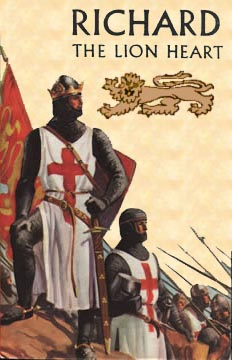

  

Birleşik Amerika Cumhurbaşkanı **George Bush** Beyaz Sarayda **iftar çadırı** kurdu. **Oval Ofis'te** düzenlenen İftar Çadırında **Müslüman Ülkelerin** temsilcilerini ağırladı ve kendilerine çorba, balık, **domates** salatası, ve **armut** suflesi ikram eti. Masada **iftariyelik** bulunup bulunmadığı **belirtilmiyor**... Aslında **Yemen** hurması, **Ayvalık** zeytini, **Ezine** peyniri, **Erzincan** tulumu, **Tekirdağ** kaşarı, **Kayseri** pastırması, **turşu,** tükenmez, envai çeşit **reçel** ve tereyağı, Künafe, **Baklava**, **Şam** tatlısı ve güllaç da **sofrada** bulunmalıydı... İnşallah gelecek **ramazana...**

**Bush** bu yıl altıncısını düzenlediği **geleneksel** İftar yemeği sırasında **Müslüman** ülkelerin temsilcilerine **vaaz** vermeyi de unutmadı. Onlara dedi ki : "_dünyada **teröristlerin** kurbanlarının çoğunluğunu **Müslümanların** oluşturduğunu biliyorsunuz ve birçoğunuz kendi **kentlerinizde**, sokaklarınızda **terörist** şiddeti bizzat gördünüz. Biz, **teröristleri** ve aşırı unsurları **yenmek için** verilen mücadelede ve **dünyada** barış ve **ılımlılık** arzu eden milyonlarca **Müslümana** daha parlak bir **gelecek** sağlama çabalarında **sizinle birlikte** çalışmaktan **gurur** duyuyoruz"_ **İftara** iştirak eden **Müslüman** ileri gelenleri bu sözleri candan alkışlayarak **Bush'a** hayranlıklarını belirttiler.

**Beyaz Saray'daki** iftarda bulunan ve büyük olasılıkla **Amerikan**, **İngiliz** ve **Fransız** üniversitelerinde okuyarak **kendi ülkelerinde** ön sıralara geçmiş olan bu **liderlerin**, dile getirdiği konularda   **Bush'**tan ayrı düşünmelerine hiçbir **olanak** yoktu. Hepsi **CİA** tarafından **özenle** seçilmiş **"ılımlı"** müslümanlardan oluşan bu **kalabalık** ve o insanlar, o gün orada, **Bush'un** huzurunda açtıkları **iftar'ın** sevabına nail olmanın **vazgeçilmez** kıvancını yaşadılar.

İslam **ülkelerinin** temsilcileri oldukları ileri sürülen bu i**nsanlardan** hiç biri gerek **iftar öncesinde** ve gerekse **iftar sonrasının** kahve saatinde **Bush'a** şöyle hitap ederek: "Başkan **efendi** ! sen aşırı unsurları **birlikte yenelim** diyorsun ama bu aşırı **unsurlar** neden aşırı **unsur** oldular ? İşin bu tarafını **merak** ettiğin yok, veya ediyorsun da işine **gelmiyor**. Eğer bunları "**birlikte yenmek** için birlikte çalışalım, **gurur duyalım**" diyorsan o zaman **Suudi Arabistan**'daki "**Dahran**" üssünü kapat ve **beş bin** askerini oradan çek... Biliyorsun **Müslümanlar** kutsal topraklara yabancı ayağı **bassın** istemezler... Buraya senin askerlerini **Suudiler** getirdi, onları da **alaşağı** etmemiz için de **bizimle çalış,** o zaman belki sokaklarımızdan **teröristler** eksilir... Senin **Dahran** üssündeki **askerin** durdukça, ortağın olan **İsrail** devleti **Filistinlilerin** topraklarından çekilmedikçe bu **kan** durmaz... **Teröristlerin** neden hep **Müslümanlardan** çıktığını ? **laf altından**   soruyorsun, **Karela'da Hintlilerin** evlerini yıksaydın onlar da **terörist** olurdu. Senden öncekiler de **köylerini** yaktıkları **Vietnamlı'ların** neden **terörist** olduklarını hep sorarlardı... Sora sora gittiler bu **dünyadan**. Teröristin başı sen olduğun halde elaleme **teröristlik** bulaştırıyorsun. **Vaktiyle** senin ülkeni kuran **büyük adamlara** da **Londra**'daki **Lord'**lar **terörist** demişti... **Bush** baba bırak bu **ayakları**. Bizi buraya **topladın** saçma sapan laflarla **iftarımızı** berbat ettin, **Arkadaş,** senin niyetin ne... ? " **diyemedi.**  

İftar sona erdiğinde **Müslüman** ülkelerinin temsilcileri **cadillac'larına**, **limuısin**'lerine binerek **Beyaz Saray'dan** uzaklaştılar. Hiç biri o gece **uzaklarda** atılan bombaların, sokaklarda **kan içinde** yerlerde çırpınan **kadınların**, **çocukların** seslerini duymadılar. Çok **yemek** yemişlerdi...

****

**Haçlı Seferlerinin** ünlü İngiliz Kralı "**Richard"**a çağdaşları "**Arslan yürekli Richard**" demişlerdi. Bu **"Arslan yürekli Richard**"   11 temmuz 1191'de **Akka kalesinin** önünde esir düşen ve **vatanını savunmaktan** başka **suçu** olmayan ikibin yediyüz **Müslüman askerini, aile ve çocukları ile** birlikte iplerle bağlatarak **şovalyelerine** kargı, mızrak, **topuz**, ok, yay, **şiş** ve yatağanla öldürttü... **Katliam,** son iniltiler kesilinceye kadar **saatlerce** sürdü. **Batı** tarihçileri Bu krala neden "**Arslan** **yürekli**" demişler, merak eder dururum. Çizilen **tablonun** **vahşetinden** mi acaba... ?   " **Arslan Yürekli"**   bu savaştan sonra çevresine topladığı **insanlıktan çıkmış** köpek suratlı **Arap emirlerine** o zaman iftar yemeği verdi miydi **acaba** ? onu da merak ediyorum.

**Bağdad'**ın bu günkü durumu **Akka'nın** o günkü durumundan **farklı** değildir. "**Arslan yürekli'nin"** ın bu günkü uzantısı "**Bush"**a da bir sıfat verilecekse eğer  **Irak** savaşındaki inadından dolayı "**keçi kafalı Bush**" dense yeridir.
