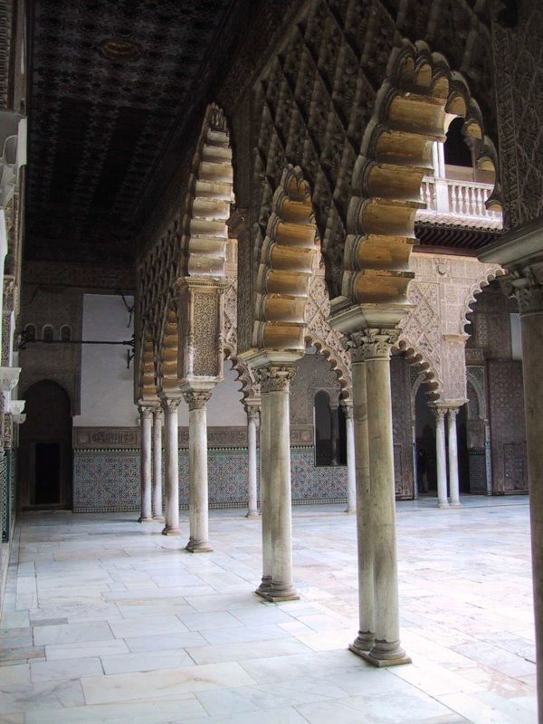

**İspanya**'da bir zaman başbakanlık yapan **Jose Maria Aznar**, geçen ay bir **Amerikan** üniversitesinde yaptığı konuşmada, "Neden **Batı** hep özür dilemek **zorunda**, oysa ki **Müslüman** dünya bunu hiç **yapmıyor**. Bir Müslümanın çıkıp da **İspanya**'yı fethedip 8 asır **işgal ettiği** için **özür** dilediğini hiç duymadım" dedi.

Destur ! Sayın **Aznar**, **Kristof Kolomb**'un keşfedip **Hindistan** zannettiği, **Americo Vespuççi'** nin adını koyduğu **Amerika** kıtasında siz değerli **İspanyollar,**  işlediğiniz cinayetler için ne zaman **özür** dileyeceksiniz ? Kendilerinden **özür** dilenecek **kimseler** dahi kalmadı ortada... Kime **özür** dileyecekseniz bir zaman önce "**dileyiniz"** ki yeryüzünde **insanoğlunun** vicdanı rahat etsin.

600 yıl önce **Güney Amerika'da** **Kortez'in** orduları karaya çıktıklarında **Şili'**de yaklaşık olarak 10 milyon yerli **Aztek** yaşıyordu **İspanyol** ordusunun yanında **savaşıları** izleyen keşiş **Bartholomeo Lascassas'a** göre bir yıl sonra o topraklarda **1,5 milyon** yerli kaldı. Sizinkiler **8,5 milyon** yerliyi **bir yılda** yok ettiler. Müslümanlar **Endülüs'**te o kadar adam öldürmedi.

Kim **kimden** özür dileyecek ? **Müslümanlar İberya** tarihine şan veren "**Kurtuba camii"**ni inşa ettikleri için mi **özür** dileyecekler ? İnsanlığın **Taç Mahal'le** birlikte en görkemli birkaç anıtı arasında yer alan **Granada'daki**, yeryüzünün "parlak mücevheri" olağanüstü **"** **Elhamra Sarayı"** nı inşaa ettikleri için mi **özür** dileyecekler ?  **Alkazar'**ı mı **Sevilla'**yı mı nereyi ?   Sekiz yüzyıl süren o **muhteşem Endülüs** İslam uygarlığından kalma daha nice **eserler** bu gün ülkenin en yüksek **değerleri** arasında yer alıyor. Sen onları **turistler**e satarak geçiniyorsun. **İslam**'ın o yörede bıraktığı **izlerdir** senin kültür **namusunu** tazeleyen... **İslam İspanya'nın** tarihine altın harflerle **kazınmıştır**. Unutmayınız.  

Müslüman **Endülüs, İspanya'da** toprak **mülkiyetinin** en sağlam **düzenlendiği** devirdi. Senin **dedelerin** sekiz asır sonra **yukardan** sarkıp eski yerlerini **tekrar** ele geçirdiklerinde o düzenin **altını üstüne** çevirdiler. İ**spanyol** iç savaşı sırasında **general Franco'nun** askerleri tarafından **köyünde** kurşunlanan **marksist noter Blas İnfante** bu gerçeği ilk defa haykırmıştı. İnfante **"reconquista**" denen ve **kahramanlık** olarak ilan edilen "ülkeyi Müslümanlardan **geri alma**" olayını Kuzey'in   **hırsız** baronlarının **toprak yağması** olarak tanımlamıştı. **Blas İnfante** 1930'larda "İspanyada **toprak hırsızlığını** önlemenin ve **ülkede** adaleti sağlamanın tek yolu **İslâmı** bu ülkeye geri getirmektir" diyordu. Adamı **faşistler** şehit etti.

Bu olayda **özür** dileyecek olanlar **Aragon kralı Ferdinand** ve şürekası, kendisinden özür dilenecek olan da **on altıncı yüzyılın** İspanyol köylüsüdür.

İslam'ın **Endülüs**'ten dolayı o yakada affedilecek hiçbir **"özrü"** yoktur. Tam tersine bu günün **İspanyolları,** Katalan'ları, **Bask'ları** Endülüs'ün İslam asırlarından **sitayişle** bahsetmelidirler. Dünya tarihi bu kadar **basit** değildir. Kimbilir toplumların, **etniklerin** derinden derine ne çeşit **ilişkileri**, etkilenmeleri vardır. Kimseyi **küçümsemeye** gerek yoktur. Kimseye **sataşmaya** gelmez... Adamın **ekini** ortaya döker, **ipliğini** pazara çıkarıverirler... **Tarih** şaka değildir
