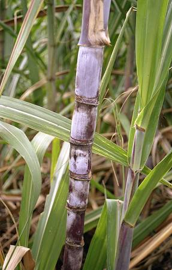

                              3  

Sesin **gönlümüzün** sesine,

Gönlümüzün **huyuna** uysun.

**Gece** gündüz **neş'elensin...**

**Söyledikçe** söylesin.

Sesin **yorulursa** biz de **yoruluruz.**

**Hasta** oluruz.

Sesin **kamış** gibi

**Şekerler** çiğnesin .

                                                                     **Mevlânâ**
