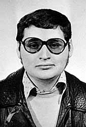

 The conditions in which **Ilich Ramirez Sanchez**, called **"Carlos",** was transferred to France on **August 1994**, to be judged, are more and more **mysterious.** At the time, it had been known that the **French** Interior Minister, **Charles Pasqua**, had negotiated this **arrest** with his friend, the **Sudanese** islamic leader **Hassan al-Tourabi**, and that the operation had been directed by the **prefect Philippe Parent.**

**Carlos** was a **revolutionist militant** who had formed a **combatants'** secret organization whose activities were **mainly** at the service of the **Palestinian cause**. He had become, in the **seventies**, the wanted **number one in the world**, and personified a violent form of transnational resistance to the **Zionism** and to the **American imperialism.**

The French writer **François-Xavier Verschave** had affirmed that in **exchange** of the handing over of **Carlos**, France had provided assistance to **Hassan al-Tourabi**, particularly in the form of **satellite photos** helping him reinforce his **military position**. He had been found **guilty** of slandering for this **assertion.**

In an interview with _**le Figaro**_, on January 10, 2006, the General **Philippe Rondot** (the name of which was linked to the **Clearstream scandal** thereafter) praised to have directed himself the **capture operation**. Which pushed **Carlos**, on June 2006, to register a complaint against him for **kidnapping.**

However, the **core** of the problem is to know if **Carlos** was extradited by the **Sudanese authorities** or if he was **kidnapped** by the **French agents.** In the second case, his presence on the **French territory** would be **illegal**, his sentencing should be **cancelled** and he should be **extradited** towards his country of origin, **Venezuela.**

Precisely, the president of the **Bolivarian Republic of Venezuela, Hugo Chavez** Frias, took advantage of the last **OPEC** summet in **Caracas** to sing the **"friend" Carlos'** praises, in his speech. Indeed, within the **OPEC,** **Venezuela** and **Iran** laud today the affectation of the **oil royalties** to the liberation of the **people** and the economic development of the **Third World** like formerly **Algeria, Iraq, Kuwait** and **Libya,** who had supported secretly the hostage taking of the **OPEC** Ministers by **Carlos.**

However, in an interview with the **Turkish newspaper _Vakit_** on July 3, 2006, **Hassan al-Tourabi -** contradicting former declarations- affirmed having never handed over **Carlos** to the **French autorities**. It is, thus, not with him that the **capture** would have been **negotiated,** and it would have been, indeed, a question of **abduction.**

The question then is: **who sold Carlos?** Specially that, at the time, the single **person** that was able to win his trust in **Khartoum,** to work, in bond, with the **American** and the **French intelligence services**, and to make him **fall** into a trap was but.. **Osama Bin Laden,** in which **Carlos** was still retaining his **confidence** when he wrote, in prison, his book, **_revolutionary Islam_.** (Courtesy **Reseau Voltaire)**
