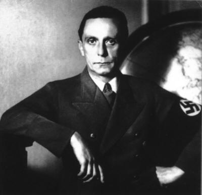

CHARLOTTE (AFP) - Un passage de 90 secondes d'un discours de **Joseph Goebbels**, numéro deux du **régime nazi**, a été diffusé avant un match de [**football**](http://fr.sports.yahoo.com/fo/) opposant deux lycées de **Charlotte** (Caroline du nord).

Le quotidien local **The Charlotte Observer** a expliqué que les mots du **ministre** de la propagande d'**Adolf Hitler** avaient été diffusés dans une **malencontreuse** tentative de motiver l'équipe du **lycée de Forestview** avant une rencontre i**mportante** samedi dernier contre les homologues du **lycée catholique de Charlotte.**"L'entraîneur et l'ensemble de l'**équipe** ont pour slogan **+Vers la victoire+.** Et dans le cadre d'un **échange**, nous avons un étudiant **allemand...** qui a appris à ses **camarades** comment dire ce slogan en **allemand",** a justifié dans une lettre, le principal du **lycée,** **Robert Carpenter**. "Des étudiants **zélés** ont cherché à **récupérer** ce slogan en **allemand** et l'ont diffusé", a expliqué **Carpenter**, qui a précisé qu'ils avaient trouvé et chargé le morceau sur [**internet**](http://fr.fc.yahoo.com/i/internet.html) et l'avaient **diffusé** sans le faire **supervise**r par des adultes.

"Leur **intention** était simplement de jouer **+Vers la victoire+.** Malheureusement, à un moment, un morceau du **discours (de Goebbels)** a été diffusé", a conclu **Carpenter,** qui a pu se **"réjouir"** de cette mauvaise **publicité** avec le succès des **siens (1-0**).(Courtoisie **AFP**)
