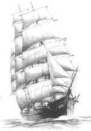

                                                                     **5**

      

                               Yazıklar olsun ki, **vakit geçti**

                                 Biz ise **çılgın aşığız**.

                                 Deli **divaneyiz.**

                                 Kıyısı belli olmayan bir **denizdeyiz.**

                                 Bir **gemiye** binmişiz.

                                 Gece **bulutlu,**

                                 **Tanrı'nın** denizinde,

                                 **Tanrı'nın** lutfuyla...

                                 O'nun sunduğu **güçle,**

                                 **Başarıyla**

                                 Gemimizi sürüp **durmaktayız.**    

                                                                                               **Mevlânâ**
