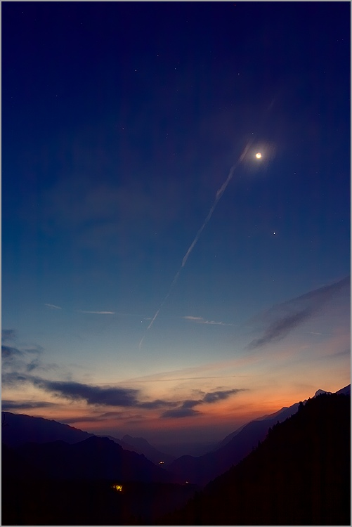

\-**5 ­**

Ces paroles **améres** qui brisent tant le **coeur**

**Miséricorde** ! Elles ne sont pas **dignes** de cette **bouche.**

Des **lévres** si douces ne disent jamais **d'amertume,**

Mon **âcre** destin est **cause** de cette **fadeur.**

\-**6 ­**

Cette **créature** au visage **radieux** que jalousent les **anges**

Venait avec **l'aube,** et me fixait de ses **regards.**

Elle a **pleuré...** et j'ai **pleuré** aussi jusqu'au **matin.**

Elle m'a **demandé**:  «De nous **deux** qui donc est I'**amant**?  »

**\-7 ­**

Le feu de ton **amour** m'illuminait,

Et l'eau de ton **entretien** nourissait la **source** de mon **coeur.**

Cette **eau** est devenue un **mirage**, et ce **feu** un **éclair.**

Ce sont des choses **passées**... ce n'était **sans doute** qu'un **rêve.**

\-**8 ­**

Le souci que j'ai de **toi** rend chaque jour mon **coeur** plus plaintif ;

Mais ton **coeur** sans **pitié** est chaque jour de moi **plus las.**

Tu m'as **abandonné,** mais Mon **chagrin** ne m'**abandonne** pas;

A dire vrai, Mon **chagrin** est plus **fidèle** que toi.

\-**9 ­**

Bien que je ne sois pas **beau,** j'aime la **beautée**

Je ne puis être du **vin**, cependant je suis **ivre de vin**.

Je ne suis pas un **homme pieux**, soit.

Du moins je suis de ceux qui **s'enivrent** dans la **taverne.**

                                                                                                                               **********Mevlânâ**

**

**Roubâ'yât,**Traduit de persan par **Asaf Halet Çelebi**

Maisonneuve **Paris**,1984**********
