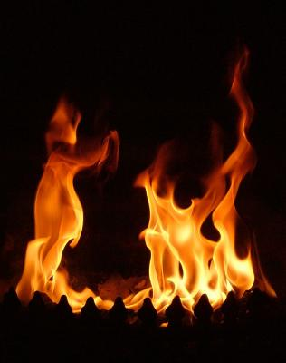

  

                                                                  

                                                                                    7                                                          

                                                              Ey seher **rüzgarı,**

                                                               Bize **haber** ver...

                                                               Geçtiğin yolda, o **alev alev** yanan,

                                                               O ateş dolu, o **sevda** dolu

                                                               **Gönlü** gördün mü ?

                                                               O gönül, yüzlerce **yalçın** kayaları,

                                                               Mermeri, **graniti,**

                                                               Ateşiyle **yaktı**,eritti.              

                                                                                                                                     **Mevlânâ**
