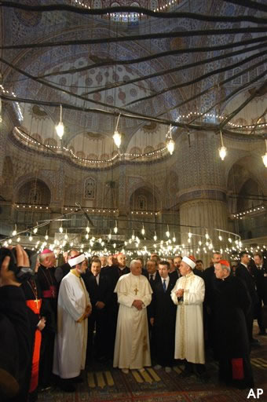

**Benoît XVI multiplie les gestes de réconciliation à Istanbul**

_Par **EuroNews**_

<table align="left" border="0"><tbody><tr><td><a href="//a763.v26131b.c26131.e.vr.akamaistream.net/ondemand/7/763/26131/v1/euronews1.download.akamai.com/26131/rm/new/cut/info-benedictXVI3011s_F.rm?')">&nbsp;&nbsp;</a></td></tr></tbody></table>

**Pour la seconde fois, un pape pénètre dans une mosquée**

Comme **Jean Paul II** avant lui en **Syrie**, [Benoît XVI](http://fr.fc.yahoo.com/r/religion.html) a poursuivi son périple en [Turquie](http://fr.fc.yahoo.com/t/turquie.html) par la **Mosquée bleue à Istanbul**, où il a été accueilli par le grand **mufti** de la ville. Si les **céramiques** bleues sont de toute **beauté,** la motivation n'est pas seulement **touristique**, cette visite a été **rajoutée** au programme du **Saint père** en signe de **respect** pour l'**Islam**. Un nouveau signe de **réconciliation** de **Benoît XVI** après l**'indignation** soulevée dans le monde **musulman** par son discours de **Ratisbonne**, où il liait implicitement **l'Islam à la violence**. **La Mosquée bleue** est érigée dans la vieille ville **d'Istanbul,** en face de **Sainte Sophie**. Le **pape** s'était **brièvement** rendu, juste **avant**, dans cette **basilique byzantine** aujourd'hui transformée en **musée.** Plus tôt, lors de **cette journée** décidément **dédiée** à la **réconciliation,** le souverain **pontife** s'est tourné vers les **orthodoxes.** Il a partagé un long moment avec le **patriarche oecuménique Bartholomée Ier**, évoquant les divergences qui **persistent** entre **catholiques et orthodoxes.** Les **orthodoxes** notamment contestent le rôle du **pape**. Les deux **églises** sont séparées depuis presque **1000 ans,** mais les deux dirigeants religieux se sont **félicités,** dans une déclaration commune, de la **reprise** du dialogue **théologique**. La visite de **Benoît XVI**, sa première dans un pays **musulman**, doit se **terminer** ce vendredi.(Courtoise **Euronews**)
