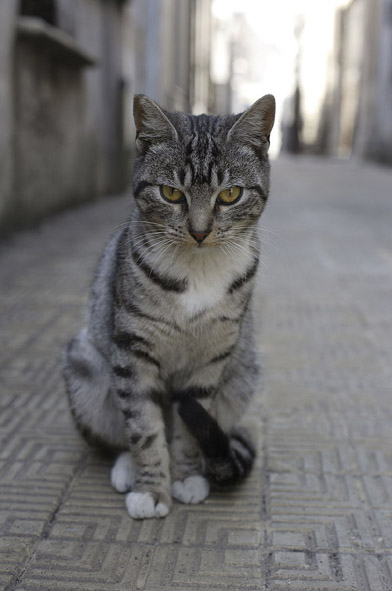

Hoca'nın tam "kadın yollarda **kayboldu** galiba..." dediği günün sabahında **Hakikat hanım** telefon etti... Gaaak. Guk

                -**Usez'e** vardım... **Claudin'in** evindeyim...

**Usez** Güney **Fransa'**da **Marsilya'**ya yakın bir kasaba...**Claudin** de **Hakika**t hanımın komşusu... Gaak. Guuuk. Tak. Turk. Tıkır...

**Hakikat** hanımın **telefonda** anlattığına göre evini **kiraya** verdiği, **keçi besleyen** kiracısı **Fred** Cuma akşamı yoldan geldiğinde onu içeri **sokmamış**... Kapıdan geri çevirmiş...Gaak, guk. O da **komşusunun** kapısını çalmış... **Allahtan** komşu evdeymiş **Hakikat** hanımı birkaç günlüğüne **misafir** etmeye razı olmuş... Olmuş ama isteksiz, **Hakika**t girdiği yerde rahat durmuyor ki, her yeri **kendi evi** zannediyor, her şeye **karışıyor**,her şeyin yerini **değiştiriyor,** herş...

                  - **Rezalet**, sen de bu **kadına** fena taktın...

                  - **Fazilet** sen sus, senin **hayallerinle** bu işler yürümez Gak...Guk, sen **iyi yürekli**, yetişkin **erdemli** bir Kargasın ama ayakların **dallara** basmıyor... Bilmiyormusun ki ? bu kadın **şirretlikle** üç ay **Hocanın** evinde misafir kaldı...adamı **deli** etti...Az daha **cinayet çıkacak**, aile **faciası** yaşanacaktı... gaaaak. Guuuk.  

                  **- Rezalet** senin adın boşuna **rezalet** olmamış, her şeyi **kötü** tarafından görüyorsun...

                  - Hayır ! ben **gerçekleri** görüyorum.

                 - **Gerçekleri** falan gördüğün yok, düpedüz **terbiyesiz,** azılı bir kargasın...

                 - **Fazilet,** kafamı kızdırma...

                  - Kızarsan ne olur ?

                 -Ne olacağını **görürsün** gaaak. guuuk... Ne diyordum, **pis karga** kafa bırakmadı ki, son zamanda hep benimle **kavga** ediyor...aramız açıldı, böyle olacağı **baştan** belliydi, bu **karga'dan** bıktım ama neyse... **Hakikat** Hanım ülkesine vardı, işlerini bitirip gene **gelecek** gaaak. O zaman ne olacak bilmem ? **Hoca** giderken "bir daha gelirsen **adam gibi gel**..." dedi. Yani "beni **kızdıracaksan** gelme..." diyor. Ama **kadın** anlamıyor, **karakteri** bozuk... yaşı da **ellisekiz**, eğitilecek gibi değil ki... gaaak. Guuuk. Ayrıca birden **karar verip** gitmesinin de sebebini yeni öğrendim, **Paşa** isimli **kedisini** özlemiş... **Paşa'**nın resmini göğsüne bastırıp ağlamıştı... demek ki **kedinin** hasretine dayanamamış... Giderken "**yaza doğru** gelirim" demişti. **Metin Sakarya** dedi ki: "bu sefer **kediyi** de getirir..." İşte o zaman kıyamet **kopar**...Gaaak.Guk.Tıssss. (Ümitsizlik sesi)
