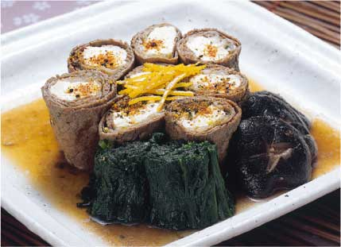

                                                   ****  

**Newyork**'ta et lokantaları yeniden **gözde** hale gelirken, bir tabak bifteğe **bin dolar** ödemek de mümkün hale geldi. **ABD'nin Japonya'dan** et ithalatına 2005 sonunda izin vermesiyle **New York'un zenginleri,** "**Kobe sığırından**" yapılan dünyanın en pahalı bifteği "**wagyu**"ya büyük **ilgi** göstermeye başladı. **Ucuz** et ve **mangal** ülkesi **ABD'nin New York** kentinde **pıtırak g**ibi açılan bu pahalı et lokantalarından **Madison** Caddesi'ndeki **İtalyan** restoranı **Nello'da,** İtalyan usulü **patates kızartmasıyla** servis edilen **450 gram Wagyu** bifteğinin tabağı **750 dolar**, bunun beyaz **trüf mantarıyla** servis edileni **1.050 dolara** satılıyor. (Teşekkürler **Hürriyet)**      

****

**Tuğrul Şavkay** (Gazeteci - Yemek yazarı) "En son **Swiss Otel'deki Miyako Restoran'a** gittim. **Atlas Kasap'ın** sahibi **Ercan Bey'le** birlikte. **Kobe sığırı yedik**. Aslında oraya üç gün önce de **Miyako Restoran'ın** aşçısı **Wolfgang'ın** davetlisi olarak eşimle beraber gitmiştik. O kadar **memnun kaldık ki,** bu sefer de **etten çok iyi** anlayan dostum **Ercan Bey'le** birlikte gittik. **Kobe sığırının** ağzımızdaki **nefis tadı** bozulmasın diye başka bir şey yemedik. Bu arada da **Ercan Bey'le** uzun uzun **etlerden** konuştuk; çok keyifliydi.   "**Miyako**'da servis çok güzel. İyi bir **Japon atmosferi** de var. Lokantanın **tek kusuru**, hani kadı kızının kusuru misali, insan bir **Japon yemeğinden** sonra iyi bir **Japon birası** içmek istiyor, ama ne yazık ki o **servisi** veremiyorlar.

"**Kobe Sığırı**" hakkında not: **Rüya gibi** bir tat: Bu müthiş lezzetin adı, **'Kobe Sığırı**.' Japonyadaki adıyla **Wagyu**, özel bir **ırktan** gelmekte. Söylendiğine göre soyu milattan sonra **ikinci yüzyıla** kadar çıkıyor.

Hayvanın **özelliği asaleti** ve atalarının geçmişiyle **sınırlı değil**. Beslenmesi ve bakımı da çok **özel.** Özellikle yaz aylarında **bira ile** besleniyor. Her gün **masaj yapılıyor**. Tüyleri **Japon rakısı** olarak adlandırabileceğimiz **sake** ile taranıyor. Tamamen **gerilimden uzak** bir ortamda tutuluyor.

Böylece **wagyu**'nun etinin yumuşacık, içi yağ damarları ile zenginleşmiş, harika bir et olması sağlanmakta. Pişirilmesi ise özel ustalık gerektiriyor.(Teşekkürler: **Tuğrul Şavkay**)  

    

Bira ile beslenen, her gün masaj yapılan, tüyleri rakıyla taranan, kilosu 700 $ harika et lokması, soylu Kobe sığırı. Devletten kaçırdığınız vergilerle ve toplumdan soyduğunuz paralarla bu sığırdan hâlâ yemediyseniz yazık olmuş hayatınıza...Gidin Newyork'ta o sığırdan yiyin ve geçen hafta Somali'de terörist Fazıl'ı ararken yüzlerce kadın ve çocuğu fosfor bombalarıyla yakan Amerikan uçaklarının yeni başarıları için dua edin... Dua edin ki, yemek yazarı Tuğrul bey'in ağzının tadı bozulmasın.(n.u.)
