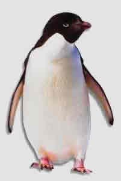

Fazilet **gagas**ı ile kafama birkaç kere vurdu...

\-Ne oluyor ? dedim.

\-Anlamayacağımı mı **zannettin**, dedi

\-**Ney**i ? dedim...

\-Neyi olacak ? yediğin **haltı** dedi. Gaaak, guuuk.

\-Ne yapmışım ki ? **dedim**.

\-Daha ne yapacaksın, hayvanın ne **etini** bırakmışın, ne **kemiğini**, günlerdir duvarın dibine sinmiş kımıldamıyor...

Başımdan aşağı soğuk **sular** döküldü, gagalarım birbirine hızla **çarpmaya** başladı, demek ki benim bir **penguen**'e saldırdığımı anladı... Eyvah... ki ne eyvah, **Fazilet** az konuşur ama bir şeyi **kafasına** taktı mı **yıllarca** unutmaz, yeri geldiğinde **taşı gediğine** koyar, şimdi bu **penguen** işini duyduysa bakın ne yorumlar yapacak... **Kapamaya** çalıştım, büsbütün direndi, anlatayım   dedim, beni **susturdu** gaaaak, guuuk, sen **namussuz** bir kargasın sus, fazla konuşma... diye **üzerime üzerime** geldi,

\- **Fazilet** dedim, ortalığı **velveleye** verme, ben kötü bir şey yapmadım.

\- Hayvana **tecavüz** etmişsin, o bana anlattı...

\- Hatırlamıyorum, ama **son günlerde** iyiden iyiye **bunaldım...**gaaak, guuuk, gatır, takır (Utanma sesi)

**Fazilet**'in dili iyice sivrilmeye başladı, bir **çıkış yolu** aradım :

\-**Fazilet** dedim, o seni kandırmış, ben **tecavüz** falan etmedim, sadece **enternetten** penguen **pornosu** indirdim. O **şımarık** şey sana **yalan** söylüyor...

Tabii **Fazile**t bu söze kanmadı, yüzüme **dik dik** bakmaya devam etti gaaak, guuuk, **Panguen** işini kapatmak için şimdilik **sulandırmaktan** başka çare göremedim,gaaak, guk. Bilirsiniz bir **dedikoduyu** önlemenin zayıf da olsa **tek çaresi** yeni dedikodular **üretmektir**, böylece olanları duyanlar **hangisine** inanacağını şaşırınca iş **mayna** olur. **Gerginlik** yerini **sallantıya** bırakır. gaaaak, guuuk, **direnç** azalır**, saldırı** yumuşar... Ben de öyle yaptım **laf** karıştırmaya çalıştım:

\-**Fazilet** dedim, bak, ben **penguen**'e falan saldırmadım, **Hakikat** in kedisine göz koymuştum,

\-Tuuuu **Allah** belânı versin senin, **kargaların** yüz karası **alçak**,rezil,gaaak,guuuk,tak,tuk.

\-**Fazilet** dedim, unutma, benim adım **Rezalet...**Boş ver şimdi, hem sen son günlerde **ortada yoktun**, neredeydin ?  

\-Hiç... **buralardaydım,** Gaaak.

\-Söyle ? sen bir şeyler **karıştırıyorsun...**

\-**Hoca**'nın yanından ayrılmadım, **adam** sıkıntıda ?

\-Neden ?

\-**Hakikat** gelecek diye korkuyor...

\-Gelecek mi ?

\-Evini **satarsa** gelir, Gaaaak. Guk.

\-**Satar** mı dersin ?

\-Müşteri varmış ama daha **anlaşamamışlar.**

\-Bu kadın bir kere daha gelirse **yandı hoca**, artık hiç gitmez...**kedisini** de getirir.

\-İşte bu yüzden **Hoca'**nın şekeri geçen hafta **500'e çıktı**.Gaaaak.

\-Ne yapabilir ki ?

\-**Malı mülkü** satıp, **pılı pırtıyı** toplayıp **kitapları** dağıtıp izini kaybettirecek...Gak.Guk.  

\-**Ölse** daha iyi...

\-Belki de ölür...Sus, **pis karga** ağzından yel alsın...Hem sen **kediyi** bekliyorsun galiba...

Yan gözle **Fazilete** baktım... **Hakikat**, **kedi** derken **Penguen**'i unuttu... **tedbir** takdire uydu, Böyle durumlarda uçup **başka dala** konmak gerekli, haydi **eyvallah**...Guuuuurk. Tıssss. Çatır. (**Uçma** sesi)
