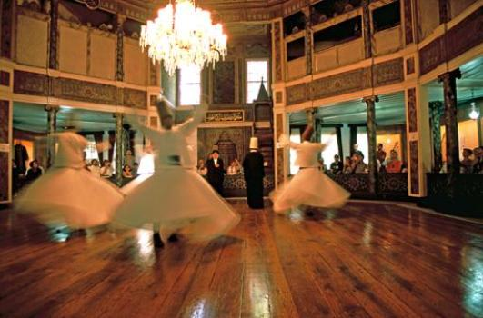

****  Resim: Galata Mevlevîhânesi, İstanbul Sema Grubu, 80'li yıllar.

**İstanbul**’un beş **Mevlevihâne**’sinden üçü kapılarını açtı, kaldı iki **Mevlevîhane**... Açılanlar sırası ile **Galata Mevlevîhânesi, Üsküdar  Mevlevîhânesi, Yenikapı Mevlevîhânesi...** Geriye kalan iki **Mevlevîhane** de **Kasımpaşa** ve **Bahariye**...

**Galata** ve **Üsküdar** Mevlevîhaneleri bundan **otuz yıl** önce, **Yenikapı Mevlevîhânesi** ise geçen hafta **hayata** yeni baştan girdi. **Galata, Kültür Bakanlığı Divan Edebiyatı Müzesi** adı ile açılmıştı. **Üsküdar Vakıflar Bölge müdürlüğünün idare binası** oldu. **Yenikapı**’nın  ise şu anda ne olacağı meçhul. **Müze** diyorlar... Göreceğiz.

 

**Türkiye**’nin bütün **Mevlevîhâneleri** ve diğer dergâhları **13 aralık 1925** tarihinde çıkarılan bir “**inkilap”** kanunu ile kapatılmıştı. **Devlet** bu kanunla yeni **laik düzenini** kurmada çok önemli, bir adım atıyor ve bu düzene uymayan **“Tekke**” kurumunu her türlü **ayrıntıları ile**  tüm vatan sathında ortadan kaldırıyordu.

 

**Galata Mevlevîhânesi**, devrin **Kültür bakanı Rıfkı Danışman’**ın pek çok **seçkin kişiye** gönderdiği **27 aralık 1975** tarihli bir **davetiye** ile kapılarını açmıştı. Böylece **laik devlet** 1925 tarihli kanundan tam **elli yıl** on dört sonra eski devrin çok önemli bir **Tekke’**sini yeni bir isimle tekrar **gündeme** sokuyordu.

 

Pazar günü yapılan **açılış** bundan **otuz yıl** sonradır. Böylece **seksen yıl** aradan sonra **Bin yıllık Anadolu tasavvuf** yaşamının **iki önemli kuruluşu**, içinde bulundukları yeni **Türk devletine** kendilerini tanıtarak, **siyasi** ve **sosyal** engelleri aşarak yeni, **modern** ve **çağdaş** bir yaşama **ilk adımlarını** atmış oluyorlar. **Rabbim** bundan sonrasını **hayra tebdil** buyursun.

 

**İstanbul**’da şimdi onarım sırası bekleyen iki **Mevlevîhane**’nin yerinde yeller esiyor. Buraları boş **arsadır**. **Kasımpaşa Mevlevîhanesi** bu ismi taşıyan **semtte** bir **yamacın** başındaydı. Büyük ve **sevimsiz** bir binaydı. **Semâhânesi**, dede hücreleri ve harem dairesi duruyordu. Her yıl **biraz daha** yıkılarak **on yıl kadar** önce yerle bir oldu. Elimizde resimleri kaldı.

 

**Kasımpaşa Mevlevîhânesini** 1925’in aralık ayında buradaki **Güreş kulübüne** vermişler. **Kulüp** derhal **binaya** el koyarak **Semâhâneye** güreş minderlerini sermiş ve **antramanlara** başlamış. Birkaç hafta sonra **1926 yılı yılbaşı** gelmiş, **Kulüp** yılbaşı gecesi için bir **balo** düzenlemiş. **Bina’**nın başka uygun yeri yok, balo **Semâhânede** yapılacak Akşamdan **hazırlıklar** tamamlanmış, o devirde “**cazbant”** adını taşıyan **orkestra** salona girmiş çıkıp “**Mutrıb”** yerine oturmuş. Başka **oturacak** yer yok.**İcrai ahenk** başlamış, aşağıda **Semâhânede** ise süslü **hanımlar** ve yakışıklı **beyler** dansa kalkmışlar, artık **Çarliston** mu oynadılar ? **tango** mu ? belli değil. Acaba diyorum **o gecede** birkaç eski **semazen** – Ne oluyor, diye **kapıdan** baksaydı, **yürekleri** burkulur muydu, yoksa – **Bu da bir tecelli**, diyerek –**Allah,** nidasıyla kendilerini **Semâhâne**’nin ortasına atarak **Çarliston** ile **Sema** arası bir **şekil** yaparlar mıydı ?  **İnkilabın** gereği...

 

**Eyyüb Bahariye Mevlevîhânesinin** **semâhâne** ve **harem** kısmı yıllar önce **yanmış,** geriye küçük bir **mesçit**, bir de ahşap, **tek katlı** bir ev kalmıştı. O evde “**Udî Şerife Hanım**” isimli **emekli bir öğretmen** oturur, **müzik dersleri** verirdi, rahmetli neyzen **Aka Gündüz** ilk musiki derslerini ondan almış daha sonra **Gavsi Baykara’**ya gitmişti.

 

İki **Mevlevîhâne** daha onarırsak **İstanbul** kurtulacak. **İş yerine oturuyor**... Bu nesil **semâ'**ları ve **binaları** ortaya çıkardı, gelecek **nesiller** de bunların içine koyacak “**Mevlevî”** yetiştirirler iş biter.

Haydi **hayırlısı,** bizden bu kadar
