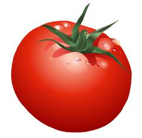

\-Hoşgeldiniz, **kimsiniz**, kimlerdensiniz ?

\-Hoşbulduk, ben **ademoğlu**, insangillerden...

\-Haa haa haa sizi **tanıyalım** adınız ne ?

\-Ali **Asgar**, İranlı.

\-Kime **misafir** geldiniz ?

\-**Yunus Paşa**'ya,

**Hoca** geçen Cumartesi günü **Taraklı**’ya gitti gaaak gaaak. Gurk. **Hoca** birkaç haftada bir **Taraklı’**ya gider, ben de **arabanın** yanında. **Kia**’nın direksiyonunda **Araboğlu**, Gaaak. Guk. **Geyve Boğazını** geçip **dağlara doğru** gittiklerinde ben biraz **yoruldum**. Guuurk, guuuk. **Boğazı** biraz zor geçtim, **hava kapalı** etraf puslu, **görüş** mesafesi, kısaydı, oldum olası **boğazları** sevmem, **rüzgarın** nereden geleceği belli olmaz, **Karga** kısmını **savurur** durur. Kanadı nasıl **tutacaksın** anlaşılmaz, **sert** dönüşlere **kuyruk** da yetmez, gaaark. **Gurk** takırrr. Tısss (Yorgunluk sesi)

**Taraklı’**ya vardıklarında **ikindi ezanı** okunmak üzereydi. **Yunus Paşa Cami’ine** girdiler. Ben de yandaki **çınarlara** konarak oranın **kargaları** ile tanışmaya gitim. **Gaaak.** Guuuk. **Taraklı** gezisinde **Fazilet** yanımda yoktu. **Guuurk**. Birkaç gündür görünmüyor. **Fazilet’**ten kurtulmanın **sevinciyle** neş’eli neş’eli o daldan bu dala **konarken** baktım aşağıda **namaz** bitmiş. Gaaark**. Hoca** camide çıkarken biri yanına **yaklaştı**. Aralarında daha önce **anlattığım** konuşma geçti. Sonra **tanıştılar**. Birlikte **mezarlığı** gezdiler. Taaaark. Tısss. **Hoca** sordu:

\-Bu mezarlıkta **çok eski taşlar** var, bunlar korunuyor mu ?

\-Yakında birileri geldi, **üniversite** öğrencileriymiş, **taşların** yazılarını okudular, **kalıplarını** çıkardılar , burayı **düzenlediler**.

\-Kayıp **taşlar** var mı ?

\-Ben **çocukken** burada daha çok **taş** vardı, şimdi **azalmış** dedi, adam.

**Cami**den çıkıp **üç gözleme** ile karınlarını doyurdular, sonra **pazara** gittiler. Gaark. Gurk. **Eski çarşıdan** geçerken **Hoca** kapalı bir **dükkanı** göstererek dedi ki:

\-Bak **Araboğlu** bu en eski **dükkan** şekli**, sokağa** bakan tarafta üstte **kepenk**, altta **tezgâh** var. Her ikisi de **menteşeli**. Şimdi **kapalı** duruyor. **Dükkan** açılacağı zaman önce **kepengi** kaldırır, sonra **tezgâhı** indirir, sonra içerden **malları** çıkararak **sokağa doğru** uzanmış **tezgâha** dizerler. Bu **dükkan** şeklini ben pek çok eski **Türk çarşısında** gördüm, en güzel örnekleri **Balkanlar**da **Saraybosna**’da “**Baş Çarşiya**” da var... Şimdi **onardılar**. Pek güzel oldu. Çok **kullanışlı**, sevimli ve **gizemlidir**. Eskiden **tezgâhın** arkasından size **güleç** gözlerle bakan **Dükkancılar**, son zamanda **Batı**’da Almanların **“kafaf”** diye **icat** ettiği sonradan gelişen “**Market”** düzenindeki **suratsız** satış **elemanlarına** benzemezlerdi... Ayrıca o asil **insanlar** yoldan geçen yayaları **zorla** dükkanlarına **sokarak** durmaksızın **tekrarladıkları** luzumsuz laflarla **kafaları** bulandırıp düşünmeye **fırsat** vermeden **mal sokuşturmayı** da denemezlerdi. Ben o **"mert"** **dükkancıya** bundan **kırk yıl** önce en son **Afyon** çarşısında rastlamıştım Yaaa... **Araboğlu,** kav çakma, bunları **öğren...**

Hoca bunları anlatırken, **Araboğlu** dükkanın **resmini** çekmeye çalışıyordu.... **Gaaak**. Guuuk. Tak Takır... **Hoca** dükkanı ve eski **dükkancı ahlâkını** öyle heyecanla anlattı ki, benim de **karga** halimle dükkancı olasım geldi... Gaaark. Acaba biz **kargalar,** dükkancı olsak, şimdiki **Turist avcısı Mısır çarşısı çığırtkanlarından** daha iyi ötebilir miyiz...? **Gaaark.** Guuurk. Tısss.

**Hoca** **Taraklı pazarında Beypazarı** domatesi aradı,

\-Yok... dediler, **Hoca**’ya yörenin yetiştirdiği **domatesi,** kilosu **iki** liradan sattılar. **Hoca** dedi ki: -Bayan **Ülker Erke**’nin geçen ay **Edremit**’ten gönderdiği sızma **zeytinyağı** tenekenin dibinde **biraz** daha kalmış, o zeytinyağını **Beypazarı** domatesi ile yiyecektik... **Yazık oldu**... Gaaark. Gurk. Ben bu işe **şaştım** kaldım. Kargalar domatesi**, zeytinyağını** ayırabilseydi ben de o zaman bu **sırlara** ulaşırdım. Bana da **yazık oldu**.... Gaaark. Gurk. Acaba **salak Fazilete** anlatsam karga aklı erer mi ?
