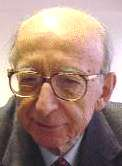

                                                

Yakın dönem **Türk siyasi hayatında** bilimsel **kariyerini** terk ederek **siyasete soyunmuş** üç insan vardır: **Şemseddin Günaltay, Fuat Köprülü** ve **Erdal İnönü.**

**Şemseddin Günaltay** bir “**İslam bilgini**” iken **Cumhuriyet Halk partisinin** yenilerek iktidarı **Demokrat Partiye** bıraktığı 1950 seçimlerinden önce **18\. Cumhuriyet hükümetinde Halk Parti’sinin** son başbakanıydı. **Fuat Köprülü** uluslar arası “**Doğu Bilim**” alanında ulaşılmaz bir **isim** sahibiyken **Demokrat Parti** iktidarının başlarından **bir kişi** olarak kendini “**Dış İşleri Bakanlığı**” koltuğunda buldu. **Erdal İnönü** de dünyaca tanınmış bir **fizik bilginiyken** Babasının adına **Siyaset** sahnesinde görüldü.

Her üçü de başarılı **siyasetçi** olamadılar. **Şemseddin Günaltay** gençliğinden beri ilmin yanında siyasetle uğraşmıştı. **1915 yılında**, otuziki yaşında **İttihad’ı Terakki Partisinden** seçilerek **Osmanlı Meclis-i Mebusanı’na** girmiş, vefat ettiği **196ı yılına** kadar **siyasetin** dışında kalmamıştı. **Batı kültürü** almış, inançlı bir **Müslümandı**. “**Zulmetten nura**” ve “**Hurafetten hakikate**” başlıkları ile yazdığı **iki önemli eserde**, o çağın tartışmalarına **ışık tutmuş** ve **İslam dininin** ilerlemeye engel olmadığını, **tam tersine** her türlü **gelişmeye** tamamiyle açık olduğunu **belgelerle** kanıtlamıştı. **Günaltay, Cumhuriyet** tarihinde ve **din-devlet** ilişkilerinde, bu devletin **temel görüşlerini** yansıtan, **uygulayan**, dini **siyasette** kullanmayı  asla **düşünmemiş**, bu konuda titiz, ** yeri** doldurulamaz bir **başbakan Â** olarak kalmıştır.

**Fuat Köprülü** büyük bir "**şarkiyatçı; Doğu bilim”** uzmanıydı. Yakın dönem **Türk aydınları** onu “**İlk Mutasavvıflar”** kitabı ile tanıdılar. Bu eserin de **bu güne kadar** bir benzeri yazılamamıştır. **Köprülü** bu eserin hazırlanışında “ **İslam tasavvuf ilminin**” bilinen tüm **ana kaynaklarını** taramış, tartışmış ve **sağlam hükümlere** varmıştı. Denilebilir ki “**İlk Mutasavvıflar**” isimli eser, **özellikle** kendine özge **tarama metodu** açısından, bir ülke insanının  **ruh yapısını** en iyi ve en ileri **derecede** inceleyen ve onun **“level”** temel **hareket noktalarını** en doğru biçimde **saptayan** bir eserdir. Alanında **bir çığır açan** bu inceleme, **Köprülü**’den sonra pek çok **bilim adamının** çalışmalarında **kaynak** ve **rehber** olmuştur.

**Erdal İnönü** ise bir **fizik profesörüydü**. Dünyaca ünlüydü, sayısız **ödülleri** vardı. Üç yıl önce **Meksika’da fiziksel matematik** araştırmalarının **Nobel’**i sayılan **Winger** ödülünü almıştı.

**Erdal İnönü** 12 yıl süren **siyasi** hayatında **parti başkanı, hükümet üyesi, milletvekili olarak** Fizikte olduğu kadar **başarı** göstermemiş olmasına rağmen **renkli bir tablo** çizmişti. **Toplantılarda,** siyasî işlerin en **yoğun** olduğu saatlerde dahi elinde bir **kağıt parçası** ve bir **kurşun kalem** problem çözmeye çalıştığı söyleniyordu.

**İnönü’nün** **SDP** başkanı olduğu günlerde **gazetelerde** çıkan bir haberde **İnönü’n**ün üçyüz yıldır çözülemeyen bir **problemle** uğraştığı açıklanmıştı. “**Pell denklemi**” adını taşıyan bu problemin, **17\. yüzyılda yaşamış İngiliz matematikçisi John Pell’den** kalma olduğu belirtiliyordu. **Problem,** haberde, ne yazık ki sadece **matematikçilerin** konuştuğuı **dille** şöylece özetlenmişti: “ **Pisagor teoreminin benzeri biçimde tamsayılarla ilgili olan “Pell” denklemi, kabaca belli iki sayının karesinin toplamının belli bir sabit değerle çarpılması sonucu ortaya çıkacak sonucun bire eşitliği…Burada bulunacak bilinmeyen katsayının, fizik ve matematik iliminde önemli yeni çıkarsamalara ön adım oluşturacağı sanılıyor.”**

**Erdal İnönü** siyasi yaşamının **doruk noktasında** yeniden **ilme** dönmeyi başarmış ve bu açıdan **ilk iki bilim adamımızın** çok ötesine varmıştır. **Bilimin siyasetten üstün** olduğunu **bilfiil** kanıtlamıştır. Bu **alanda** geleceğe **parlak** bir örnek bırakmıştır.

**Erdal İnönü’nün** vefatının üzerine **söz söyleyen** bazı siyasîler “**ondan alacağımız çok ders var**” dediler. Bence tek bir **ders alıp** onun gibi **“siyaseti bırakmaları**…” gerekir. Ama **kayda değer** başka bir işleri yok ki **biçârelerin**… Herkes **Erdal İnönü** olabilir mi ? **Rabbim** rahmetini esirgemesin. **Türkiye’nin, Türk insanının** adını**, şerefini,** ilimde **itibarını** yücelten bir insandı.
