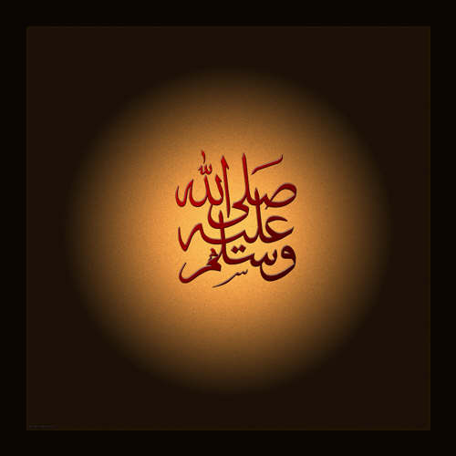

                                    

**Avrupa Parlementosu’ndan** bir **Alman** Milletvekili “**İslam’ın Avrupa’da yeri yoktur. İslam Avrupa’nın tüm değerlerine aykırıdır**…” dedi.

**Elhamdülillah**… Çok **mutlu** oldum. Böylece bu ağzı kalabalık adam**, Avrupa** uygarlığı ile **İslam medeniyeti** arasındaki **farkı** ortaya koydu… “**İslam  bize uymaz**”  Dedi. **Çok doğru** söyledi. “**Uyar**” deseydi üzülür, **kahırlanırdım.**  

Bu fark **büyüktür**, hem de çok **büyüktür**… Bence **Avrupa** ve onun  gerisinde **Pasifik okyanusun** kıyılarına kadar uzanan **Batı medeniyeti**, onbeş asırlık **İslam medeniyetinin** yanında “**Nefsi emmare”** mertebesindedir.  **İslam** ve **Müslümanlar**, son yaşanan **kanlı olaylar** yüzünden, yedi derecelik “**tasavvufi tekamül**” mertebelerinde, **zorunlu biçimde** kendilerine “**çeki düzen”** verme gereğini duymuş ve **Allahüâlem “Levvame**” ye ulaşmış olabilirler. Batılılar ise henüz “**Nefsi emmare**” nin başlarında **yer** tutmuşlardır**.** Yani doğal **itişimler** ve yontulmamış **reaksiyonlarla**  yaşayan **ilkel** nefisler. **Doğdukları** gibi kalmışlar.

**Avrupa** Milletvekilinin “**Avrupa”nın değerleri”** dediği nedir ? **Filistin- İsrail** savaşı mı  ? **Amerika- Afganistan- Irak** savaşı mı ? bunlar **felaketin** tablosunda **ilk bakışta** göze çarpan değerler. **Amerikan** iç savaşından beri **Batı’nın** iki yüz yıldır çalıp söylediği “**insan hakları”** türküsü **bu yerlerde** nereye gitti ? Neden **hiç ses** duyulmuyor ?  Dünyanın **süper gücü** ve **Batı medeniyetinin** şu sırada en **önde gelen** ülkesi **Amerika,**  terörist kovalama adına **Dünyanın** bütün **Müslüman** ülkelerine **savaş** ilan etmiştir. Yakında **İran’a** saldıracak. “**Durmayın orada yakarım**…” diyor.

**Afgan** savaşının en **kritik** günlerinde, o ülkede **dereler boyu** kan akarken, **İngilizler  Kabil’** de aç kalmış ihtiyar kör aslan **Marjan’a Londra’da** para toplayıp **et** gönderdiler. **Marjan**’ın yiyecek hakkı kadar **o ülke** insanlarının  **beslenme** hakları yoktu. Bu muydu **Batı’nın** değeri… ?  

Savaşın **Amerikan savunma bakanı Donald Rumsfeld**, bakan olmadan önce bir **ilaç** firmasında müdürdü, o firma **AİDS’e** karşı bir **ilaç** üretiyordu. Sudan’da “**Eşşifa**” isimli bir firmanın da **benzer ilaç ürettiği** anlaşılınca **Rumsfeld**, eski firmasındaki arkadaşlarına **hoşluk** olsun diye **harb** içinde bir gece **Irak’ı** bombalamaya giden **B-52 uçaklarını** gizlice **Sudan**’a çevirerek “**Eşşşifa”** laboratuarlarını **imha** ettirdi. Bu muydu **Batı** medeniyeti.

**Fransız** gazeteleri şu anda “**Nuhun gemisi**” şirketi ile uğraşıyor. Bu **şirket Afrika’nın Çat** ülkesinden **130 çocuğu** çalarak **Avrupa**’da **sapıklara** satmaya **niyetlenirken** yakalandı…

**Batı medeniyeti** birkaç yüzyıldır **Afrikayı** soyarken **Belçika**’yı **tetikçi** olarak kullanmıştı. Hiçbir **varlık sebebi** olmayan bu **ülke** şimdi dağılmak üzeredir. **Açlıktan ölmüş** milyonlarca **Afrikalı** çocuğun **kan parasını** da **boynuna** asarak gidiyor.

**Bin dokuzyüz**’lerin başında **Uzakdoğu’da Fransız sömürgesi** olan **Yeni Kaledonya’da** yerli bir kahve üreticisi **Kanak** köylüsü, kendi ürettiği **kahveyi**  içerse cezası **idamdı**. Onu asan **cellat** 15 frank **ücret** alıyor bir de **mahkumdan** kalan **kahve fincanını** yalıyordu. Zira **mahkumun** son arzusu **bir fincan kahve** içmek olabilirdi ama **bitirmeye** hakkı yoktu. Bir yudum alacak **fincanı** yerine koyacaktı. **Fincanda** kalan son **kahve** telvesi **celladın** hakkıydı. Bu muydu **Batı medeniyeti** ? **Batı**’nın yüksek **insanî** değerleri ? O **vahşî** yıllarda **Paris**’te **Şanzelize** kahvelerinde **süslü boyalı kokanalar** rahat kahve içsinler diye acaba kaç **Kanak** köylüsü hayatını kaybetti ? Hatıraları önünde **saygı ile** eğilirim.  

**Holandalılar Endonezya’yı** ele geçirdiklerinde, **insan eti yiyen** yerli **Aborijen** halklara  yamyamlığı **yasak** ettiler. Bir süre sonra **Japonlarla** savaşa tutuşunca **yasağı** kaldırdılar.  “**Japon yemek serbesttir**…” dediler. Bu muydu **Avrupa medeniyeti**…

İ**ngilizler** ilk makinelı tüfeği kullandıkları **1895 Omdurman** savaşında ilk gün **altmış bin** yerli öldürdüler. O sırada **Orduda** teğmen ve aynı zamanda **gazeteci** olan, sonraki yılların büyük devlet adamı  **Churchill,** **Londra**’ya şu telgrafı çekti: “**Medeniyetin silahları önünde 60 bin vahşî yok oldu**…”

Erken **Sömürge döneminin** İngilizleri için **dünyada** iki cins halk vardı: “**Medeniler ve vahşiler…**” Yaşaması gereken “**Batılılar**” ve ölmesi gereken “**vahşiler**” Başta **Hindistan** olmak üzere tüm sömürgelerde **ateşli silah** kullanmayı ilk onlar **başlattılar**, Fikir **Fransızlardan** çıkmıştı, **İngilizler** üzerine **atladılar.**

İşte buydu **Avrupa medeniyeti…** 

Sen boş versene sayın **milletvekili, İslam’a** karşı oluşunuzun sebebi bellidir. “**Avrupa’da İslam’ın yeri yok**”  doğrultusundaki söyleminizin kökeni sabittir**. İslam** her türlü **eşkiyalığın** sonudur. **Size yaramaz**. **İslam** bir gün **ufkunuza** yayılırsa size ve **ortaklarınıza** yer kalmaz.

**Avrupa’da  İslam’a yer yok** diyorsunuz.Destur... **İslam’da Avrupa’ya yer var mı** ?   Â
