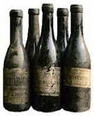

**                                                  Â** 

Bir şarap firması “**İstanbul kadeh kaldırıyor**” isimli bir **festival** düzenlemiş. Şehrin tanınmış **restoranlarının** katılımı ile düzenlenen bu **festivald**e şarabın en iyisi **ödül** kazanacak. Verilen habere göre bu festivalde **şarapseverler** 6o’a yakın **üzüm türünden** üretilen **şaraplarla** tanışmak fırsatı bulacaklar.

**Şarapseverleri** bir araya getirerek bir **şarap kültürü** yaratmayı **hedeflediği** anlaşılan  bu **festivalin** ilki geçen yıl yapılmış, **Festival** bu yıl da **başarılı** bir şekilde sonuçlanırsa gelecek yıllarda da tekrarlanacağından kimsenin **kuşkusu** olmayacak demektir.

Bir **alköl** türü olan ve **dinimizce** kullanımı, üretimi ve **satışı** yasaklanmış olan **Şarab**’ın bu ilahî emirlere rağmen **İslam** ülkelerinde kullanımı, **üretimi** ve satışı engellenememiştir. **Şarabın** şiir dilinde “**aşk”** la bir tutuluşu, bir ölçüde bu konudaki **yasağı** delmeye **bahane** sayılmıştır.

**Şarap** dinen yasak olduğu halde “**zillûllahı fil âlem”** yanı **: “Yaradanın yeryüzündeki gölgesi”** lakaplı **Osmanlı Padişahları** dahi şaraba meyletmişlerdir. Bunlardan **IV. Murat** bir zaman içkiyi ve **sigarayı** yasaklamasına rağmen kendisi **şaraptan** vazgeçmemiştir. **Osman**’ın sülalesinin son temsilcilerinden **sultan Abdülmecit**, genç yaşında **şaraptan** verem olmuş, kurtarılamamış  ve **hayata veda** etmek zorunda kalmıştır.

Osmanlı devletinin bir **İslam devleti** olup olmadığının konuşulduğu bir toplantıda, bazı araştırmacıların “**şaraptan vergi alıp devlet gelirlerine katması**” dolayısı ile bu devleti bir **“İslam devleti**” saymama **eğilimi** gösterdiklerini hatırlıyorum.

İçki’nin ve **şarabın** yasaklandığı, bu yasağa uymayanların **şiddetle arandığı** bir dönemde bir **Bektaşî şeyhi’nin** evinin altında **bostancılar** yeni doldurulmuş **şarap fıçılarına** rastlamışlar, **bostancıbaşı** sormuş :

\-Bunlar ne ?  **Efendi hazretleri** cevap vermiş:

\-**Üzüm** suyu…

\-Bunlar **seneye** böyle mi kalacak ?

\-Biz **üzüm suyu** diye doldurduk, Hikmetinden **sual olunmaz,** bilemeyiz, belki sonradan **şarap** olur.  

**Padişah IV. Murad’ın**, ilan ettiği içki yasağını bizzat **izlemek**  maksadı ile **kıyafet** değiştirip saraydan **gizlice** çıkarak sokakları **gezdiği** rivayet olunur. **Sultan** böyle bir zamanda elinde şişesi ile bir **sarhoşa** rastlar, ince **zekalı adam** Padişahı tanır, **şişeyi** arkasına saklar, **Sultan** yaklaşır:

\-Ne var **elinde** diye sorar, adam **sağ** ile tuttuğu şişeyi arkasına **saklamaya** devam ederek Sultana **sol**  elini  gösterir. **Sultan** durumu fark eder:

\-**Sağ** elini göster...der. Adam acele ile **arkasında** el değiştirerek  **şişeyi** sol eline alır ve **sağ** elini uzatır. Sultan bu defa **sesini** yükseltir:

\-**İki** elini de göster… Adam yavaşça geri geri giderek **bir duvara yaslanır** şişeyi sırtı ile duvar arasına **sıkıştırır** ve iki elini açarak **Sultanın** yüzüne bakar. Bir an **sessizlikten** sonra sultan gürler:

\-Bir adım **öne at**… O zaman hiç bir **kurtuluş** ümidi kalmayan **sarhoş**, çaresizlik içinde konuşur:

\-Halt etme **Murat**, şişeyi kırdıracaksın…

**Şarabın** edebiyat ve **şiir** dilindeki hoş **hikayeleri** sürer gider ama şu ana kadar bu **ülke** genellinde **şarab** konusunun bir **kültür** düzeyine ulaştığı görülmemiştir. Suratı **şarabın rengine** dönmüş **Batı** insanından bizim **nur** yüzlü **Doğu** insanımızın karşılıklı görüntüsü, bu **olgunun** açık işaretidir. Neye yarar ki bu **ülkeyi** ve bu insanı “**bozmaya**” yeminli  nesebi **gayri sahih** maksatlı **karanlık** çevreler, şimdi onu “**şarapçı**” yapacaklar…

**İstanbul kadeh kaldırıyor**… Hayır ! **İstanbul** eski kültürüne, eski **yaşam biçimine** ve asırlarca yerleştirdiği eski **asil tavrına** sayenizde…**baş kaldırıyor**. Sizin için biz hepimiz **şarapçıyız.**  

**Destur...** Buyurun, bir **kadeh** de bizden için.
