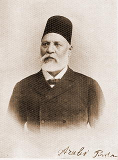

  

Arabî Paşa  

                       

Batı, Filistinli’leri **iyi Filistinli** ve **kötü Filistinli** olarak ayırdı. İyiler “**el Fetih**” kötüler “**Hamas”** İyiler **Batı Şeria’**da, kötüler **Gazze**’de. Şimdi sıra kötüleri iyilere **ezdirmeye** gelecek.

**Amerikalı**’lar bunu daha önce **Kore**’de yapmışlardı. Pasifik Okyanusundaki **Kore** yarımadasını  Güney **Kore,** Kuzey **Kore** olarak ayırdılar. O zamanın **modasına** uyarak  Kuzeye **Komünist,** Güneye **Hür Dünya** dediler ve sonra her iki tarafı birbirine **kırdırdılar.** Dünyanın tüm **ülkeleri** de bu **yalanı** yuttu. **Dünya** henüz o sırada “**Hür Dünya**” değiminin “**Dünyayı soyma hürriyeti**” anlamına geldiğini bilmiyordu. Herkes bayıla bayıla **Kore**’ye asker gönderdi, **Türkiye** dahil…

**Amerikalı’**lar daha sonra aynı şeyi **Vietnam’**da denediler tutmadı. **Dünya** artık uyanmıştı…Bu defa **tutacağını** sanıyorum zira **Dünya** çeşitli nedenlerle yeniden **karanlığa** gömüldü. Amerikalı ilk defa **Somali** saldırısında, daha sonra **Afganistan** ve **Irak**’ta basını engellemekle bu sonuca ulaştı, şimdi yarım yüzyıllık  **Kore** siyasetini yeniden **gündeme** sokacak.

**Romalı**’lardan kalma yaşlı “**divida impera**: parçala yönet” siyasetinin yakın zamanda **Amerikal**ı mimarı, ellili yılların **Amerikan** Dış İşleri Bakanı olan **John Foster Dullas**’tır. Bir ölçüde **ilkel** fakat sonradan gelişen **“Dullas”** doktrini, şimdi **İsrail**’de nasıl başarılı olur ? göreceğiz.

**Amerikalı**’lar “**parçala hükmet**” siyasi terimini, **kültürel** kökenlerinin uzandığı  **Anglo-Sakson** yönetim biçiminden aldılar. Bu **tarihsel** olayın en çarpıcı örneği **İngiltere**’nin **Mısır**’ı işgalidir. **İngilizler** 1882’de **Mısır’**a girdiklerinde o tarihten 13 yıl önce açılmış olan **Süveyş kanalı** yüzünden zaten **Fransızlar’**la rekabete düşüp **Mısır**’ı ele geçirme **planları** yapmaya başlamışlardı. Bir **Osmanlı toprağı** olan ancak Batılı **emperyalistlerin** elinde bir **kurtlar vadisine** dönüşen **Mısır**’da 1878’de **1\. Mısır Meşrutî Hükümeti** kurulduğunda maliye bakanı bir **İngiliz**, bayındırlık bakanı bir **Fransız’**dı. Bu süreç içinde **Mısır**’da milliyetçi **Arabî Paşa** direnişi görüldü. **İngilizler** 1882’den sonra bu direnişi **kan** ve **ateşle** yok ettiler. **Arabî Paşa** ve **milliyetçileri** tarihten silindiler.

**İngilizler** fiilî  İşgalden sonra **Mısırlı**’ları “**iyi Mısırlı’**lar” ve “**kötü Mısırlı’**lar” olarak ayırdılar, aynen şimdi **Amerikalı’**ların **Filistinde** yaptıkları gibi… **İyi Mısırlı**’lar işgalci **İngiltere**’ye bağlıydı, kötü **Mısırlı’**lar ise isyancı, **terörist**...  Sonra işgalin gerekçesini “**kötü Mısırlı"**lar üzerinde yoğunlaştırdılar ve bunları, kendilerine bağlı “**iyilere**” kırdırmaya başladılar.

**Londra**’nın **Mısır**’a atadığı ilk **Genel vâli**, yüzü gülmediği için “**suratsız**” lakabı ile tanınan **Cromer Lordu Evelyn Baring** daha sonra anılarında **Mısırlı**’lar için şunları yazdı:

“**Enerji** ve **girişim** yoksunu “**saf**” kişilerdir. Her zaman “**sadakatla yaltaklanmaya hazır**” entrika ve **kurnazlığa** yetenekli, hayvanlara karşı **acımasız** insanlardır. **Doğu**’lu ne doğru dürüst **yolda**, ne de **kaldırımda** yürümesini bilir. **Dağınık kafası**, yolların ve **kaldırımların** yürümek için yapıldığını **fark** eden **Avrupalı** zekâsının yanına **dahi** erişemez. **Doğulu**’lar sağlam **yalancıdır**. Hareketsiz ve **şüphecidirler**. Tek kelime ile **Anglo-Sakson** ırkının **açıklığına**, doğruluğuna ve **asâletine** ters düşerler"

**Mısır**’ı “**demir elleri ile**” **25 yıl** yöneten **Kromer Lordu** bunları yaşlılığında yazdığı “**Modern Mısır”** kitabında dile getirmişti. **İngiliz Vâlisi** tam anlamı ile görmek istediği ve **İngiltere**’nin işgalini **haklı** gösterecek bir **Mısırlı** tanımı yapmıştır. Aynen şimdi **Amerikalı’** ların çizdiği “**Hamas**” yanlısı **Filistinli** gibi...  Daha önce çizilen “**Kuzey Koreli** “ ve “**Kuzey Vietnamlı**” portrelerindeki genel çizgilerle…

Lord **Cromer'**den önce **Mısır**'da ahlâki ve **siyasi** mücadele veren **Arabî Paşa** ve arkadaşları acaba Lord'un "**yaltaklanmaya hazır**" dediği **cinsten** insanlar mıydı ? Elbette hayır, **İngiliz** geldi, o dürüst **insanlarıÂ**  ortadan kaldırdı, geriye **İngiltere**'ye ve işgale uygun **köpek** suratlı "**yalakalar"** kaldı.

İşte o **"yalakaları"** tarif ediyor **Cromer**. Bunu siyasi yatırım gereği **bilerek** mi yapıyor ? yoksa kendi **medeniyetini** yüceltme iç **güdüsüyle** bilmeden mi ?  işte onu **kimse** bilmiyor . Her ikisi de ağır  **ceza** gerektiren açık seçik **insanlık** suçudur. Adamların hem **memleketlerini** ellerinden al hem de **onları** türlü hakaret **ve iftiralarla**  yerin dibine **batır.**

Dünyayı **iyi** ve **kötüler** diye ayırıp böylesine **bozmak** için kimden  **yetki** aldıklarını bir gün insanlar, **bunlara** sorarlar…
