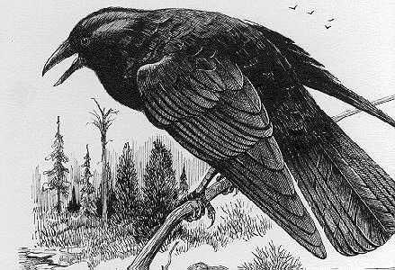

                      

Hoca geçen hafta **İstanbul**’da konser verdi. Gaaaak. Biz **Fazilet’**le ağaçtan ağaca konarak **konserin** verileceği yeri aradık. Uzun süre **Taksim Beyoğlu** dolaştık. **Parmakkapı**’da **Ağa Cami**’inin çatısına konmuş **kargalara** sorduk… Gaaak guuk. **Tarif** ettiler, yine bulamadık, sonunda **İstanbul** trafiğinde kaza geçirip **topal** kalmış bir **karga** bize **yol** gösterdi. Gurk guruk. Güç bela **Fransız Konsolosluk** bahçesine ulaştık. Bir **pencerenin** yanına konduk… **Fazilet** dedi ki:

–Burası  **Fransız toprağı** bizden **vize** istemesinler ?  Benden önce **topal karga** konuştu:

–Korkmayın **istemezler**,  bir ara isteyecek oldular, sonra bunların **parası** yoktur diye **vaz** geçtiler…

Pencereden içeri baktık, **Hoca** müzisyen arkadaşları ile sahnede **prova** yapıyor… Gaaak. Gurk. Karşısında **Hakikat** hanım oturuyor. Yanında onları yeni arabasıyla **Sapanca’**dan getiren emlakçı **Mustafa Bilgin**. **Hoca** dedi ki:

–**Mustafa** emlakçılıktan **çalgıcılığa** terfi etti. Bundan sonra ev satarken **ney** üfleyecek…

Hoca **konsere** çıktığı saatlerde oldukça sıkıntılıydı. **Fransızlarla** günlerdir boğuşmuş, bir türlü **müzisyenlerin** kaşesini imzalı kağıtların arasından **çekip** çıkaramamıştı. Gaaak. Gurk. Hiç böyle bir **iş** gelmemişti adamın başına, gark. Ne zaman **konser** düzenlese kendisine eşlik eden **san’atçıların** alın teri hakkını **önceden** öder, herkesi **rahatlatır**, sahneye öyle çıkarırdı, bu defa **başaramadı**… Bütün **çabaları** boşa gitti… Buna rağmen **programda** çok önemli bir aksama olmadı. Herşey **düzgündü.**

**Hoca** kafasında önceden **tasarladığı** düzeni rahatlıkla sonuna kadar **götürdü**, bir buçuk saat çaldı söyledi, neyzen **Volkan**, tanburî **Alper**, Kanunî **Hakan** da ona tam **uyum** sağladılar. İstemediği, beğenmediği **hiç bir şey** yapmadılar, istediklerini de **hemen** yerine getirdiler. Gaaark. Ben **müzikten** anlamam **Fazilet’**e sordum: –**Nasıl** oldu…? Dedim. –Çok **iyi** dedi… **Fazilet** sonradan hoca ile konuştu gaaak. Gurk. **Hoca** ona demiş ki :

–Salondan  sorun çıkmadı, her yer doluydu… **Ses** ve **ışık** iyiydi. Ben tanıyan çok **kişi** gelip ön sıralarda yerini almıştı, bizim evin eskisi Meb’us **Ahmet Tan** bile **Ankara**’dan gelmişti, kırk dört yıl önce **Edremit** 57. **Alay**’da askerliği beraber yaptığımız **Bekir** ve **Ergül** de oradaydı. Semazen **Şahin** **Şair** bana su getirdi, **Fatih Söğütlü** suyu sahneye uzattı. Kağıttan bardağın üzerinde  **coca cola** yazısını görünce **espriyi** kaçırmadım, bardağı **havaya** kaldırdım ve –Gördünüz mu ? **Bakın**, bu bir **reklamdır**…dedim. Herkes **gülüştü**. Bir saatin sonunda sesimin **yorulduğunu** fark ettim. –Artık **gideyim** dedim, **bırakmadılar**, birkaç **parça** daha söylettiler…   

Hoca bu **konserde** artık **yorulduğunu** anladı gaaaak. Guuuk. **Ihı…ıhı**… **70 yaşında** adam, kırk yıldır **halkın** önüne çıkıyor, daha **yorulmasın** mı ? Ben bile dayanamam.

**–Fazilet**  sen dayanabilir misin ? 

–Kargalara **böyle şeyler** sorulmaz bilmiyor musun ?

–Ben **sorarım…**

–Sorarsan **ayvayı** yersin, O **adam**; sen **kargasın** gaaaak. Gurk. O bir hamlede **yüzlerce şiiri** namesiyle beraber **arka arka** sıralamayı **yarım yüz yıl** önce öğrendi, sen daha **babanın** karnında **sübye,** ananın **yumurtasında** takırtıyken o **tekkelerde** geziyordu. Gaaak. Gurk. Tısss. **Sahneye** çıkmayı **talihsizlik** sayıyor, kötü **kaderinden** biliyor. Guuuurk. O, **garipler** yurdunda**, ahîler** sofrasında**, dervişler** ocağında, **şeyhler** eşiğinde dolaşmayı seviyor… Yıkık **tekkelerde**, harap **mabetlerde** eski zamanlardan kalma **nurlu yaşam** kırıntıları arıyor. İnsanlar adamı **saatlerce** durmadan, dinlenmeden dinliyorlar, sen **ağzını açsan** herkes kaçacak **delik** arıyor… Gaaark Gurk.

–Ben **ilahî** söylesem **kimse** dinlemez mi ?

–Dinleyen çıkar, **ses** yarışmasına gir, **kargaların** da meraklısı var…

–Dur,  **söyliyeyim** de dinle…

–Aman **Rezalet** sus, **Hoca** duyacak…
