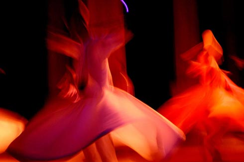

**                          Â** 

Vaktiyle **Mevlevî** tekkelerini kapatan **Devletin** zirvesi “**Ne olursan ol gel**…” deyince hepsi birden **Mevlânâ**’ya koşmuşlar… **Tören mangası** olup sıra sıra **gösteri salonunda** yerlerini almışlar. Ne olduklarını **kendileri biliyor**, ama yine de kısa yoldan **bir kere daha** öğrenmeye **Hz. Pir**’e sığınmışlar.

**Mevlânâ** sağlığında bunlara **yüz** vermemişti. O sırada yıkılmakta olan **Anadolu Selçuk Devleti’**nin son baş veziri **Muiniddin Pervâne**’nin yüzüne bakmamıştı. **Vezir Pervâne** ağlaya sızlaya **Pir kapısına** geldiğinde **Mevlânâ** medresenin **başka tarafına** geçmişti.

**Uhrevî** saltanatın **yüce** sultanlarının  **Dünya** saltanatının **cüce** umerâsı ile ne **işleri** var ?

**Mevlânâ Muiniddin Pervane**’yi gördüğü zaman neden **başını** çeviriyordu ? Bana kalırsa  **Devletin** kuruluşunda en büyük çileyi çeken “**Türkmenleri**” darılttığı için… Aynı şimdiki **Devletin** bir “**laik”** lafı tutturarak **Müslümanları** darıltması gibi…

Ben küçükken rahmetli **babam** bana bir **şiir** ezberletmişti. **Doktor** babamın sınıf arkadaşları eve geldiğinde beni **masanın** üzerine çıkarır o **şiiri** okuttururdu. “**Gülhâne**” ‘nın eski öğrencileri hep **gülüşür**, eğlenirlerdi… **Şiirin** çok az bir bölümü  **aklımda** kalmış :

 “**Ne Budha’lar Brahma'lar,** **   Ne Muhammed ne de İsa.  Â**  **Bize el uzatmadılar…”** 

Sanırım bu **şiir** o devrin gözde şairi **İsmail Hakkı Baltacıoğlu**’nundur. **Türk İstiklal savaşında** hiçbir yerden yardım **almadığımızı** ve yalnız kaldığımızı **şair hayalleri** ile anlatıyordu. Aradan **uzun yıllar** geçti, sonra bir başka gözde şair **Behçet Kemal Çağlar**, 50’lı yılların sonunda Harbiye’deki **İstanbul Radyosu’**nun üst katındaki **odasında,** bana “**Muhammedin ne azgın olduğunu ben bilirim**…” demişti. Eve gelip **ağlamıştım…**

Bu günlerde artık **peygamber düşmanı** şairler aramızda yaşamıyor… Varsa da ben **duymadım**. Ama yüreğim **küçüklükten** yanıktır. Bu **devletin** bir büyüğü ile **aynı** sokaktan yürüyüp **Mevlânâ**’yı ziyarete **gitmem** ben... Başka **yerden** giderim. **Devletime** saygım sonsuz… Şarkın en **kabadayı** ulemasından **İmamı Gazal**i’nin değimi ile “_Devletsiz ve kanunsuz kalan insan topluluklarının daimi çatışmalarla birbirlerini yok ettiklerini_” de bilirim. Lâkin muhteremlerin **Mevlevî tekkelerini** kapatıp yerine **Oper**a açmalarını **anlamaya** asla **gücüm** yetmiyor.

Sırada “**gel gel…”** şiirinin üzerindeki **kuşku** var… Efendiler, bu şiir **Mevlânâ**’nın  olamaz… Zaten **büyük** araştırmacı rahmetli **Abdülbaki Gölpınarlı**, o şiirin **Mevlânâ**’ya değil, **Yusuf KâşÃ¢nî** isimli bir **başkasına** ait olduğunu söylerdi… Ben ise **kesin** inanıyorum ki bu sözler **Mevlânâ**’nın ruhuna aykırıdır. Öncelikle **din terbiyesine** ve **etiğin**e aykırıdır. “ **Tövbesini bin kere bozan adam**” hangi dinin **malı** olabilir ki ? Diyelim ki **öyle** olsun… Adam bir kerre daha **tevbe** etti, **Pir’in Dergâhına** sığındı. **Lâki**n son **tevbe**’nin de bozulmayacağını kim **garanti** ediyor…?   

Ayrıca **Mevlânâ**’ya yakıştırılan bu **şiirin** bir satırında “ **Dergehi ma dergehi nevmidi nist**” cümlesi var. Bu cümle “**Benim dergahım ümitsizlik dergâhı değildir**” anlamını taşıyor. “ Bu ne **demektir** ? Bunun “mefhum u muhalifinden” diğer dergahlar “**ümitsizlik**” dergahıdır, anlamı çıkıyor. Buna **Fahri Kâinat** efendimizin **dergahı** da dahil mi ? Hadi **canım** sende…

**Pir** olan **âdem** böyle şey söyler mi ? Bu **lafları** kim uydurmuşsa bu **çağın** insanı için uydurmuş… Zamanın **devâsız  dertlerine**  reçete yazmış. Bir **kağıda** kaydedip **yarım bardak** suya atıp **içmeli,** iyi gelir… Ruha **ferahlık** verir.

Sen “**Ne olursan ol, ne istersen onu ol**…” Beni **bırak**, yeter ki beni **kendine** uydurma.
