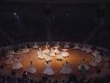

     Nâmûsu câhı çaha atan Mevlevîleriz

     Dünyâ-yi dûnu hiçe satan Mevlevîleriz

     Deh rûze kâr ü bârını dehrin hebâ kılıp      Peygûle-i fenâda yatan Mevlevîleriz

     Ârâmımız semâ iledir rûzgarda      Girdab-ı bahri aşka batan Mevlevîleriz

     Telhî-i fâka etmek için nefsimiz helâk      Hân-ı vücûda zehr katan Mevlevîleriz

      Biz ey NESİP devlet-i Mollâ-yi Rûmda       Dünyâ-yi dûnu hiçe satan Mevlevîleriz   

                                Yenikapı Mevlevîhânesi Şeyhi

                                 Seyyid Yusuf Nesip Dede

                                18. Yüzyıl başı
