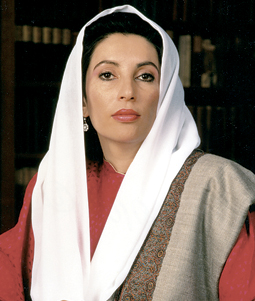

Dost **Pakistan**’ın yürekli politikacısı **iki kurşun,** bir bombayla hayatını kaybetti. **Bile bile** ölüme gitti. Âdetâ: “**gelin beni öldürün…”** dedi. **İntihar** gibi bir şey. **Ölüm** bu ailenin **geleneğiydi.** **Pakistan**’da halkın karşısına çıkanlar **politikaya** başlarken **ölümü göze** alıyorlar… **Ölümü** hak etmişler. **Babası** da öldürülmüştü. **Geleneği** bozmayan k**ızı** ise zaten ölüydü.

Bu **Ülkede** ölüm, **politikanın** devamıdır. . **Hindistan**’ı **İngilizler'** den kurtaran tarihin en ünlü **siyasetçi** ve vatanperveri **Mahatma** **Gandi** de bu **dünyadan** bir suikastçı **aracılığıyle** ayrılmıştı. Kızı Başbakan **İndira Gandi’**yi koruması **öldürdü**.

Tanrı ölenlere **rahmet**, kalanlara **merhamet** etsin…

Ölmek **politikacının** şanındandır. Vaktiyle **Türkiye**’yi on iki sene yöneten **İttihad-ı Terakkî** **triomvirası**’nın **üç başkanı,** süikastçı kurşunuyla **terk-i hayat** eylemişti. O da **bir hizmet**. Bir **ülkeye** yaşayarak da **hizmet** edilir, ölerek de… İyisi **yaşayara**k hizmet etmektir. **Görevi** başında ölen **politikacı** da şehittir.  Kalan **gâzi**… Er meydanında, **savaş** alanında ölen “**Şehit**” de devlete **arka** çıkmaya çalışırken ölen **şehit değil mi** ?  Politika mesleğinin **kaderi** bu. **Tanrı** şehitlerden yanadır.

**Pakistanı** altmış sene önce **İngilizlerin** desteği ile **Hint Müslümanları** kurdu. **Pakistan** kurulduğunda **Hint Yarımadası**’ nın  tüm **Müslümanları** arabalarla taşınarak bu **Ülkeye** doldular. Bazıları gitmek istemedi. **Hindistan**’da çok az **Müslüman** kaldı. **Pakistan** **“bir İslam Ülkesi”** olarak doğdu.

Ancak **Pakistan** bir türlü **düzelemedi**. Kuruluşunun üzerinden **yarım** yüzyıldan fazla zaman geçmesine rağmen bu **Devlet** kendini toplayamadı. **Kurumlarını** geliştiremedi, **kamu hayatını** sağlam esaslara bağlayamadı. **Irak’**ta olduğu gibi bu yörede de **idare,** devamlı olarak **darbelerle** el değiştirdi. Her **iktidara** gelen, öncekini **öldürerek** egemen oldu.

Ben bu **Ülke’**nin son zamanda bütün **macerasını** izledim. Rahmetli **Bhutto** Hanım’ın Babası rahmetli **Zülfikâr Ali Bhutto** zaman zaman **Türkiye**’ye gelirdi, biz **gazeteci** olarak **adamı** yakından izlerdik. Uzun boylu ve **yakışıklıydı**. Acırdık adama, **bir gün**  hain bir **süikastte** öleceği belliydi. **Hayatı** uyduruk bir **mahkeme** sonucunda **asılarak** son  buldu.  

**Kızına** sıra geldiğinde artık **ölümlerin** sona erebileceğini düşünmüştük. **Yanılmışız**… Bir gün müdürü ziyaret maksadı ile **Ayasofya Müzesi’**ne gitmiştim. Müştemilatın kapısına doğru yürürken **Merkez** binadan **korkunç** tavırlı, **sert** bakışlı, uzun **boylu**, çevreye **telaşlı** nazarlar fırlatan **esrarengiz** adamlar çıktı. Yeşil **üniformala**rı ütülü ve tertemizdi, başlarındaki **ber**e yağız delikanlılara doğrusu pek yakışıyordu.

En son **model** sofistike **silahlar** taşıyorlardı. Her an **ateş etmeye** hazırdılar. Tetiğe bastıkları anda **mahvolabilirdik**. Hasbelkader **Ayasofya**’nın avlusunda titreşen bizler, **hazan yaprakları** gibi **sapır sapır** dökülebilirdik. **Katliamda** muhteşem Mabed’in tertemiz **mermerleri**, diz boyu **kana** bulanabilirdi. **Kudüs’**te **Haçlı** saldırısından sonra **15 temmuz** 1099 cumartesi günü  “**Harem-i Şerif**’te” olduğu gibi.

**Bunlar** kimler ? Burada **ne** arıyorlar ? derken içerden bayan **Bhutto** çıktı… Başından devamlı kayan **Hint sârî** kumaşından **başörtüsünü** düzelterek yürüdü… **yanımızdan** geçti. Önünde, arkasında, sağında solunda, üstünde altında her tarafında **Ecyad** kalesi gibi korumalarla ** cem-i gafir** halinde ilerliyordu. **Kalabalık** ağır ağır yürüyen **zırhlı** bir **tank** gibiydi. **Bakakaldım**… Soğuk soğuk **terlemeye** başladım.

Bir **patlak** vukuunda nereden **kaçarım,** diye hesaplarken gözüm **kalenin** ortasındaki **biçâre** kadına takıldı. Bu kadar **silahlının** ortasında nasıl da **rahat** yürüyordu ? **Deli** olmalıydı. O **korkunç** adamlardan biri **silahını** çevirip onu **öldüremez** miydi ? Nitekim bu olaydan az bir zaman sonra **Hint Başbakanı bayan İndira Ghandi**’yi koruması öldürdü. Keşke böyle **şeyler** aklıma gelmeseydi. Bayan **Bhutto**'nun kaderiyle **oynamış** gibiydim.

Bu **ülkede** kim kimi, **neden** öldürüyor ? **belli** değildir. **Öldürüyor** işte… Herhalde **ölümden** bizim gibi **korkmuyorlar.** Belki yaşarken de **ölmüşler**… Belki **yaşamaktan** canları sıkılıyor… **Şevket Süreyya Aydemir**’in “**Suyu arayan adam**” kitabında anlattığı gibi **Rus halkı** örneği  topluca **ölmeye** can atıyorlar.

Bayan **Bhutto** öldü. Şimdi bir süre sonra bu **aileden** bir başka **hanım** veya **bey** çıkacak “**Ben Bhutto’ların devamıyım, beni de öldürün”** diyecek onu da **öldürecekler**. Kim ne kazanacak…? **Pakistan** müreffeh olacak mı ? **Halkına** güven sağlayacak mı ? **Hukuk** ve **İktisadı** yerine oturacak mı ? **Hür** ve **şerefli** ülkeler arasına gururla katılacak mı ?   

Bu ülkede “**İslamcı, terörist, anarşist, şeytan ruhlu, muzır, tahtakurusu gibi ölmeye hazır**” olarak anılan rejim karşıtlarına, hayat hakkı tanınacak mı ? Yoksa bu **Ülke**, ortaklıkları **Batı**’nın ve **ABD’**nin bilmem hangi **şer** odaklarına kadar uzanan **gizli sahipleri’**nin hain ve kanlı  **emellerine** kurban olacak mı ?   

Bir **konu** daha var: **Batı** basınından tercüme **Türk Medyası**, müteveffa bayan **Bhutto** için “**İslam ülkelerinin ilk kadın başbakanı**” diyor… Anlamadım… **Ne demek** ? Bu memlekette eski başbakanlardan bayan **Tansu Çiller** Müslüman değil miydi ? Bu ülke bir “**Müslüman ülkesi”** değil mi ? **nasıl** olur da, bayan **Benazir Bhutto**, dünyada ilk **Müslüman** başbakan olur ? **Rejim dolayısıyle** diyeceklerse bu da **laf** değil.

“**Bînâzir: eşi yok**” sözcüğünü  **İngilizce’**ye çevirirken “**Benazir** yapan **Batı** basını, bu ismin **Türk** haber diline “**Benazir**” olarak girmesinden de **sorumludur**. Vaktiye biz basında, yıllarca **Endonezya** Devlet başkanı, Müslüman **Ahmet Şükrânî**’yi,  **Batı**’nın bize **ezberlettiği** biçimde “**Sokarno**” olarak yazmıştık. **Cezayirli “Ebu Meyden:** Medyen'in sülalesi**”** tanımını  da  **Fransızca**’dan tercüme “ **Bumedyen**” olarak söylediğimiz gibi… Basın daha bayan **Bhutto’**nun adını **belleyemedi**… Haberlerini nasıl doğru **dürüst** verecek ? **Şaşmak** gerekir.

**Rahmet** olsun. İnşallah bu **son** olsun…
