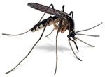

Ey iman **incisini,** Bir **ekmek** karşılığı veren. Ey gönül **madenini**, Bir **arpaya** feda eden, **Nemrud** gönlünü **Hakk**’ın dostu İ**brahim’e** Teslim etmedi de **Sonunda canını bir** **Sivrisineğe** verdi.           

                      **Mevlânâ**
