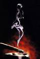

Bu sendeki **gurur**

Daha ne **kadar** artacak ?

Her çeşit görünüşün, **hayallerin**

Daha ne kadar **sürecek** ?

**Süphanallah** sende **şaşılacak** bir tavır,

Anlatılmayacak bir **iş,**

Bir **hal** var.

Ben sana **“hiç”** diyeceğim ama,

Sen hiç **bile** değilsin...

Bu kendini **bir şey görmen**

Hep senin **kuşkularındır.**

**                               Mevlânâ**
