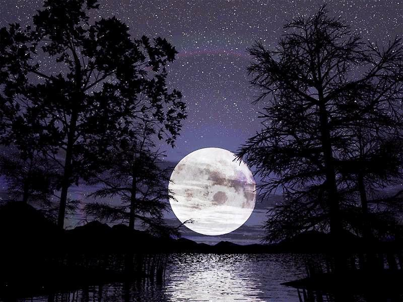

****

**Âlemler** nura gark oldu **Muhammed** doğduğu **gice** Mü’min münafık **fark** oldu **Muhammed** doğduğu **gice** 

**Arşın nuru** yere indi, **suyun rengi** nura döndü

Hep susuzlar **suya** kandı **Muhammed** doğduğu **gice**

**Huri** kızları geldiler, **kundağın** bile sardılar **Muhammede** yüz sürdüler **Muhammed** doğduğu **gice**

**_YUNUS_** der ey **kardaşlar**, akar **gözden** kanlı yaşlar **Secde** kıldı **dağlar** taşlar **Muhammed** doğduğu **gice**   

                                                      ****Yunus Emre****
