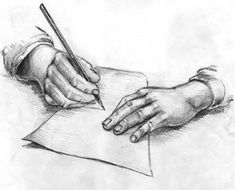

Bir **yazar** gece yarısı evinden alınıp **kırk yıl önce** yazdığı bir yazıdan dolayı **sorguya** çekilirse, o ülkede yazı yazmak **yasaklanmış** demektir… Yazmak da **yasak**, düşünmek de… Orada artık hiçbir **akıllı** yazı yazmayı ve düşünmeyi **aklına** getirmez.

Bir yazar **gece yarısı** evinden **alınıp** sorgulamaya götürülerek “_kırk yıl önce şunu yazmışsın, bunu yazmışsın, neden yazdın ? amacın neydi ? kime hizmet ettin_ ? ”  diye **sorguy**a uğradıysa o ülkede yazı yazmanın **kırk yıl sonrasını** da düşünmek gerekir. O halde en iyisi **yazmamalı**, düşünmemeli, bu işlere hiç **bulaşmamalı**… Başını **belaya** sokmamalı.

Bu **mantık** dünyayı durdurur, **uygarlıkları** tersine çevirir, **gelişmenin** önünü keser, bu böyle giderse - ki  gideceğe benzer - **hayat durmuş** demektir. **Mağara** devrine geri döndük, “**sil baştan**” oldu…herşey **yeniden** kurulacak.

Yarın ölüleri de **sorguya** çekecekler, Vaftizci **Yahya**’ya **İncil**’den soru soracaklar: " _Şu **ayeti** neden tekrarladın ? **Tanrıyı** nerede gördün ki, onun **ağzından** konuşuyorsun ? **Kanıt** göster, amacın nedir ? **Yedi kilise'ye**, yedi **mektubu** neden yazdın ? hangi **örgüte** hizmet ediyorsun_ ?" **Musa**’ya soracaklar: " _**on emri** kimden aldın ? örgütünüzün **lideri** kimdir ? Sen kimin “**fikir babasısın**_” **Buda**’ya soracaklar: “**_Kama Sutra_**_’nın poşetlik olduğunu bilmiyormusun_ ?" **Mevlânâ’**ya soracaklar: “**_Eşek_** _hikayesini **neden** anlattın, kime **mesaj** verdin_ ?” **Martin Luther**’e soracaklar: “_**Papa’ya** neden kafa tuttun ? **Kilisenin** kapısına neden **bildiri** astın_ ? ”

Bunun **sonu** gelmez…Vaktiyle **kılçık** konularda **yazı yazmaya** niyetlendiğimde bir **basın savcısı** arkadaşım vardı, ona sorardım.– Şu  yazıda **suç** var mı ? – Şimdi bilemem, sen **yayınla** da bakarız derdi.

Kırk yıl önce **Ankara**’da **Parlemento** muhabiriyken şehirde **gazetecile**r arasında bir haber yayılmıştı, **Newsweek** veya **Time** gibi tanınmış bir İngilizce **siyasî derginin** o hafta çıkan  sayısının kapağında yer alan **Stalin**’in resmi dolayısıyle derginin **Ankara**’da görev yapan **Türkiye** muhabirini tutuklamışlar, sonra **ne oldu** bilemedik. Acaba **adamı** bıraktılar mı ?

Bir zaman şunu **duymuştuk**: Polisler **Cizre**’de bir yerde **sufilerin** gizli bir **toplantı** yaptığını haber almışlar, **gidip** bakmışlar, toplantı **Beyazıd-ı Bestâmî**’nin makam **türbesinde** yapılıyormuş , herkesi **dışarı** çıkarmışlar, arabalarla **emniyete** götürmüşler, **savcı** sormuş:

 –Neden **toplandınız** ?

 –**Beyazıd-ı Bestâmî’**yi anmak için…

 –O dediğiniz **kişi** kimdir ?  orada mıydı ?

 –Hayır yoktu…**Pir**’imizdir, biz hepimiz **O’na** bağlıyız.

Ve **savcı** 9. yüzyılda **Basra**’da yaşamış **Beyazıd-ı Bestâmî** için o gün, **tevkif müzekkeresi** çıkarmış, polisler o gün **Cizre**’de ev ev **Beyazıd-ı Bestâmî**’yi aramışlar.

Uygarlık bir **süreçtir**, uygar olmaya çalışmak bir “**denemedir**” olabilir veya olamazsınız, ama bunun bir tekniği var: “**insan düşüncesine ufuk açma**k” İnsanı **insan** olarak yorumlayarak ona yapısına uygun “**gelişme ortamı**” sağlayacak **önlemleri** almak. Bunun  adı **uygarlıktır**. Bunun tersi **vahşettir**. Uygarlığı **yasaklar**, önünü keser, **hayatı çekilmez** kılarsanız bu insanlık **suçudur**.  Siz uygarlık adına “**düşünmek yasaktır**” uygarlığı kurar ve böyle yaptığınızı **fark** dahi edemezsiniz. Değerli **uygarlık bekçileri**. Siz hangi **örgüte** hizmet ediyorsunuz ?
