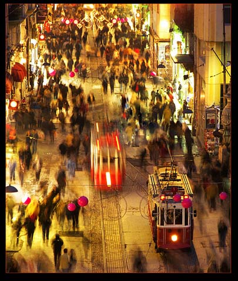

                       

Birden **ortalık** karıştı, **sesler** yükselmeye başladı, ihtiyarların **kavgası** da ilginç oluyor, taraflar **sinirlenip** bağrışmaya koyuldu  mu **çatlak zurna** gibi sesler çıkmaya başlıyor, **gençlerin** kavgasında duyulan o **kalın** ve **vahşî** sesler ihtiyarların kavgasında yerini **cırlak seslere** bırakıyor, yüksek **tonajda** kelimeler **nefes** yetmezliğinden küçülüp **dertop** oluyor. **Kamçı** darbesi gibi… Kimin **ne dediği** anlaşılmaz **düzeye** çıktığında da  artık garip bir **ses akordunda** her şey, **arap saçına** dönerek hayat **çekilmez** oluyor, o anı yaşamaktan adam **çekimserlik** göstermeli …

Geçen cumartesi akşamüstü **Beyoğlu**’nda **Ağa Cami**’de **Hasnun Galip** Sokağında **Simurg** kitabevinde benzer bir **sahne** zuhur ettiğinde olayın **vehâmetini** kavrayan **Rezaletle Fazilet** kargalar karşıki **balkona** kondular, **Fazilet** her zamanki **saflığı** ile **rezalete** sordu:

\-Ne oluyor ? bu da **nesi** ?

\-Dur **Fazilet**, kafamı karıştırma **anlayamıyorum**…  

**Fazilet** **Rezalet**’in yanından ayrıldı bir **başka** yere konarak **kitapçı** dükkanın içini **kerteriz** aldı, insan **kafalarının** arasından olayları **görmeye** çalıştı, bir takım **yüksek**  sesler duydu, çözemedi. Bir ara **Hoc**a’nın sesini duyar gibi oldu, **aniden** yerinden fırladı, **kanat** vurup **Rezalet’**in yanına yaklaştı:

\-Duydun mu **Hoca** bağırıyor ! gaaak guuuk guruk (endişelenme sesi)

\-Duydum **duydum**… görüyor musun **? sol** yanında iri yarı **mor gömlekli** şapkalı **gözlüklü** bir adam var, ona bağırıyor, o da **Hoca’**ya bağırıyor….Bak **Fazilet**, döğüşecekler galiba **gaaak.** Guuurk.

\-Koca adamlar **döğüşür  mü** ? senin gibi **karga** mı onlar ?

\-**Sus** şimdi… **kapa gaganı**, sonra konuşuruz, ben **duyamıyorum**, ne konuşuyorlar ?

\-Hoca diyor ki “ **Koskoca bir millet nasıl cahil olur, cahil sizsiniz**…”

\-**Adam** ne diyor ?

\-Sen okumuşsun ama **boş** okumuşsun, ben **Anadolu’**yu gezdim, halk **cahild**ir, seçimden, **demokrasi’**den anlamaz bunlar **sopadan** anlar, **AKP**’yi hemen kapamalı… Bağırma **terbiyeni takın.**

\-Hoca’nın **can dama**rına dokunmuş, **Demokrasi’**ye çamur  atıldı mı adam **çileden** çıkar… Gaaak.

\-İşte bak **rengi** attı, saçları dikildi, **şekeri** fırladı, **tansiyonu** çıktı… Gaaark guruk (Korku sesi)

\-**Rezalet** birşeyler yap, **adam** gidiyor, git o herifin **kafasını** gagala… Gaaaark.Tısss…

\-Ayol **deli** misin, ben **kargayım** elimden ne gelir…?  

\-Karga marga **Hoca’**yı kaybediyoruz...

\-Bişiii olmaz ona, **işi** toparlar…Gark.

**Rezalet’**le **Fazilet** dükkana giremedikleri için bundan **fazlasını** izleyemediler. **Adam** bağırdı, **Hoca** bağırdı, dükkandakiler bir anda **alevlenen** tartışma karşısında **donup** kaldılar. **Bir kişi** adamdan yana oldu, diğer **üç kişi** tarafsız ama **Hoca**’dan yana **tavır** koydukları anlaşılıyordu. O sırada **kitapçı** dükkanının **sahibi** devamlı olarak tarafları **yatıştırmaya** çalışıyordu… ne mümkün “**Yapmayın, etmeyin**” sesleri arasında biraz sonra **iş** kendiliğinde **yatıştı**, adam **Hoca**’ya:

\-Seninle **anlaşamayız** dedi, **Hoca** derhal son noktayı koydu:

\-Ben halkıma **hakaret** edenle anlaşmam, sen **yoluna**, ben **yoluma**, ne sen beni **tanıdın**, ne ben **seni**, kes…

**Hoca** o anda, yıllar önce **Üsküdar**’da **İzmirli**’nin kahvesinde o **yıllard**a çok sevdiği emekli **İstihbarat** görevlisi **Hacı  Emin** **bey**’le bir katı **müslümanın** tanık olduğu kavgasını hatırlamıştı... **Hacı Emin bey** adama **son sözünü** söyledikten sonra “**Ne sen beni tanıdın, ne ben seni**” diyerek **diyaloğu** kapatmıştı. **Hoca** da öyle yaptı. Geçmişten **miras**, hazır **formüllerden** birini kullandı.  

Dükkandan çıktılar, **Beyoğlu** caddesinde yürümeye başladılar. **Hoca** yanındaki arkadaşı, **Ertuğrul**’a döndü: “**Bu günlerde herkesin baktığı yerde durma**…” dedi.
