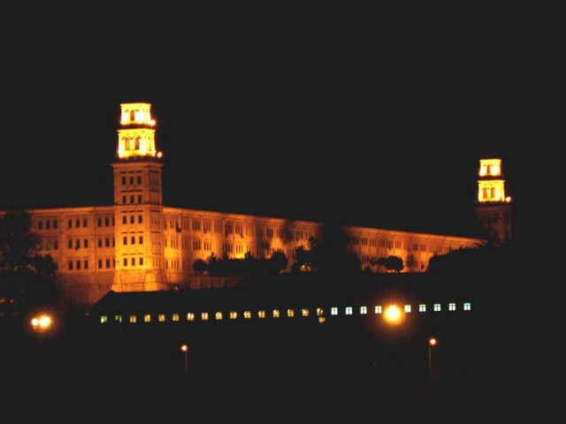

                                                 

Bu gün 29 mart **cumartesi,** Saat 9.40 treni beni **İstanbul’**a getirdi. **Haydarbaşa**’dan vapura bindiğimde saatler **bire** yaklaşıyordu. Gemi önce **Kadıköy**’e uğradı, sonra **Karaköy**’e yöneldi. **Selimiye** **kışlası’**nın önünden geçerken **gözlerime** inanamadım, sahilde **Eyfel Kulesi** kadar göğe uzanan bir **bayrak** direğinin üzerinde muazzam bir **Türk bayrağı** sallanıyordu. Son zamanlarda gittikçe daha **büyük** bayraklar ve daha yüksek **bayrak direkleri** yaptıklarını  fark ediyordum ama hiç bu kadar **yükseğini** görmemiştim.

Gözlerimde “**paralaks**” bozukluğu mu var ? derken, dikkat ettim, **fon** görüntüleri ile **bayrak** direğinin **oranlarını** düşündüm, bir **eksiklik** olmadığını fark ettim. **Bayrak** ve **direk** gerçekten **devâsâ** bir şeydi. **Direğin** ucunda **şanlı bayrağımız** tüm **haşmetiyle** dalgalanıyor, gelen geçene **posta** koyuyordu. **Uçaklar** çarpmasın diye acaba ucuna kırmızı **lamba** da koymuşlar mıydı ? Bence orada **hava trafiği** sorunu vardı. Ya **ip** koparsa, nasıl bağlanacaktı ? **direğin** üzerine **kim** ? nasıl tırmanacaktı ? Herhalde **helikopter** kullanacaklardı. **Gemi Kışla'**nın önünden **süzülüp** uzaklaşırken **Bayrağımızı** yürekten selamladım. 

**Bayrağı**n bulunduğu yerde, 1853-1856 **Kırım** harbinde yaralanarak **Selimiye**’de ölen **İngilizlerin** gömülü olduğu **Haydarpaşa İngiliz Askerî Mezarlığı** ve **Kraliçe Viktorya** **Anıtı** vardır, denizden pek görülmez. Bir ara **fark ettim**. Zavallı **anıt** göğe ser çekmiş **Türk Bayrağının** yanında, pek **ufak**, pek çelimsiz, pek **biçâre** kalmıştı.

**Sarayburnu**’na yaklaşırken **yüreğim** yine cız etti. Deniz altından yapılan **tunel** projesi dolayısıyle su üzerine bırakılan **şamandraların** arasında **yolcu vapurları** svalon yapıyordu. Büyük kazalara **gebe** bu bölgeden geçerken bildiğim bütün **duaları** sıraladım. **Galatasaray**’da bir arkadaşım  vardı, **Kadıköy**’de otururdu. altmışlı yıllarda **Moda**’da **Lozan Kulübü’**nde şarkı söylerdi, K**araköy**’den gemiye bindiğinde hiç yan taraftaki **açık yerde** oturmazdı “**gemi çarpar**” derdi, bir gün oturdu, o gün **gemi çarptı** çocuk öldü.

Öğleden sonranın **başlangıç** saatlerinde **Galatasaray**’da **Aslı Han**’da sahaf **Halil bey**’in dükkanına vardım. Orada her **cumartesi** günü gazeteci **Murat Çulcu**’nun başını çektiği bir **sohbet toplantısı** oluşur, yıllardır **sürer** gider… **Murat** benden geçen hafta **Birinci Dünya savaşı’**nda **Galiçya Cephesinde** **Ruslarla** savaşan **Türk askerlerinin** ve **subaylarınınÂ**  resimlerini istemişti, **yanımda** getirmiştim verdim, yine **rahat** durmadı bu sefer **Tepedelenli Ali Paşa’**nın kitabını istiyor. –Bende **yok**, diyorum, dinlemiyor…–**Bul**  diyor. Nereden **bulacağımı** söylemiyor.

**Aslıhan**’dan ayrılıp **Hasnûn Galip** Sokağında **Simurg kitabevi**’ne vardığımda vakit **akşama** doğruydu. Burada **Musevî** bir arkadaşıma rastladım. O da bana “**tasavvuf**” dedi. Aramızda şu **konuşma** geçti:

–**Musevî Â** olduğuna göre “**Kabala**” okumalısın, **tasavvuftan** sana ne ?   

–Ben  her **şeyi** araştırıyorum.

–Böyle **şeyler** araştırmakla öğrenilmez, **içine düşmen** gerek, Madem ki **Musevî’**sin  içine düşeceğin şey “**Kabala”** olmalıdır. İçine **düşmezsen,** ben ne kadar “**kabala**” biliyorsam sen de ancak o kadar t**asavvuf** öğrenirsin. Boş ver **tasavvufu** da “**Kabalaya”** yönel. Zaten o da sizin t**asavvufunuz** değil mi ?

–Evet ama **kabala** beni sarmıyor.

–O senin **eksikliğin**… Bekle biraz, her **şeyin** vakti **saati** var,

–Ne zaman ? ben hep **O’nu** arıyorum anladın mı ?

–Anladım, sen **O’nu** arayamazsın, **O seni** arayacak. **Yöntem** böyle…  

**Simurg**’tan çıktığımda **zaman** bir hayli ilerlemişti. Yine aynı **deniz yolundan** tren istasyonuna vardım. Gecenin **karanlığı** daha da **ürkütücü** oluyor. Sağ salim **Haydarpaşa**’ya çıkınca **karayı** öptüm. **Adapazarı** ekspresi 3. yolda dediler.

İndirimli **bilet beş** lira yetmiş beş kuruş. Â
