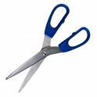

TV’de **Anayasa** dersleri veren bir **profesör**, göklere çıkardığı **1961 İhtilal Anayasasını** “**Anayasaların en mükemmeli** “olarak niteledikten sonra bunun **yürümeyişini** ülkedeki “**demokrasi kültürünün eksikliğine**” bağladı.

Yani profesör kalabalığa dedi ki: “**size mükemmel bir elbise diktik, neden giymiyorsunuz** ?” Profesör, **ölçüyü** yanlış alarak **elbise diken** terzinin suçunu **halka** yükledi. Hem de **hakaret** ederek. Ulusa **hakaret** etme yarışında kendi **sınıfına** bir aşama daha kaydetti.

Kurulduğu günden beri **seksen yıldır**  rejim kavgalarından bir türlü **başını** alamayan bu **Devletin** genellikle darbelerden sonra ele alınan **anayasaları** neden yürümüyor ?  kimsenin **aklı** ermiyor. Sadece **Cumhuriyet** değil, **anayasa** denemelerinin **Osmanlı’**sı da var… Onun adı “**Kanun u Esasî**” **  İstanbul**’da **Tepebaşı’**nda bir “**Kanun u Esasi Kıraathanesi**” vardı. Bilmem şimdi duruyor mu ? **Gençliğimizde** gider bilardo oynardık. **anayasa** lafını ben ilk orda duymuştum.

**Türkiye**’de ilk Anayasa **1876 Mithat paşa Anayasası’**dır. **Osmanlı padişahı Sultan Abdülaziz**’in bir **cunta** tarafından tahtından indirilerek **öldürülmesinden** sonra düzenlenmiştir. Bu **Anayasa** defalarca yenilenmiş, **Cumhuriyetle** ortadan kalkmıştır. **Cumhuriyetin** birkaç defa değişen **Anayasa’** sı da 1961’de **Adnan Menderes**’in devrilmesi ile sislenmiştir. Sonraki **Anayasa** da **Demirel**’in **Evren Paşa** tarafından iktidardan **alaşağı** edilmesi sonucunda doğmuştu. **132 yıldır** yapılan Her **anayasa** bir siyasî **felaketin** acıklı sonucudur.

Bu **ülkede** herkes bir öncekini **indirip** yerine oturduğunda **anayasa** yapıyor. 1876’dan beri **zamanımıza** kadar **132 yıldır** anayasa yapıyoruz. İki **padişah,** üç **başbakan** yiyen **anayasalar** yaptık, **devirler** kapatıp **devirler** açtık. Bu nedir ?  130 yıldır **demokrasi kültürümüz** neden gelişmedi ? **Demokrasi** yeni bir kelime, bunun  **eski adı** neydi ? TV’deki **profesör** diyor ki: “**anlaşıldığına göre en mükemmel anayasalar dahi bir toplumun istenen biçimde şekillenmesine yetmiyor**…” İşte bütün **mel’anet** bu cümlenin içinde saklı. Meselenin **gözü** burada…

Siz toplumun kendi “**istediğiniz gibi şekillenmesini**” neden istersiniz ki ? Nedir **sizin** şekliniz ? En iyi **şekil** sizde mi ? **Halk**’ta hiç mi **yaşama** işareti yok ? Halk’ta hiç mi **yaşama işareti yok ?** Sizin yaptığınız **anayasaların** yürümeyişinin sebebi son derecede **açık**… Siz ne **istediğinizi** bilmiyorsunuz. Ne **istediğinizi** ? nasıl **istediğinizi** ? neden **istediğinizi ?** bilseniz **işler** düzelecek. **Ülkeleri** ileri götürenler bunları **bilenlerdir**. Onlar **geçmişe** değil, **geleceğe** takılı insanlardır. **Benjamin Franklin** ve **Abraham Lincoln** için **Amerikanın** geçmişi değil, **geleceği** önemliydi. Onlar bunun  için **büyük adam** oldular. **Reaksiyon** değil **aksiyon** adamlarıydılar. Siz **toplumu** istediğiniz modelde **şekillendirmeye** çaba harcadığınız sürece siz **toplumu** değil, **toplum** sizi şekillendirir. 

Siz **anayasa** yaparken sadece eski **anayasanın** kötülüklerini **silmeyi** düşünüyorsunuz. **Geleceğe** dair bir **planınız** yok… **geleceğe** dair bir **düşünceniz** yok… Halbuki **gelecek** her şeydir, **her an** karşımızdadır. **Gelecek** hep **gelir**. Sizin yaptığınız **anayasalar** ise hep geçmişte kalıyor. Her **anayasa** hızla geçen bir **devrin** ürünü, Her **anayas**a bir önceki kötülükleri düzeltme **anayasa’**sı. Nitekim şu günlerde hazırlanan **Anayasa** değişikliği de **yaşadığımız  devrin** ürünü olacak. O da devrin **reaksiyonlarını** taşıyacağı için son **130 yıllık sonuç** yine değişmeyecek.

Siz önce ölçüyü **tam** alın, **elbiseyi** sonra dikin. **Acemi** terzinin eline **makas** yakışmıyor.  Â
