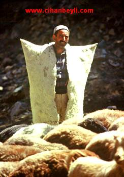

                                             

Kadın diyor ki  “ **Benin  oyum çobanın oyuyla nasıl eşit olur** ? ”

**Olur** ! hatta **Çoban**’ın oyu sizin **oyunuzu** geçer, geçebilir. **Geçmelidir** de. Çobanın oyu **Devlet** için daha **değerli**  olur, **olabilir.** Olmalıdır da.  Çünkü **oy için** gerekli olan “**bilgi**” değil “**vicdandır**”. Vatandaşlık vatandaşların “**vicdanı**” üzerinde kurulur, **yükselir**, gelişir. Ber **vechi** kaide **Vicdanlı** insanlardır **vatandaşlar**. Yürekli **insanlardır** vatandaşlar. **İyi** insanlardır vatandaşlar. **Kötülükte** bir araya gelmezler, hep **iyilik** gözetirler. Bilgiye **ulaşamamış**  olsalar da…Vicdanlı **cahil,** bilgili **kötüden** iyidir.

**Vicdanın** ham maddesi **hukuk** duygusudur. Başkalarının **hakkını yemeyen** insan **hukuk** sahibidir, O insan **vicdanlıdır**, o vicdanlılar topluluğundan **Devlet** doğar. **Bilgililer** topluluğu ondan hemen sonra gelir. “**Çağımız bilgi çağı diyenler**” haklıdır ama kişilerde **vicdanın** ızi yoksa o “**bilgi**” insanlığın başına belâ olur.  **Â** **Hanımefendi**… Yeryüzünde nice bilgili **insanlardan** çıkmıştır **tarih** boyunca **vahşî hayvan** gibi **azılı** halk düşmanları.

Vaktiyle eski **Yunanistan**’da **Perikles** ile **Temistokles** arasında seçim yapılıyormuş. \[gdt:gereğinden dolayı “**tekrar**”\] Vatandaşlar **sabahleyin** kalkmışlar, yıkanıp **traş** olmuşlar, temiz **elbiseler** giymişler, **güneş** doğarken evlerinden çıkıp **seçim** yerlerine yollanmışlar. **Perikles** meraklı, ortalığı **kolaçan** etmek istemiş, yolda bir **köylüye** rastlamış, fotograf yok ya, köylü **Perikles**’i tanımıyormuş, **hiç** görmemiş… **Perikles** köylüye sormuş:

–Kime **oy** vereceksin ?  

–**Temistokles**’e…

–Neden  **Perikles**’e vermiyorsun ? **Yunanistan**’ı P**erikles** kurmadı mı ? **vatan** millet, **Delos** birliği… **Köylü** feryat etmiş:

–**Perikles**’ten bıktım, yıllardır **Perikles, Perikles**… yeter artık, başka **adam** yok mu ?

**TV** döneminde buna “**surat eskimesi**” diyorlar. **Politikacıların** sonu anlamında… **Rabbim** hiçbir **siyaset** adamını böyle bir felakete **mahkûm** etmesin. **Ülkeyi** kuran bile olsa… “**Siyaseten ölüm**” savcının **yasaklamasına** benzemez, adamın **cesedi** bile bulunmaz, **mezarsız** kalır zavallılar. **Savcı**’nın yere gömdüğü **siyasi**, gelecek yıl dipdiri **filiz** verir, aradan **otuz yıl** geçse kemiklerini çıkarır, **tabutunu** bayrağa sarar, Devletin **top arabasına** koyar, getirir şehrin en **uğrak** yerine gömersiniz. Üstüne de **anıt mezar** yaparak… ama halkın **sandığa** gömdüğü **siyasi**’den hiçbir haber alınmaz… İşte bu halkın **vicdanıdır.** Bir başka söylemle **Siyasî hukuğun** temeli…

Siyasi hukuğun temelinden doğacak **Anayasalardır** geçerli ve **sürekli** olacak **Anayasalar**. Hukuk hocalarının **eskimi**ş kitaplarından çıkan **fersûde, pejmürde, prematüre** anayasaların yaşayacağını mı **zannediyorsunuz** ?  Temelsiz, köksüz, **geleneksiz** metinler doğarken ölüyor.Son yapılan “**Richmond oteli anayasasının**” başka türlü olacağına **inanabilirmiyiz ?** **Â** 

**Sapanca**’da **Richmond** Otelinde son **anayasa** yapılırken **Malezya**’dan, **Endonezya**’dan **Tayvan**'dan getirilen **masörler**, masözler **profesörleri** uzun masalara yatırıp **oğuştururken** doğdu bir **“Anayasa**.” Bakalım ne kadar **sürecek** ? Göreceğiz. Halbuki aynı saatte **Kasabada**, evlerde, çarşıda, **Bostancı**’nın kahvesinde **93** muharebesinin **Kafkas muhacirlerinin** torunları da “**anayasa**” konuşuyordu. **Masörler, masözler** bıraksaydı da, o **profesörler** gelip bunları dinleselerdi, belki **anayasa** hukuğu **bilgileri** artar ve daha “**kalıcı**” anayasa yapabilirlerdi.

Neye yarar ki o **anayasacılar** için gelip burada **ihtiyarları** dinlemek öylesine “**eşyanın tabiyatına**” aykırıydı ki, sonuçta girişilen şu sakat işin akibetini **Sapanca**’da bir **çocuk** dahi kestirebilirdi.

Bir “**Çobanın** dahi oyu üstündür” **anlayışına** varmadıkça, bu ülkede ne **demokrasi** olur ne de **Anayasa. Musa Kelimûllah**, aleyhisselam, **Sina** çölünde **çobanla** konuşurken bir peygamberdi ama ikisinin de “**oyu**” aynıydı. Siz ne biçim **demokratlarsınız** ? memleketi yücelterek geliştirme **sevdasına** kapılmışsınız. Siz ülkeyi **havalara** uçurmak değil **uçurtma** bile uçuramazsınız.
