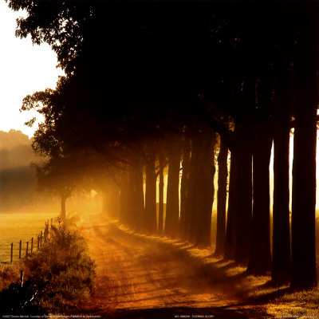

Ben  bu **dehre** gelmeden **nerdenliğim** bilmişem. Bilmeyene o **mülkü,** bildirmeye gelmişem. 

**Od** ü **su**, toprak, **hava** bulmadan **neşv ü nema**, Gelibeni bu **eve,** girmeye **yönelmişem,** 

Evveli **yok** evvele, gün gibi **mir’at** ile, Mazhar olup **zat** ile, aynı **safâ** olmuşem. 

**Aşk** ile **aklın** ilin, **tay** kıluben cüz Külün, **Yokluğ** ile **varlığın**, bilmek **içün** gelmişem. 

**Maarifetin** haline, **münkir** iken kaaline, Cehl ile **idlâline,** ağlar iken **gülmüşem.** 

**Aşk** ile **hamr-i ezel,** içeliden **lemyezel,** Sarhoş olup **sehv** ile, sanmanız **yanılmışem**.

**Ruşenîden** ay gibi, _**Gülşeni**_ devran ile,

**Ay** ile gün **yoğ** iken, **buluşuben** dolmuşem.

                         **İbrahim Gülşenî** (1426-1533)
