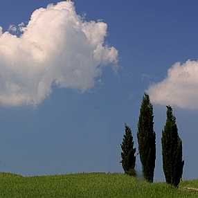

Ey nazlı nazlı **yürüyen** selvi,

Hazan **rüzgarı** sana değmesin.

Ey cıhanın **göz bebeği**,

**Kem göz** senden **ırak** olsun.

Sen göklerin de **canısın** yerin de.

Canına **rahmetten**,

Rahattan

Başka **bir şey**

**Dokunmasın**.

                                  **Mevlânâ**
