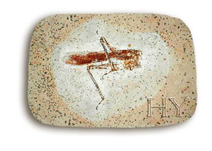

                 

Bir çekirge doğdu, adı **Kalender,** cinsi ender, **çekirgeler** güzeli… **Anas**ı küçükken onu çok severdi, **Kafasını** antenini okşar **üşümesin** diye yapraklara sarardı. **Gece** soğukta bırakmaz, koynuna alırdı. Başka **böceklere** yedirmedi**. Kalender** çekirge büyüdü. Koca başlı bir **çekirge** oldu. Çocukluk ve **gençlik** yılları **geride** kalmıştı. **Anası** öldü, **babası** bilinmezlere karıştı.

Aslında **çekirgelerin** ailesi olmazdı, **larvadan** çıkardı çekirgeler, ama bu başkaydı. Bu **çekirge** her çekirgeye benzemiyordu. Bunda bir **hal** vardı… Bunu **yaratan** özenmiş bezenmiş, ona **gizli** bir karakter seçmiş, **atlaya sıçraya** büyüsün demiş bir yerde **durmasını,** atlamasını, sonra tekrar **durmasını** ve yine **sıçramasını** öğretmişti.

                   Bir çekirge **dünyaya** geldi **larvadan**

                   Hayır gelmez asla **boş laftan** zırvadan

**Özel** eğitimden geçen bu **Çekirgenin** başka hiçbir **çekirgede** bulunmayan **huyları** vardı.

**                   Çekirgeler** güzeli, **benzemez** her çekirgeye                    Yaşar ormanda, **kırda** ağlamadan **gülsün** diye

Kalender **Çekirge**’ye **kalender** adını kimin koyduğu bilinmiyor ! Neden “**Kalender**” o da anlaşılmıyor. Bu **Çekirge** bu isme **layik mi** ? O da bilinmiyor. Pekiyi ya **Kalender** ne demek ? işte değerli ve **kıymetli** dostlar, bütün **sır** burada…

                    Çal sazını **kalenderce** yiğit kardeş,                     Namelerin **rüzgardan** tatlı…

Birkaç **sözcüğü** aklımda kalmış, eski, bir **gemici** türküsü bu… Acaba size bir **ip ucu** verir mi ? Ben **Kalender** nedir ? bilemedim. Siz bildiniz mi ?  **Belki** ilerde anlaşırız.

Kalender **Çekirge** doğduğundan **şu ana** kadar hiç yanımdan ayrılmadı, **başımın** üzerinde geziyor, azalmış **saçlarımın** arasında dolaşıyor, **durmaksızın** kımıldıyor, **habire** kıpırdıyor. hiç **rahat** durmuyor, **varlığından** her an beni **haberdar** ediyor, bu onun için en **temel** hakk mıdır ? yoksa yersiz bir **huy** mudur ? veya **zamansız** bir duruş mudur ? yahut **uğursuz** bir **saplantı** mıdır ? yoksa **psikopatalojik** bir takıntı mıdır ? hiç biri değil de **saf** bir mâcerâ mıdır ? mâsum bir **serüven** midir ? **acaba** nedir ? **belli** olmuyor.

 Bazen birden, ve **aniden** başka yere **zıplıyor,** öyle **hızlı** ki, iki **hareket** arasında **adetâ** yok oluyor. **Kainattan s**iliniyor, **varlıktan** soyunuyor, **yaşamsal** bölgeden çıkıyor, **kamusal** alandan ayrılıyor. **Görüntüden** kayboluyor,  Burada **dururken,** orada **durmaya** başlıyor. Bir başka zaman **boyutuna** geçiyor. Ne **aslı** kalıyor ne **gölgesi**. Işıktan **soyutlanıyor.**  Sonra yine “**reenkarne**” oluyor. sanki hiç bir **şey** olmamış gibi. Bundan ne **fiziği** zarar görüyor, ne **kimyası**. Ne de **psişik dünyası.** O h**ep** eski yerine geliyor…  Her **zaman** aslına dönüyor. Bu da bir **huy** demek…

                      Kalender **Çekirge**’nin yaşam **saltanatı**                       Bu onun **gizem** dolu  bir başka **sanatı**  

Kalender **Çekirgeyi** seveceksiniz. Aslında bu **efsane** yaratık, **yaradılmışların** en güzeli… Yeryüzünde **Adam gibi** yürüse onu **sevmeyebilirdiniz**. Devamlı **atladığı** için ona **hayran** olacaksınız… Oradan **buraya**, şuradan **oraya**, ama hep **size doğru** atladığına onda kendi **benliğinizden** bir şeyler bulacaksınız. Ben **fazla** konuşmayı sevmem, **yazmaktan** da hiç hoşlanmam. Bakın **Kalender** çekirgeye dikkatle… O size, **sizi** anlatacak… Haydi **hayırlısı** olsun. **Kalender Çekirgeyle** güzel günler, **sizlerin** olsun.

**                     Çekirgelerin** şahı **Kalender Çekirge**, **                     Canbazların** hayranı **Kalender Çekirge**.
