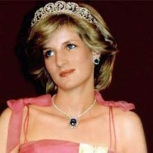

 

Saray gelini Diana  

                                       

Dost ve kardeş **İngiltere**’nin **82 yaşındaki** kraliçesi **Majesteleri Elizabet** hanım **Türkiye**’nin şeref misafiri. Devletimiz **Kraliçeyi** büyük törenlerle karşıladı. **Cumhurbaşkanımız** bu uğurda **simokin** giydi. **Hanımı** pek ileri **tarzda** süslendi. **Başbakanımız** beyaz **papyon** kravat taktı. **Devletin** zirvesi bu **karşılama** töreni için özel **kurslar** gördü. **Protokol** kuralları öğrendi. **Kraliçeye** nasıl **reverans** yapılacak, elinin **kaç parmağı** öpülecek, bu sırada **diz** nasıl kırılacak **günlerce** çalışarak öğrendiler.

İngilizler moral verdi “**Kraliçemiz öyle her şeye aldırmaz**” dediler. Sırasında **protokol**’e kulak asmayan sıcak kanlı **Kraliçe** geçenlerde **Buckingam Sarayı**’nda **Fransız** Cumhurbaşkanı **Sarkozi**’nın sevgilisini ağırlarken, kadını yatacağı **odaya** bizzat götürmüş, **tuvaleti** bile  göstermiş, “buraya **işeyeceksin”** demiş.

Devletimizin misafiri olan **İngiltere Kraliçesi’**ne hörmet etmemiz gerekir. Bunun  amıcası vaktiyle **asaleti** olmayan sıradan bir **kadına** aşık olup **tacı tahtı** terk etmiş **kadının** peşinden gitmişti. Sanırım **8\. Edward** olacak, ben çocuktum **gazeteler** günlerce yazmıştı. Daha sonra kız kardeşi **Margaret, Towsend** isimli bir yüzbaşıya aşık oldu. Yandı yakıldı e**vlenmek** istedi. **Saraylı**’lar bırakmadılar, o olayı da aylarca, **yıllarca** gazetelerden okuduk. Şimdi bunların **sırası** değil, Devletimizin **misafirine** saygı etmeliyiz..

Bu **Hanım**’n gelini **oğlunu** kandırıp bir **Arapla** sevişti, **Saray**’dan kovuldu. Tam **Araptan** hamile kaldığı söyleniyordu ki, **kadın** kuşkulu bir **trafik** kazasında **dünyasını** değiştirdi. Bu iş o zaman **102 yaşında** olan ve “**Queen Mom**” (Mumya kraliçe) diye anılan **Ana kraliçe**’nin başının altından **çıktığı** söylendi. **Mumya Kraliçe**  **Hanedan'**ın namusunu kurtarmak istemiş: **Töre cinayeti**.

Ne **olduysa** oldu, anlayamadık. **Leydi Diana**’nın kazanın olduğu **Paris**’te, can verdiği yerde, şimdi **Amerikalı turistler** her hafta **mumlar** dikip ayin yapıyorlar, **tütsüler** yakıp tapınıyorlar. Değerli **misafirimizin** müteveffa **gelini**’ne dinince dinlenmesi için **dualar** ediyoruz. **Kraliçe'**nın küçük kardeşi **Margaret** geçende TV’lerde göründü. Yaşlanmış, **Afganistan’**da **Taliban** kovalayan yeğeni **Edward’**a gülücük yaptı, **madalya** taktı. Uzatmalı sevgilisi **Yüzbaşı** ne oldu acaba ? Misafirimize **saygı** etmeliyiz.

Devletimizin **şerefli misafiri** bu yıl **82 yaşına** gelen **İngiltere kraliçesi** **Elizabet** hâlâ tahtını bırakmadığı ve bırakmaya da **niyeti** olmadığı için oğlu **Charles** kral olamıyor. **Charles**’in müslüman olduğu ve **Kıbrıslı Hoca** tarafından **sünnet** edildiği **rivayetleri o**rtada dolaşıyor. Doğrusunu **Rabbim** bilir. Bu hanedanın başına gelenler **Osmanlı hanedanı’nı**n  bile başına gelmemiştir. Ancak bütün bunlar **Değerli misafirimizi**, bağrımıza **basmamıza** engel olamaz…Misafirimize **saygı** göstermeliyiz.

**İngiltere Kraliçesi Majesteleri Elizabet** bu ziyareti sırasında **Bursa**’ya gidecek. **Sultan Abdülmecit** zamanı o çağda **Osmanlı Ülkesinde İngiliz tahtını** temsil eden Büyükelçi **Lord Stratfort Canning**’de **Bursa’**ya gitmiş ve **Manchester** ipeği ile rekabet eden **Bursa** ipek tezgahlarını **sembolik** biçimde **bastonuyla** kırmıştı. Acaba “**Ho Majesty’s**”in şimdiki **büyükelçisi** de böyle bir **davranış** içinde olabilir mi ? **Elizabet**’in **Bursa’**da ne aradığını merak ediyorum doğrusu… **İpek** işi çoktan bittiğine göre herhalde **Çekirge’**de vaktiyle **Theodora**'nın yıkandığı **sulara** girecektir. Bin yıl sonra **Eski Kaplıca'**da, **Aslan** **Ağzı**'nda  bir **kraliçe** daha...

Bundan  birkaç yıl önce **Majesteleri** sabah **uyandığında** yatağında bir **yabancının** oturduğunu görmüştü. Derhal **koruculara bakıcılara** haber verildi bu **kişi** dışarı atıldı. O zaman **İngiltere’**de **gazeteler** bir **delinin** güvenliği aşarak **Kraliçenin** yatak odasına girdiğini yazmışlardı. Sorguya çekilen **adam** ise “**İngiltere** **Sarayı’**nda güvenliğin ne kadar **zayıf** olduğunu **kanıtlamak** istedim” dedi. Adamın **deli** olmadığı anlaşılmıştı.

Devletimizin mümtaz misafirine **saygı ediyor** ve onu **gönülden** kutluyoruz.
