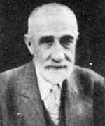

  

Sabah treni beni öğle üzeri **Haydarpaşa**’ya indirdi. **İskele**’de gemi var, bindik. –**Karaköy** diye bağırıyorlar, halbuki **gemi**’nin burnu **Karaköy**’e değil de **Kadıköy**’e baktığı için bazı yolcular –**Bu Karaköy’**e mi gidiyor ? diye soruyorlar, Kapıları açan **iskele memuru**  –Önce  **Kadıköy**’e sonra **Karaköy**’e gidecek, diye sinirli sinirli **anlatmaya** çalışıyor. Anlamıyorlar… **yürüyüp** gidiyorlar, arkadan **gelenler** yine aynı şeyi **soruyor**… Adamı **kenara** çektim –Bak  **kardeşim** dedim, ben bu  **Kadıköy**’de **elli dört yıl** oturdum, hiçbir idare, **Karaköy**’den kalkıp **Kadıköy**’e gelen, sonra geri dönen **vapur**; yolun yarısındaki **Haydarpaşa** iskelesine gelirken mi **uğrasın** ? dönerken mi **uğrasın** ? sorununu halledemedi.

**Beşer onar yıl** ara ile öncekinin **tersi** yapıldı, şimdi birkaç yıldır “**önce Haydarpaşa’ya uğrasın sonra Kadıköy’e gitsin”** siyaseti uygulanıyor, **Gelecek yı**l değişecek, **vapurlar** önce **Kadıköy**’e gidecek dönerken **Haydarpaşa**’ya uğrayacak, sonra **yine değişecek**, kendini **sıkma**, gülüver gitsin… Ne kendini **üz**, ne **vatandaşı**, bunlar **İstanbul**’un denizli karalı **yaşamının** çapakları… **İstanbul**’un yönetimi bir gün **İstanbullu**’ların eline geçerse **düzelir**.

****

**Gemi** az sonra **çımayı** çözüp **Kadıköy**’e doğru süzüldü. **İskeleye** yanaşınca önceki izahatı **umursamayan** bir kısım **yolcular** sordular:

–Burası **Karaköy** mü ?

–Hayır…**Kadıköy**.

–Biraz önce **Karaköy** dediler ya…

–O  sonraki **iskele**… burası **Kadıköy.** Haydi bir **kavga** da burada… Bazı **yaşlı yolcular** **Anadolu**’dan gelen ve belki de **ilk defa** deniz gören; ne **Karaköy**’ü, ne **Kadıköy**’ü bilmeyen ve **vapuru** otobüs zanneden **yolculara** işi anlatmaya çalışırken ortada dolaşan **gazozcudan** bir liraya bir şişe **portakal suyu** alıp içtim. **Vapur** yeniden **denize** açıldı.

Birkaç dakika sonra gemi **Karaköy** iskelesine yanaşmak üzere **sahile** yaklaşırken rıhtımda **sıra dağlar** gibi dizilmiş “**turis**” gemileri gözüme çarptı. Ama **Allahım**! **Belgrad** kalesine benzer gemiler, bir tanesinin boyu **Galata kulesini** geçiyor, **gökdelen** gibi gemi. **Kat kat** say bitmiyor. Şekli **uğursuz**, estetiği **bozuk**, salınımı **düzensiz.** Gemi değil **su aygırı**…O mubarek **hayvan** bile bundan daha yakışıklı. **Limanı** kirletiyor. Bu nasıl **dik** duruyor ? **Rüzgar** kuvvetlense **yan** yatacak. Ne **direği** var, ne bacası. **Deni**z üzerinde bir **ucube,** altındaki **bin çeşit** mahlukatın en **çelimsizinden** daha **şekilsiz**. Bunun çalışan kalabalığı **Anadolu**’da bir vilayet eder. **Aşçıbaşı** kaptandan daha **kıdemli** olmalı ki, onca  **halklı** doyursun…

Gemimiz **halatı** bağladığında **rıhtımda duran** en öndeki **gemiye** bir göz attım, **gördüğüme** inanamadım. **Geminin** burnuna **bir çift dudak** resmi yapmışlar… Tekrar **tekrar** baktım… Evet ! bir çift **dudak**; yanlış değil. Önce uzaktan **resmini** çektim sonra **rıhtımda** yürüyüp  **yanın**a kadar yaklaştım. **Dudağın** dibine vardım, oradakilere sordum –Bu ne **resmi** ? Hepsi baktı –**Dudak** dediler.

Düşümdüm bunlar **fuhuş** gemisi, tabii ki önünde **dudak resmi** olacak, **Akşam** dönerken olayı öğrenen Zeyrekli **Ertuğrul** dedi ki: –Bunun **arkasında** yakışan bir **resim** daha olmalı… Utancımdan gidip bakamadım. **Dostlar** ! şaşılacak bir şey yok. **Kuzey**’den **Güney**’e, **Doğu**’dan **Batı**’ya tüm çevremiz **fuhuş** gemileri ile dolu. Her yer **fuhuş** kaynıyor. **Fuhuş**, bu yörede **yaygın** ve **saygın** bir endüstri oldu. **Avrupa**’nın tüm **orta yaşlı**, işin **sonuna** gelmiş, gözleri **süzgün**, bacakları **düzgün**, neş’esi **yerinde**, parası **cebinde** aygın ve **baygın** madamaları, **şen dulları** durmadan  **Türkiye**’nin **Güney** sahillerine, **kelebek** avlar gibi **jigolo** avına geliyorlar.**Jigolo** safarisi, cazibesine dayanılmaz **av partisi**…

Onların ardından her yıl “**Büyük Türk Jigoloları**” sahillere akın ediyor. **Hürriyet gazetesi**, ünü cıhanı sarmış, bir **Türk jigolosunun** anılarını yayınladı. İşin bir başka **acıklı yönü** de alnımızın **akı** gibi tertemiz **maaşlarımız,** bu yıllarda  içine **fuhuş** parası karışmış **bütçelerden** ödeniyor.

Geminin yanından ayrılıp **Yer altı Camii**’ne doğru yürüdüm. **Camiin** önündeki, parkta saçı sakalı karışmış **kimsesiz bir vatandaş** tahta sıranın üzerinde **uyuyordu.** Yüzünde huzur ve **mutluluk** sezdim, **fuhuş** gemisine girse bu kadar **rahat** olmayabilirdi, üstelik o **gemi** onu kirletirdi. Şerefli bir **adam** olduğunu düşündüm.

İkindi **ezanına** az bir zaman vardı, **Camiye** girdim doğruca **Süfyan ibni Übeyne**’nin yanına… Bu zat eski adıyla “**Kurşunlu Mahzen**” denen bu **Camide** yatan üç **Sahabe**’den biridir, **merkad-i mubarekeleri**  Deniz yönünden girildikte **sol tarafa** rastlıyor. **Cami**’ye bitişik **kubbeli** ayrı bir **türbesi,** sandukası ve **su kuyusu** var. Son zamanda **tamir** ettiler, temiz ve bakımlı. **Sahabeler**’le ilgili ve bazı **mukaddes emanetlerin** resimlerini duvarlara asmış, **bilgi** vermişler. Burası küçük bir “**Sahabe Müzesi**” olmuş.

**Ziyaretten** sonra biraz daha kaldım. **Her şey çok iyi,** her yer çok **temiz**  ama **sandukanın** üzerine şekilsiz bir **cam bölme** yapılmış, biraz **mobilyacı** **dükkanına** benziyor. Böyle **nâzik** yerlere fazla **dokunmaya** gelmiyor. Eski **harap** ve **loş ışıklı** zamanını **heyecanla** hatırladım. Başta **Sahabenin** parlayan yıldızı **Eyyüb**’ül **Ensarî** olmak üzere **İstanbul**’da yatan 28 kutlu **Sahabenin** her biri için vaktiyle ismi bilinmez bir şair **dörtlükler** hazırlamış, Hz. **Süfyan ibni, Übeyne** için söylenen dörtlük şöyle:

                                     “Cürm-ü **isyanla** deyre

                                       Aman **Süfyan bin Ubeyne                                      Â**  Bunca hattım **germâbına**                                       ** Şefaate** ir gör **bizi**”

****

**Yer altı Camiinde** yatan diğer iki **Sahabe** “**Amr ibn ül As**” ve “**Vehb ibni Huşeyre**”. İlki için **söylenen** dörtlük şu:

                                       “**Galata** fâtihleri **eşhas                                       Â**  Ya hazreti **Amr ibn ül As**

                                         **Kurşunlu Mahzen** sizlere has

                                        ** Şefaate** irgör **bizi**”

**Vehb ibni Huşeyre** için ise meçhul **şair** şunları söylemiş:

                                        “**Bais** oldun nice **hayre                                          Â** Dâhilek **Vehb ibni Hüşeyre                                         Â**  Bizi muhtaç etme **gayre                                         Â**  **Şefaate** irgör **bizi**”

İslam’ın büyük ismi **müceddid**\-i **elf-i sâni Hz. İmam Rabbani**’ye **Sahabeleri** sormuşlar. Hz. şöyle cevap vermiş: “**Siz onları görseydiniz, deli derdiniz, onlar sizi  görseydi, size Müslüman demezlerdi”** İstanbul’daki **Sahabeler**  hakkında **uzun yıllar önce** hazırladığım bir kitaba, **fakir** acizâne şu **hükümleri** eklemiştim: “**Bütün insanlık tarihinde Eshab-ı kiram kadar muazzez, yüksek, nâzik, edepli, kahraman, vefalı, dürüst ve kâmil bir topluluk görülmemiştir.”**  

****

**Yer altı Camii** ziyaretini, bu makamda **altmış dört yıl** hizmet eden Hocam, **üstadım,** efendim, **Üsküdarlı Ali Efendi’**nin temiz ruhuna **Fatihalar** göndererek bitirdim. **Nur** içinde yatsın. **Sordum,** bilen kalmamış. **Nasıl** kalsın ki ? **Hoca göçeli** otuz iki yıl oldu.

 

**Kurşunlu Mahzenden** çıkarken **Deniz kapısını** değil, **Necati Bey Caddesi**, tarafındaki kapıyı tercih ettim. “**fuhuş gemisini**” tekrar görmemek için… İnşallah **palamarı** toplayıp gitmiştir. O mendebur “**nefsi emmare gemisi**”  bu makamın **yanına** yakışmıyordu.

**İstanbul**’daki diğer **sahabeler** hakkında bilgi almak isteyenler, Hocam rahmetli **Prof. Süheyl Ünver**’in **Ayvansaraylı Hüseyin Efendi** **Mecmuasına** dayanarak **kaleme aldığı** ve 1953’te yayınlanan “**İstanbul’da Sahabe Kabirleri**” başlıklı kitabına müracaat edebilirler. Â
