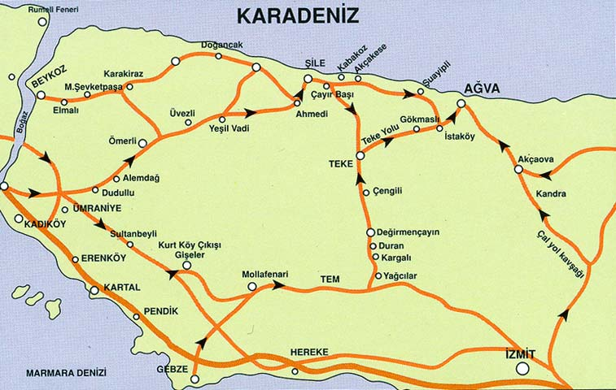

_(Resimleri büyütmek için üzerlerine tıklayın)_

_5 eylül 2008 Cuma_

 

**Karadeniz**’in başında **Şile’**den öteye giderseniz **Ağva** kasabasına varırsınız. **Şile**’ye iki, **Kandıra**’ya bir yoldan bağlı olan bu kasabanın iki yanından iki dere akar. **Ağva** demek zaten iki dere arası demekmiş. **Şile**’den gelenler ya **Kabakoz** ve **Şuayip**li’den geçen sahil yolunu, ya da **Teke** ve **Gökmaslı’**dan geçen üst yolu izlerler, **Kandıra**’dan gelenler de **Akçaova**’dan geçerek **Ağva**’ya varırlar…

İki hafta önce Bizim vazgeçilmez şöför **Ahmet**’le **Kandıra** yoluna düşerek **Ağva** sapağına kadar gittik. **Paşaların** yattığı hapishanenin önüne gelince sola dönerek **Ağva** yoluna girdik. **Ahmed**’e dedim ki:  –Aman Ahmet, buralarda fazla eğlenme, bizi **paşaları** kurtarmaya gelen **teröristler** sanıp nöbetçiler **ateş** eder, sonra da arkamızdaki **beş yıldızlı** hapishaneye koyarlar.

İftara bir saat kala **Ağva**’ya vardık. **Dere** kenarına parkettik. –Selamaleyküm, bunlar ne ? –Deniz  **salyangozu**… –Yeniyor mu  ? –Biz yemeyiz, **dışarıya** gidiyor… 

   Deniz Salyangozu              Dere Ağzı                                                                     Dere Ağzı, Rıhtım    Karadeniz çıkışı,                              Derelerde sular kararıp **Karadeniz** karanlıklara bürünürken **Ağva**’nın batısında **Kurfallı** Köyünden **Cemil Kaptan**’ın torunu **Gürdal’**ın Oteline vardık. Sora sora yolu bulup verandaya çıktık. –Hoş geldiniz, buyurun, oturun, Birader **çay** yap… –Hoş bulduk, burası mı **senin** yerin ? –Şimdilik öyle sayılır, **Nezi Abi** beğendin mi ? 

**Gürdal Üsküdar Fıstıkağacı**’ndan kalma, otuz yıllık komşu… Bana “**abi**‿ dedikleri yıllardan miras. Şimdi yaşlanıp **Hoca** olduk ya neyse, **Gürdal** hâlâ eski zamanları unutmamış. Biraz sonra hanımı **Şeniz** ve has dostu **Erman** da yanımıza geldi. O da eski **Üsküdar’**lı… Şimdi **Gürdal**’la beraber otel işletiyorlar. Biraz sonra **çaylar** geldi, yerimize yerleşip **rahatladık.** –Biz nerede kalacağız ? –Şu yukardaki beş numaralı **oda** senin, **Ahmet**, arabadan eşyaları çıkar…

Otel **on üç** odalı, odaların tümü **ahşap,** görünüşe göre burası **çam ağaçlarının** kıyısında şirin bir **hafta sonu** oteli. **İstanbul**’da evinden sıkılıp **uzağa** gidemeyenler için **ideal** bir mekân. Restoranı, **yemek** servisi, her şeyi tamam. Salonda bir **TV** var, başka yerde yok. Az sonra **odaya** çıkıyoruz, tertemiz **yataklar,** çarşaflar, eski fakat bakımlı duş ve **tuvalet**, Lavabo ve ayna var. **Ayna’**nın önünde traş takımı, **diş fırçası** gibi şeyler için bulunması gereken **raf** yok, olsun... başka bir **önlem** alacağız. Aldık bile üç yataktan birini **etajer** olarak kullanacağız. Yaydık çantaları o **etajerin** üstüne.

**Ahmet** bir çalışma masası buldu, üzerine **evde**n getirdiğimiz **örtüyü** koyduk, **Bilgisayarı**, masa lambasını, **cep** telefonunu hep yerleştirdik. Her şey için **bir defada** yer bulunacak, sonra o **yerler** değişmeyecek, tekrar tekrar düşünmemek ve aradığını hemen **bulmak** için. Bilirsiniz “her şeyin bir **yeri** vardır, her şey **yerindedir‿** Yerinde olmayan **şey** kullanılamaz… Kaldır **at** daha iyi. Unutsan da olur. **Rahat** edersin.                                                            

_6 eylül 2008 cumartesi_

Akşam oldukça geç yattık. **Sohbet** muhabbet, eskiler, **hatırala**r derken vakit ilerleyip gözler **ufalıp,** başların dik durması zorlaştığında herkes **odasına** taksim oldu. İnsanlar **uykuya** dalarken benim **mesai saati** başladı. Geceler verimlidir. **Gece** kafalar rahat çalışır.      Gürdal’ın otelinde         Sabah çayı                                            **Kahvaltı’dan** sonra gezintiye çıktık**. Gürdal** arka tepelerde bir yer almış. Oraya daha büyük bir **otel** yapacakmış. Arabaya binip **tepelere** bakmaya gittik. **Ağva**’yı kuşbakışı gören bir yer. Henüz hiçbir **hareket** yok. Etrafa yayılmış birkaç ev ve konak. **Orman** yolları patika… Evler sıklaştığında herhalde bu **yolla**r da yapılacak. Ancak yörenin geleceği oldukça **parlak** gibi…

           Tepelerden Ağva           Nezih Uzel, ve Gürdal 

      Gürdal ve Nezih Uzel    Gürdal, Nezih, Barbaros,  Mehmet Ağva, Eylül 2008           Üsküdar, Nisan 1970 

Bağ bahçe **arsa** ziyaretinden sonra **sahile** indik. Yine **deniz** kenarındayız. **Ağva**’nın Mendireği yapılalı otuz yıl var, vatandaşlar **direğin** ucundaki f**enerin** üzerine yazılar yazarak içlerini dökmüşler. **Deniz Feneri** dert küpü olmuş. Deniz Feneri **davas**ı buraya da ulaşmış.                                                              Karşı sahil, nezih uzel    Yazılı Fener

Ağvanın **Yakuplu** Deresinda otuz yıl önce köprü yoktu. Karşıdan karşıya geçmek isteyenler “**bot‿** denen bir sala biner, kıyıdan kıyıya gerili **telleri** çekiştirerek botu harekete geçirir, amacına ererdi. Şimdi bir **köprü** yapılmış, derenin her iki kıyısı oteller, **restoranlar**, çay bahçeleri ile donatılmış. Burası tam bir yerli **turist** pazarına dönmüş. **İstanbul**’un kalabalığından bunalanlar için en birinci **havalanma** yeri. Gelin, görün, **çay** için, yemek yiyin. Derede **pedallı** yunus’a  binin.

    Yakuplu Deresi                  Ağva kumsalı

_7 eylül 2008 Pazar_

Bu gün dönüyoruz. İki gün yeter. **Gürdal** otel parası almadı. Demek ki geleneksel **misafir** statüsüne girmişiz. **Misafirlik** üç gündür. Biz iki günde **işi** bitirdik. Aynı yoldan **Sapanca**’ya geri döndük. **İzmit**’te birkaç alışverişten sonra **evimizin** yolunu tuttuk. İşte şimdilik **bu** kadar.
