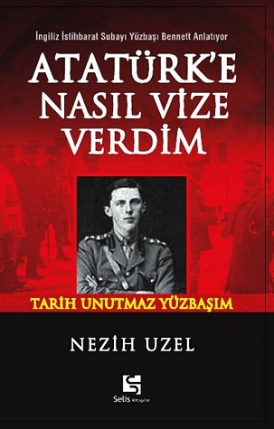

_****_

_**Yüzbaşı'nın kitabı**_

_**Nezih Uzel’**den not: Gazetecilikte önderim, üstadım, hocam, bundan kırk yıl önce 1968 nisanında şu fâni dünyada günlerini tamamlayarek alemi ukba’ya göç eden  devrinin şöhretli köşe yazarı Refi’ Cevad Ulunay, gençliğinde siyasette yanlış ata oynadığı için ülkenin o zaman değişen sahipleri tarafından memleketten çıkarılmış, yıllarca gurbet ellerde çile çekmişti. Ülkeye döndükten sonra da kusurunu anlayıp artık hiç siyaset yazmamıştı. Siyasette yanlış değil, doğru ata bile oynasa insan, ağır vebal altına girer. Siyasetin bir yalanlar yumağı olduğu günümüzde ise bir yazar için bu tehlike daha da ulaşılmaz boyutlara varmıştır. Bir devrin haini bir başka devrin kahramanı, bir devrin kahramanı bir başka devrin haini olduğu sürece insanlar için bu işten hayır yoktur. Edebiyata yönelmeli. Edebiyatta derece almalı. Sonra siyaset de yazsanız kimse alınmaz edebiyat zannederler. Victor Hügo’nun “sefiller” romanı   gibi. Bendeniz siyasî tavırlı yazılarıma “Yüzbaşı Bennett” in hikayesi ile son veriyorum. O bir zorunluluktu, yerine getirdik. İnşallah yeni baskısı yapılmaz. Saygılar sunarım._
