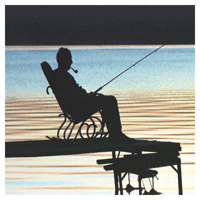

              

\-Haydi gidip **balık t**utalım.

\-Hayır **tutmayalım**.

\-Biraz **tutalım** biraz tutmayalım…

\-Yine **saçmaladın**… Bu gün **balık** tutma günüm değil

\-Ya ne **günün ?**

\-**Yas** tutma günüm.

\-Neden ?

\-İçimde **sıkıntı** var ?

\-Hayır **yok**…

\-**Olur** sana ne oldu ? benim içimi **nereden** bileceksin ?

\-Ben **bilirim…**

\-Hayır **bilemezsin**

\-Bilirim **dedik** ya…

\-Hem bilirsin, hem **bilmezsin…**

**Olur**’la **Olmaz** yine anlaşamadılar. Biri diğerinin **içini** bildiğini söylüyor, diğeri bunun  anlamsız olduğunu **yineleyip** duruyordu. **Anlaşmaları** mümkün olmuyordu. **Bunlar** anlaşamamakta olağanüstü **dirençlıydiler**, anlaşmamakta **birleşmişlerdi**. Yaşamları **anlaşamamak** üzerine kurtulmuştu. Anlaşmazlık **batağında** çırpınıp durmak **hoşlarına** gidiyordu. Birinin **ak** dediğine diğeri **kara** dedikçe yaşamlarına **anlam** yüzlerine **renk** geliyordu.

Bunlar ne biçim **yaratıklardı** ? ben anlamadım… Ama belki de **anladım** şimdi **ben** de hem **anladım** hem **anlamadım**… **Olur’**la **Olmaz**’ı birbirine karıştırdım. **Tedbir** almalıydım. **İnceden** düşünmeliydim. Ne olur ne **olma**z diyerek, **Olur**’ la **Olmaz**’ı birbirine **karıştırmam** gerekirdi. Bilemedim. **Suçla cezayı** karıştıran saygıdeğer **yargıçlar,** soru **soranla sorulanı** bir de **soruyu** ayıramayan kahraman **polisler** gibi  ben de bunlara **uydum.** **Olur**’un **Olmaz’**ı, **Olmaz**’ın oluruna karıştı.

Eskiden **dünyada** bir **din** varmış, **üç bin yıl** yaşamış, o dinin **papazları** sonunda iyi ile kötüyü **ayırd edemez** olmuşlar. İyi **kötüye** kötü **iyiye** karışmış, o din ortadan kalkmış. Ona **Mani dini** derlermiş… Bir **medeniyet** sona yaklaşırken bunlar oluyor, **iyi** ile kötü **birbirine** karışıyor… **Medeniyet** kuyruğunu yiyen **canavar** gibi kendi kendini **yok** ediyor.

\-**Olmaz**… \-Ne **olmaz**…. \-İyi kötü **karışmaz…** \-Karışır… **\-Hayır** karışmaz \-Hem karışır, hem **karışmaz…** \-OImaz yoruldum, **yetti** artık senin **zulmün…** 

**Olur’**la **Olmaz** balık tutmak ve **balık** tutmamak üzerine anlaştılar, böylece **anlaşınca** takımları **oltaları** hazırlayıp **yola** koyuldular… Bir de **mangal**, tahta parçası, **kömür**. Bulundukları yerden **koca** bir nehir geçiyordu, bu **nehirde** tatlı su **balıkları** vardı… O **balıklardan** tutacaklardı, **Mangal** yapıp kızartacaklardı. **Olur** dedi ki:

\-**Tatlı** su balıkları **tatsız** olur… O yüzden yanlarına **şıfalı** otlar, **kokulu** bitkiler alarak nehir kenarına yerleştiler. Saldılar **oltaları** suya, takıldı bir **balık**, **Olur** çeker gelmez, **Olmaz** çeker gelmez, sonunda **her ikisi** birlikte çekti oltayı, **geldi** balık. Bakındı **alık** alık**.** **Balığı** tuttular, **mangalı** yaktılar, **şıfalı** otları, kokulu **bitkileri** balıkla birlikte **ateşin** üzerine koydular, bastı **nehir kenarını** bir  duman, sardı **ormanı** bir koku… **yayıldı** ortalığa bir sis … **Pişti** balıklar.

**Olur’**la **Olmaz** balıkları, bir **güzel** yediler, oradan geçen bir **jandarma** gördü onları, sokuldu yanlarına :

– **Yasak** dedi…

**Olur’**la **Olmaz** yasağı da **mangala** koyup kızarttılar…Sonra **Olur**’la **Olmaz** ve de **jandarma** bir köye geldiler…. **Köyde insanlar** onları karşıladı. Başlarından **geçenleri** sordular… **Olur** dedi ki:: –Anlatalım…

**Olmaz** dedi ki:: –**Anlatmayalım**…

**Olur** dedi ki .

\-Hem **anlatalım** hem **anlatmayalım**... Bunun üzerine **jandarma** kızdı, her **ikisine** de dövdü. Köylüler **Olur**’la **Olmaz**’a acıdılar. **Jandarmaya** selam verip  **Olur**’la **Olmaz**’ı kurtardılar, evlerine götürdüler, **ağırladılar**. Yedirip içirdiler. Bir de **kuzu** kestiler.

Bir başka **gün** yine **başka** şeyler oldu. Bu **kainatın** sırrıydı.
