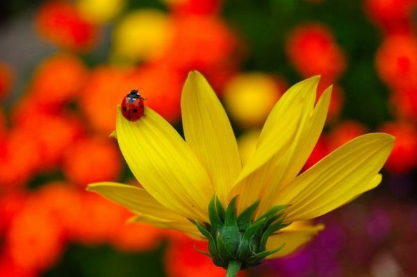

Acep hayran oldum **aşka uyaldan** Yanup **büryan** oldum aşka uyaldan

Ne **assı** fark ederim ne **ziyânı** Külli **virân** oldum **aşka** uyaldan

Sabredeyim derim **durmaz** bu dilim Söyler **ozan** oldum aşka uyaldan

Dökülür didemden dürr ü cevahir Gizli **umman** oldum aşka uyaldan

Kimi der **usludur** kimi der **deli** Halka **seyran** oldum **aşka** uyaldan

Uçtu rahat kuşu **mihnet** uyandı Derde **dükkân** oldum aşka uyaldan

İlm ü hikmet ile doldu **vücudum Ayn-i irfan** oldum aşka uyaldan

Salâdır nefesin içen **âşıka Âb-ı hayvân** oldum aşka uyaldan

**Ümmi Sinan** eder kalmadı bir gam Özge **sultan** oldum **aşka** uyaldan

                                 **Ümmi Sinan**                                               (1568)
