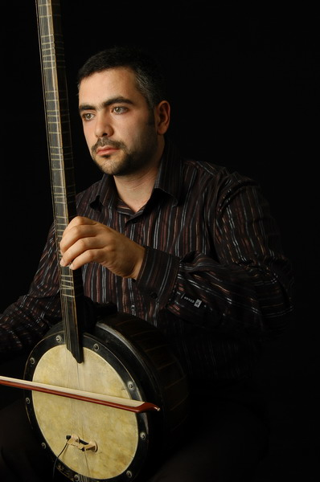

****

**Men aref’**in hoş aksi var Gönlümün başka **nesi** var Telden yaydan **her** dökülen Namede **ruhun** sesi var  

Çal **sazını** kalenderce Derinden gelen her **hece** Bir **sırrın** hem habercisi Hem **hızla** örteni bence

**Aşktan** doğdu bunca varlık Aşk gelince **olmaz** darlık Bana **kulak** vermelisin Diyeceğim bu **kadarlık**

İlgili aramalar: [müzik - yaylı tanbur taksim](http://www.izlesene.com/video/muzik-muzik----yayli-tanbur-taksim/600092/ref=embednew "müzik - yaylı tanbur taksim") -  [yaylı tanbur](http://search.izlesene.com/?vse=yaylı tanbur&ref=embedv2link "yaylı tanbur") -  [yaylı](http://search.izlesene.com/?vse=yaylı &ref=embedv2link "yaylı ") \-  [yaylı saz](http://search.izlesene.com/?vse=yaylı saz&ref=embedv2link "yaylı saz") -  [tanbur](http://search.izlesene.com/?vse=tanbur&ref=embedv2link "tanbur") -  [yaylı tambur](http://search.izlesene.com/?vse=yaylı tambur&ref=embedv2link "yaylı tambur") -  [tambur](http://search.izlesene.com/?vse=tambur&ref=embedv2link "tambur")
