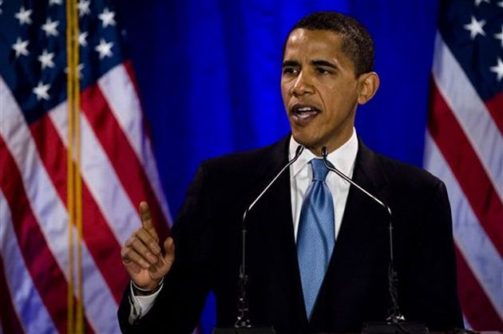

        

**Türkiye**’nin ilk dış işleri bakanı **Yusuf Kemal Tengirşenk** 1920’lerin başında **Mustafa Kemal**’in selamlarını **Rusya**’nın yeni lideri **Lenin’**e sunmak üzere **Moskova**’ya gittiğinde, dönüşte **Türkistan**’a uğramıştı. Orada **ırkdaşlarımızla** görüşen Bakan, onlara “yeni kurulan **Sovyet rejimi Osmanlı** sistemine benziyor, orada bir **köylü** çocuğu dahi yükselerek **paşa** olur, devlet adamı olurdu, siz şimdi bu yeni **düzene** uyun… **baş** kaldırmayın ” demişti.

**Amerika**’ya başkan olan **Obama** da **Kenyalı** bir köylü çocuğudur. Bu hesaba göre çağdaş **Amerikan** rejimini de **Osmanlı**’nın benzeri saymak mümkündür. Bu olayın yeryüzündeki **örnekleri** kesilmeden devam ediyor. Birileri halkın muazzam **yaşama** gücünü **sinsice** kullanmak üzere onun **seviyesine** iniyor, sonra o gücü korumak ve **çalıştırmak** için **zenginlerin** kademesine çıkıyor… Halkı da **peşinden** sürükleyerek. Taa ki **yalan** ortaya çıkana kadar. 

**Roma**’sı da böyleydi, **Dâra**’sı da böyleydi, **Küba**’nın Kastrosu’da, **Meksika**’nın **Zapatası**’da. şimdikiler de işte **tam** böyle… Bunlara neden **kızalım** ki ? … Ezeli ve ebedî bir **kural** içindeler. Kasımpaşalı **Tayyip** bey’in veya Kenyalı **Obama**’nın bunun dışına çıkabileceğini **düşünebilir** misiniz ?

Bir topluluğun **siyasal** gücünü **halk**, parasal gücünü **zenginler** temsil eder. Elbette **politikacı** esnafı ikisinin ortasında **çan tokmağı** gibi bir oraya bir buraya **vuracak,** bir o köşeye bir bu köşeye **çarpacak**, bazen şaşırıp arada **fırıldak** gibi dönecektir. 

Eğer bu **tabiat kuralı** geçerli olnmasaydı dünyada kurulan **devletler** zamanların sonuna kadar kesilmeden **sürer** gider kurulu **düzenler** hiç bozulmazdı. Ortada bir **hayat çelişkisi** var… Belki de bu çelişki **politik yaşamın** ta kendisi… Dünyada gelmiş geçmiş **düşünce** ve inanç adamlarının en önde gideni **İbni Haldun’**a göre devletlerin en uzunu **altı asır** yaşar. En iyi örnek **Osmanlı İmparatorluğu**… Devletler, rejimler **sistemler** de insanlar gibi doğuyor, **yaşıyor,** yaşlanıyor ve **ölüyor…** Sonra **yenisi** kuruluyor**.**

**Obama**’nın köylü çocuğu oluşu **ne işe** yarar ki ? elbette o da bir süre sonra **Şikago**’nun azgın **para babalarına** teslim olacak, **Detroit**’teki otomobil fabrikalarının dumanlı **gölgesine** sığınacak, **Locked-Martin’**in hisse senetlerinden kendine **kuştüğü** yatak yaptıracaktır. Ondan sonra **Tayyip** beyi Kızdıran **Fehmi Koru** gibi biri de **Amerika**’da çıkacak, Yakışıklı  **Obama**’nın esmer yüzünü bir kere daha **karartacaktır**. İnsanlara değil içinde yaşadıkları **ortamlara,** sistemlere ve kaynayan **kazanlara** bakmalı…

Devlet işinin başı **yalan**, sonu **talandır**… Ben **Galatasaray**’da okurken bir **Ekonomi-Politik** hocamız vardı: **Mösyö Mosé**…İstanbul yahudisi’ydi…Dinince dinlensin, bir gün derste “ **en büyük eşkıya devlettir**…” dedi. O zaman yadırgamıştık… Yıllar sonra “**susurluk olayı**” ortaya çıktığında **Hoca**’nın ne dediği anlaşıldı.  Birkaç devrin adamı **Demirel** de başlangıçta “**Devlet eşkıya ile konuşmaz**…” demişti. Sonradan o da konuştu… Devlet **eşkiya** karşı **eşkiya** kullandı.

**Obama** köylü çocuğuymuş, **Demirel** de **Çoban sülü** değil miydi ? İttihatçıların **Talat paşası** da telgraf memuru… Bunlar birer **beyaz perde**… Sahneler kurulduğunda üzerlerine **zenginlerin** ışık tayfları yansıyor ve **film** başlıyor… Ta ki perde **yırtılıp** iş ortaya çıkana kadar…

Neyse değerli **dostlar**… Siyaset yapmayalım dedik yine **içine** düştük. Şu güzelim **dünyada** adam gibi yaşamanın başka **yolu** yok mu **Allahaşkına ?**
