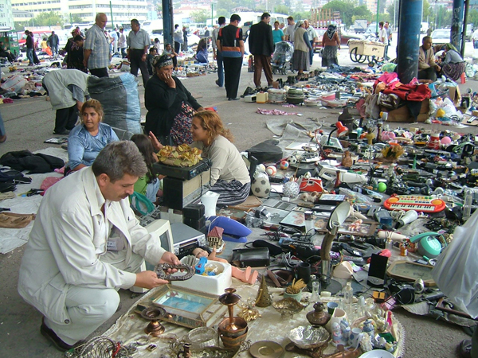
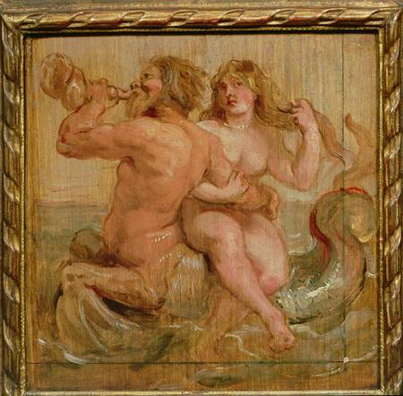

_Kaptanın Seyir defteri_  12 kasım 2008 çarşamba

Akşamüstü yine **bitpazarı’**na yolumuz düştü. Vakit oldukça ilerlemişti, **kış geldi** diye  saatlerle oynadılar ya, hava erken kararıyor. Gitsek mi ? gitmesek mi ? derken e-5’te bulduk kendimizi. **Kia’**yi yine **Amed** kullanıyor. Pazara vardığımızda **ortalık** toplanıyordu. **Operasyonun** hızı kesilmiş, **hırslar** sona ermiş, alış verişÂ  **şamatası** dinmişti. Üstü kapalı, **hangar** gibi koca bir yer burası, yüksek tavanda **neon** ışıkları var ama **belediye** daha yakmamış… **Karanlıklarda** dolaşarak işe yarar **bir şeyler** bulmaya çalışıyoruz.

     

Tam herkes **tezgahını** toplarken ışıklar yandı. Biri **düğmeyi** vaktinde çevirmeyi unutmuş. Öyledir, **aydınlık** sürerken **karanlığı**, karanlık basınca da **aydınlığı** unuturuz. Kışın kalın **kazak** giyeriz **yaz** gelince sırtımızda kalır, yazın ince **gömlek** giyer, kışın  da onu **unuturuz**… Ben ağustos ayında **sırtı kazaklı** çok adam gördüm. **Kışın** ince gömlekle gezeni de… Bunlar bizim **yaşam** sırları.

Pazarın girişinde bir **sandık** gördüm. Yaklaşarak baktım. Üzeri kararmış bir **deri** ile kaplı, ince **ahşap** kuşakları, sarı pirinç **düğme** ve kilitleri var. Düğmeler eksik, **kilitler** kırık. Deri kaplama **yer yer** yırtılmış altından **tahta** görünüyor. **Sandığın** boyutları çarpıcı. Bu sandıklar evlerimizi **Batı usulü** dolaplar, **konsollar**, hele şimdi **çekyat, it otur** faciaları doldurmadan önce **en önde** gelen kullanım araçlarımızdı. Bizim neyzen **Fakıh Kademoğlu’**nun amcası “**Sandık Kültürü**” üzerine koskoca bir kitap yazdı.

Gözlerim sandığa, **aklım** bir yerlere  takılmaya başladı. Bu sandık **Gürcü** sandığı olabilir miydi ? **Çevre köyler** Gürcülerle doluydu. Bunların çoğu **1876-77 Türk Rus** savaşının mağduru, **yüz elli yıllık** göçmen ailelerdi. Acaba bu sandık **Sochi** veya **Batum**’dan gelmiş olabilir miydi ? **Kaç devir** ? kaç yol ? **kaç nesil** görmüştü ? Sandıkla konuşmaya başlamıştım. Açıldıkça **açılıyordu**.

Zavallı çürümüş deri, kurtlu **tahta** bana bir şeyler anlatmaya çalışıyordu. Algılarım **sandıktan** yükselen nâmelerle bir türlü buluşmuyordu. Kafam **Haçlı seferlerine** kadar gitmişti, sanki bu sandık **Godefroy de Bouillon’**un sandığıydı. **Antikacılık** böyledir. Adam bir defa **kapılmaya** görsün, yüzlerce yılın **yaşam şeridi** bir anda **şimşekler** gibi kafasına dolar da ucu **paraya** dayanır ve sonunda **cılız cüzdanları** deler geçer…

Daldığım **rüyadan** sıyrılıp sordum: -Kaç para bu ? -Altmış milyon… **Amed** atıldı: -Yirmi milyon. **Amed**’in arkadaşı **Aykut** konuştu: -Beş milyon… **Milyon** unutulalı iki sene var, bunlar  hâlâ **milyon** diyorlar… Satıcı kızdı: -Ben altmış diyorum, siz **beş** diyorsunuz… -Haydi 25 olsun… -**Al git**…

Çocuklar itiraz ettiler: -**Hocam** sandık **arabaya** sığmaz, nereye koyacaksın ? Doğru…**hiç** düşünmemiştim…Yürüyerek gittik, **dönüp dönüp** sandığa baktım… Uzaklaştıkça **sesi soğu** kesilmişti…. Acaba ne oldu ?

**Bitpazarından** ayrılırken karanlık iyiden iyiye çökmüştü. Gökyüzünde **mehtap** vardı… Aslında biz bu gece **mehtaba** bakmaya **Kerpe**’ye gidecektik. **Kerpe**’deki kayalıklarda her mehtapta **mangal** yapmak huyumuzdur. Yine aynı kararla yola çıkmış ama **güzergahta** yer alan **Bitpazarına** uğramıştık. Hava bulutluydu. **Ay** bir görünüp bir kayboluyordu. Bir ara **karar** değiştirir gibi olduk ama **vaz** geçtik, çevirdik arabanın burnunu **Kandıra** yoluna… 

**  Kerpe** Kandıraya yirmi km. kuzeyde şirin bir **Karadeniz** kasabamızdır. Girintili çıkıntılı kayalıkları ve korumalı **kumsalı** ile meşhurdur. Ben **Kerpe**’ye ilk defa on yedi yıl önce gitmiştim. Gecenin bir **karanlık** zamanında kayalıkları zar zor görebildiğimde şaşkına dönmüştüm. **Kayalıklar** sanki insan eliyle yapılmış bir **liman** ve şimdi harap olmuş bir **kale** gibiydi. Dalgalar vurdukça **taşların** arasından, oyuklardan devamlı akan **suların** çıkardığı şırıltılar, **fışırtılar** sessizlikte yankılanıyordu. **İnsan** sesine benzer karışık **sesler** geliyordu kulaklarıma. O **sesleri** yıllarca unutamamıştım. Eskiden **Yunanlılar** bunları duyunca **Tanrı** sesi zannederlermiş…**Tanrı**'larla iç içe yaşarlardı ya... **Balık** ayaklı çapkın **Triton** deniz tanrısı... istiridye kabuğundan bir **borusu** vardı, **fırtınalı** havalarda onu çalardı.

                                                                                                  

             **Bak** nasıl yükseliyor **Proseus** denizden…              Dinle… yaşlı **Triton** borusunu çalıyor…

**Kerpe**’ye geçen yazlarda hemen her **hafta** birkaç defa gidiyorduk. Bu yaz olmadı. **Kasabaya** vardığımızda vakit ilerlemişti. Hiçbir **evden** ışık sızmıyordu. Ortalıkta kimseler yoktu. Sadece **Jandarma karakolu** ışıklıydı. Biraz ürperek geçtik **karakolun** yanından. Bizden kuşkulanabilirdi. **Gece yarısı** bu anlamsız ziyaretin masumiyetini merak edebilirlerdi... “**Mehtaba bakmaya geldik**” de diyemezdik ya… neuzubillah.

 [Â](../uploads/2008/11/dsc02795-1.jpg "dsc02795.JPG") 

Çocuklar **ateşi** çabuk yaktılar. **Mangal** kısa zamanda hızını aldı… **Battaniyelere** sarılarak başına çöreklendik… Mükemmel bir **mangal** safası son zamanda fakire nasip oldu. **Amed**’e sordum: -**Karadeniz**’in eski adını biliyo musun ? -Hayır ! -**Propontis**…. Eski zaman insanları “**Propontis**” derlermiş… -Bana ne **eski za**man insanlarından…

**Amed** eski zamanı hiç sevmez. “**Eski zaman**” diyene kızar… O şimdiki zamana **gözünü** dikmiştir. Ben ise ikide bir “**eski zaman**” diyorum… Başını çeviriyor.

**  ** 

**Sapanca**’ya döndüğümüzde yeni bir **gün**’ün ilk saatleri başlıyordu. İlginçtir. Biz sabah **güneş** doğmadan “**yeni bir gün başladı**” demeyiz. Halbuki **gün**, gece 1’de başlar… Bunu da **Amed**’e anlatamadım. Bir de “**takip**” meselesi var: **gece** mi **gündüzü** takip eder ? **gündüz** mü **geceyi** kovalar ? İşte bunu **ben** de bilmiyorum. Bilen varsa **söylesin    Â**
