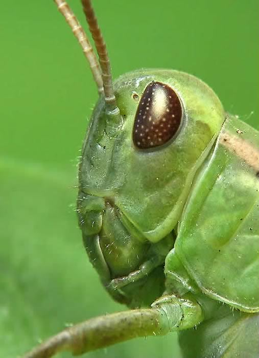

****

**Kalender** dedi ki bir gün -ben **baş** olmalıyım Dünyayı yönetip ona **sırdaş** olmalıyım **Bataklıkta** tüm yaratıklar benim olmalı Hepsinden üstün **güçlü** bir bedenim olmalı

**Yusufçuk**  gürledi -ben  **arka**daş olmalıyım. **Yaradılmış** ne varsa,  **gönüldaş** olmalıyım. Seni bilmem ama ben hep **sevgiden** yanayım Seni bile **sevdim** nice derdime **yanayım**

**Kalender** dedi -inan  bu **laflara** karnım tok Ben **baş** olmak istiyorum, başka hiç **çare** yok Dünyayı tez zamanda **düzeltmektir** dileğim **İnsanın** gidişi nereye varır bileğim

Sevgi **muhabbet**  bunlar aslı olmayan **masal** kötüleri yok etmektir **iyilere** misal Yok etmenin çaresi **başkan**  olmaktır bence  Kötü **sinince** yol açılır yaşlıya gence

Yusufçuk dedi -**Kalender** senin  yanlışın var O eskidendi, şimdi iyi **kötüyü** kovar Sen iyi ol, **kötüler** kendiliğinden gider Dünyaya **başkan** olma, iyi bir **kul** ol yeter

**Yusufçuk** ne dediyse **Kalender** dinlemedi **Yusufçuk** çok yalvardı, hep **ağladı** inledi **Kalender** başkan olma huyundan **vaz** geçmedi Dünyayı **islah** için başka bir **yol** seçmedi.

Kuşku yok ruhunda **terör** vardı **Kalenderin Başkan** olmak nesine o **vahşî** sergerdenin Dünya değişti artık, **sanma** ki geri gele Şimdi ona **başkan** olamaz hiçbir **hergele**
