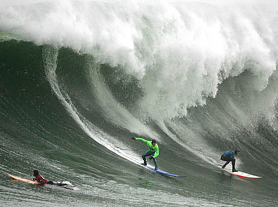

Ey aşk **hastası** gönül ! kendine gel, **Cessur** ol. Bu gün **yiğitlik** gösterecek Bir gündür. Ben senin **aşkına** bağlıyım. **Yabancı** gibi durma Aklın **önüne gelen** her şeyi bırak. Şimdi **coşkunluk**, **çılgınlık** zamanıdır.                                          **Mevlânâ**
