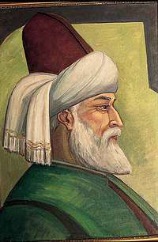

Gözün **zamandan** daha **Kan** dökücüdür. Kirpiklerindeki **ok** **Mızraktan** daha keskindir. Kulağıma **gizlice** bir şey Fısıldamıştın. Bir **sır** Söylemiştin. O **sırrı** açıkça, Biraz daha **yüksek** sesle söyle, Çünkü **kulağım** pek ağır **İşitiyor.                              Mevlânâ**
