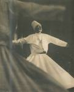

              

Hazreti **Monla-i Rum:** "Bad ez vefat **türbeti ma** der zemin mecuy  Der **sinahayi** merdum ü **arif** mezarı mast” diyor. Türkçesi: “Ölümümden sonra **mezarımı** yerde arama  Arif kişilerin **gönlüne** gömüldüm ben”

**Mevlânâ**’nın **Hakk**’a vuslatı bir **kere** daha anılıyor… **Rabbine** aşık olan bir **İslam** büyüğünün hatırası bir **kere daha** dile getiriliyor,  **madde tuzağına** düşüp cayır cayır yanan şu **güzelim** dünyada, **Mevlânâ** rüzgarı bir **kere** daha esiyor. **Ruhlar** onun maltemi ile doluyor, **Bedenler** onun rüzgarı ile **kendinden** geçiyor. Hesapçılar kendileri ile **hesaplaşıyor**lar. Kötüler kötülüklerinin **derdine** düşüyor. İyiler **iyiliğe** doymuyor. Ortalık **toz duman**. Nefisler **ruhlarla** kaynaşmada, **ruhlar** nefislerle çatışmada, canlar **karmaşada** yol arıyor. Ruhlar, **canlar** ve **nefisler** alt alta üst üste boğuşuyor… **Manzaraya** bakın siz… En alttaki en **üstte**, en üstteki en **altta…** Pirim olanları **bir bir** görüyor, gösteriyor, **biliyor,** bildiriyor. **Söylüyor**, anlatıyor:

"Bu sendeki **gurur** Daha ne **kadar** artacak ? Her çeşit **görünüşün**, hayallerin Daha ne kadar **sürecek** ? Süphanallah sende **şaşılacak** bir tavır, Anlatılmayacak bir **iş**, Bir **hal** var. Ben sana **“hiç”** diyeceğim ama, Sen **hiç** bile değilsin... Bu kendini bir **şey** görmen Hep senin **kuşkularındır**."                                            **Mevlânâ**  **Hakk**’ın açtığı kapıların **sonu** gelmiyor. **Aşk** her yerden doğuyor. **Aşkın** görüş sınırı **uzayda** kayboluyor. **Mevlânâ** insana **insanlığını** öğretiyor. O’na kendisini **tanıttı,** şimdi de kalbine “**ümit”** isimli bir **enerji** yerleştırıyor.

"Bizi **dirilten** o dost, Ne kadar **temiz**, ne kadar tatlıdır. Ne kadar **hoştur**, güzeldir... Biz insanlar, **ruhlardan,** **Gönüllerden** ibarettik. Bedenlerimiz **yoktu.** O aziz **Dost,** Bedenlerimizi **ruhlarımıza** konukevi Olarak **yarattı.** O dostumuz, O efendimiz, **lutfeder**, kerem buyurursa, Bizi **affeder**. Nasıl önceden **yarattıysa**, Gene **öyle** yaratır. Bizi yeniden **diriltir**."                                **Mevlânâ** **Mevlânâ**’dan söz açtık ya, başka ne **yapabilirdik** ki ? Açtık bizi **doyurdu,** sefildik bizi **giydirdi**, yoksulduk bizi **dirliğe** kavuşturdu. Yersizdik bize **yer** buldu. Bütün bunları **Hakk’**tan aldığı izinle yaptı. **Karanlıklarla** boğuşuyorduk, bizi **ışıklı yere** götürdü. İnsanlıktan **uzaklaşmıştık.** Geri döndük. O adımızı **temize çıkardı**, düşmanımızı tanımazdık, parmağının **ucuyla** gösterdi. **Peygamberin** yolundan ve **Tanrı’**nın izninden bir an ayrılmadı.

**Pirim** yedi yüz yıl önce yaşadı. Hayır ! Burada, **bu gün**, şurada yaşıyor. Geziyor dolaşıyor. **Sıkıldığı** yerden kaçıyor. **Dostları** ile beraber. O’nu tanımayanlar “**Konya’da yatıyor**…” diyorlar. Hayır ! yatmıyor. **Dimdik** ayakta… Sen de **yatma.** Git O’nunla dolaş… Bir **gece** olsun uyuma.

"Dostların **hatırı** için bu gece **uyuma** Gecenin **kulağını** tut, uyuma “**fitnenin uyuması iyidir”** derler Sen de bir **fitnesin**, ancak Senin gibi **güzel** bir fitnenin **Uyanıklığı** daha iyidir. Bu yüzden **acele** etme, Uyuma."                                    **Mevlânâ**

**Mevlânâ** bir kere daha anılıyor. Orada, burada, **arzın** öbür ucunda. **Tahtını** kurduğu her yerde. **Aşkın** ulaştığı her alanda. O’nu ananlar O’nu değil **kendilerini** anıyorlar. O’na herkes kendi **kutrundan** bakıyor. Onu herkes kendi **çapı** ile ölçüyor. **Mevlânâ** herkesin dünyasında kendi  **varlığıyla** yer tutuyor. O kime ne **söylüyorsa** o insanlar O’nun sözlerinden kendi **anlayacakları** kadarını anlıyorlar. Yetenekleri **yeterince** yol bulup **düzlüğe** çıkmaya çalışıyorlar.

**Düz yol** arayıcıları. **Pirimin** size son bir **çift** sözü var:

"Ey **ten**, böyle **can,** Böyle **ilâhî** bir emanet sende oldukça Sen **ölmezsin.** Ey imansızlık, Sapıklıktan kurtuldun, **imana** kavuştun. Neş’elen, **neş’eni** arttır. Çal, çağır. Her ne kadar, **nefsine** uymuş, **Tensel** zevklerin altında kalmış kişilerden Bıktın, **rahatsız** oldun ise de, sen Nefsini yenmiş, **temiz** duygulu **Erlerin** huyundasın. **Ermişlerin Desteği** seninle beraberdir."                                            **Mevlânâ**

İşte bu kadar ! aziz dostlar. **Allah** dostları ! **Tanrı** erleri… Söylenecek **şeylerin** sonu geldi. Gönlümüze gömülmüş o **Dost,** bizi **Dost'**a doğru çekiyor. Artık **inattan** vaz geçin de gelin **beraber** olalım. Bu dünyaya aldanmayalım **fânidir** kanmayalım. **Oldu** mu ?   **Mevlânâ**’yı analım. O’nun **gibi** olalım.
