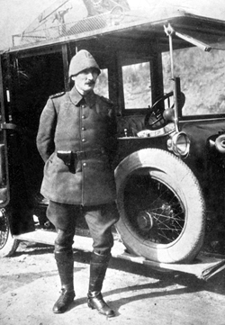

Eğer bir zamanlar **Türk** vatanında **Atatürk** çıkmasaydı 1918 sonbaharında **İstanbul**’u işgal eden müttefik savaş gemileri “**geldikleri gibi gitmezlerdi**…” Irak’ı işgal eden **Amerikan** ve **İngiliz** birliklerinin **geriye** gitmedikleri  ve **gitmeye** niyetleri olmadığı gibi…

Eğer bir zamanlar **Türk** vatanında **Atatürk** çıkmasaydı, cephelerde **bozulmuş** orduların **kaçak** kumandanları **ülkeyi** ele geçiren yabancı **işgal** ordularının kumandanlarının göğsüne **madalya** takarlardı, şimdi bazı **Iraklı**’ların **düşmanın** **göğsüne** madalya taktıkları gibi.

Eğer bir zamanlar **Türk** vatanında **Atatürk** çıkmasaydı kimse **ülkeyi** ele geçiren düşmanlara karşı onları **kızdırmak** pahasına bir **kurtuluş mücadesi** yapmayı **aklına** getirmezdi , şimdiki **Irak Parlementosu’**nun milletvekilleri gibi

Eğer bir zamanlar **Türk** vatanında **Atatürk** çıkmasaydı işgal yıllarının **Damat Ferit** başkanlığındaki **Osmanlı hükümeti**, düşmanın işgalini **kutlamayı** varlığının sebebi bilir ve **düşman** saldırısına  **şükür** ederdi, şimdiki **Mâlıkî** başkanlığındaki **Irak** hükümetinin yaptığı  gibi…

Eğer bir zamanlar **Türk** vatanında **Atatürk** çıkmasaydı bazı **Türkler** yabancı orduların ülkelerini **işgal** etmesini çağdaş **medeniyetin** gereği zannederler, onlara **karşı** çıkanı barış düşmanı, **vatan haini** ilan ederlerdi, şimdiki **Irak** kabinesi’nin **tüm** üyelerinin yaptığı  gibi

Eğer **Atatürk** çıkmasaydı işgal sırasında **İngiliz** güdümüne girmiş **Osmanlı yönetimi** İngilizlerin ülkeden çıkıp gitmelerinin **ülke** yararına olmayacağını söyler ve **işgali** canü **gönülden** alkışlardı, şimdiki **Irak yönetimi** gibi

Eğer bir zamanlar **Türk** vatanında **Atatürk** çıkmasaydı **bedenen** yorgun, **ruhen** yenilmiş **Osmanlı** paşalarının verdiği **emri** herkes dinler, kimse **İngiliz** uçağına **ateş** etmez **ülkeyi** yakan yıkan **düşman uçaklarına** yol gösterirdi, şimdiki **ırak** hükümetinin yaptığı gibi…

Eğer bir zamanlar bu ülkede **Atatürk** ve **Balkan** muharebesinde, ayaklar altında kalan **şerefini** kurtarmaya azimli bir grup dürüst **Osmanlı subayı** çıkmasaydı, **Türk vatanı** düşman çizmesinden **asla** kurtulmaz bu çizmeyi vatanın selameti adına **yalamayı** yeğleyen ruhen ve **bedenen** yenik o bazı **Osmanlı subayları** ülkelerinde **söz sahi**bi olmaya devam ederdi, şimdiki **Irakta** olduğu gibi…

Ve değerli **dostlar** ! eğer bir zamanlar bu ülkede **Atatürk** ve henüz bağrında onur ve **şerefi**  sönmemiş bir grup **yürekli, erdemli**, askerlikten anlayan **arkadaşı** olmasaydı, Türk vatanı **şerefsiz** ve **onursuz** kalırdı şimdiki **Irak** gibi…

İnsanlar gibi **milletlerin** de başına elbette **felaketler** gelebilir… Bu felaketler onursuzluk ve **şerefsizlikle** sonuçlanır, ancak toplulukta tek bir **şerefli insan** kalsa, onun **şerefi** bir gün topluluğu **yeniden** şereflendirebilir. **Türkiye**’de olduğu gibi… Bu **Irak**’ta da olabilir, ancak Geçtiğimiz **kasım** ayında ülkelerinde **Amerikan işgalinin** devamı için oy veren **Irak** hükümet ve milletvekillerinin ilerde, **emri hak** vukuunda mezar **taşlarına** acaba ne  yazacaklar… **Şeref** mi ?
